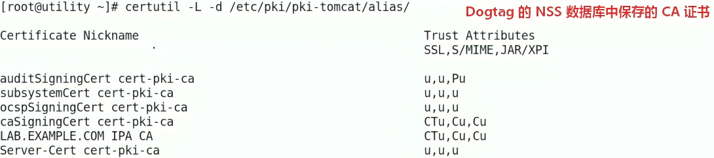
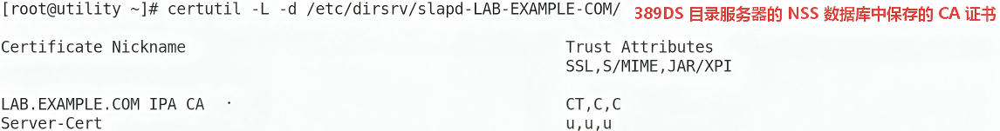
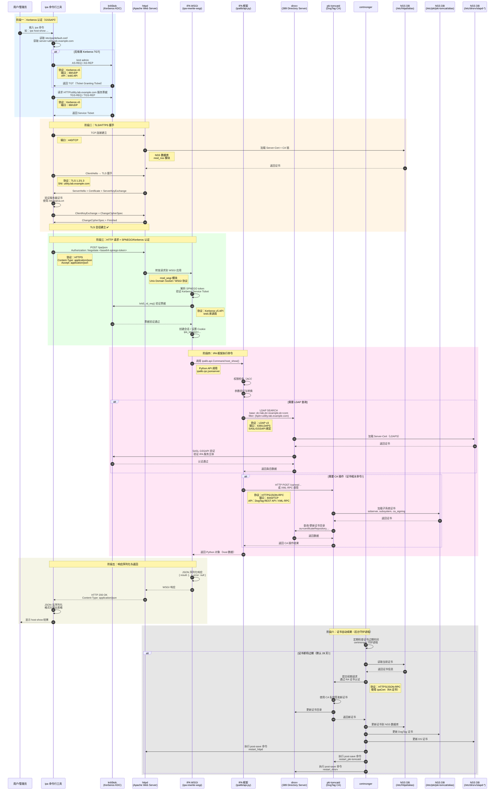
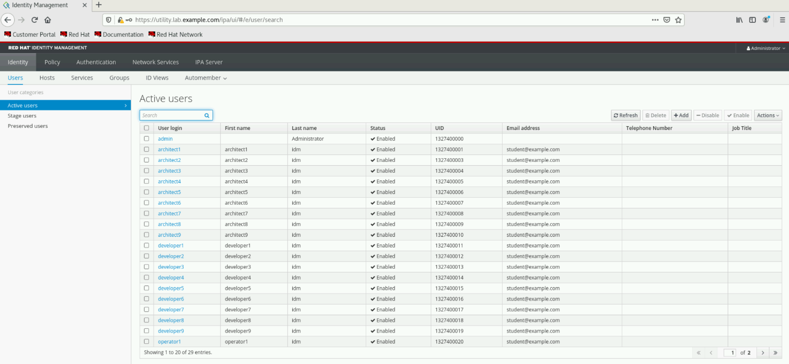

# 🔧 故障排除：修复过期 CA 证书系统导致的 IdM 服务不可用

## 文档说明

- FreeIPA 作为 IdM 的开源版本，文中提及的 IdM 操作均可在 FreeIPA 中测试验证。
- 本案例中 IdM 服务运行正常，但 certmonger 服务未正常监控 CA 证书系统导致 IdM 中的证书过期服务不可用。原 IdM 服务配置正确未作修改，只是证书过期导致服务不可用，因此尝试下文中的方法进行修复。

## 文档目录

- [🔧 故障排除：修复过期 CA 证书系统导致的 IdM 服务不可用](#-故障排除修复过期-ca-证书系统导致的-idm-服务不可用)
  - [文档说明](#文档说明)
  - [文档目录](#文档目录)
  - [1. IdM 中的组件与认证体系](#1-idm-中的组件与认证体系)
    - [1.1 组件名称与功能介绍](#11-组件名称与功能介绍)
    - [🧬 1.2 PKI-Tomcatd / DirSrv / NSS / Certmonger 核心交互时序图](#-12-pki-tomcatd--dirsrv--nss--certmonger-核心交互时序图)
    - [🎯 1.3 pki-tomcatd 服务内部调用过程](#-13-pki-tomcatd-服务内部调用过程)
    - [🚩 1.4 PKI-Tomcatd 与 DirSrv 认证连接过程（SASL EXTERNAL 认证）](#-14-pki-tomcatd-与-dirsrv-认证连接过程sasl-external-认证)
    - [🪝 1.5 PKI-Tomcatd 与 DirSrv 的强依赖说明](#-15-pki-tomcatd-与-dirsrv-的强依赖说明)
    - [🔥 1.6 IPA 命令执行完整时序图](#-16-ipa-命令执行完整时序图)
  - [2. 故障排除：修复过期 CA 证书系统导致的 IdM 服务不可用](#2-故障排除修复过期-ca-证书系统导致的-idm-服务不可用)
    - [2.1 故障复现：验证 ipa 命令是否可执行](#21-故障复现验证-ipa-命令是否可执行)
    - [2.2 修复步骤1：验证 NSS 数据库中各证书的有效期](#22-修复步骤1验证-nss-数据库中各证书的有效期)
    - [2.3 ipa 命令行与 IPA Web UI 使用的认证方式差异](#23-ipa-命令行与-ipa-web-ui-使用的认证方式差异)
    - [2.4 修复步骤2：执行 IdM 各证书系统更新](#24-修复步骤2执行-idm-各证书系统更新)
    - [2.5 修复步骤3：验证更新后的 CA 证书](#25-修复步骤3验证更新后的-ca-证书)
    - [2.6 修复步骤4：更新客户端 CA 根证书](#26-修复步骤4更新客户端-ca-根证书)
    - [2.7 修复步骤5：ipa 命令行验证与 IPA Web UI 登录验证](#27-修复步骤5ipa-命令行验证与-ipa-web-ui-登录验证)
    - [2.8 修复步骤6：同步 IdM 证书监控状态](#28-修复步骤6同步-idm-证书监控状态)
  - [3. 参考链接](#3-参考链接)

## 1. IdM 中的组件与认证体系

### 1.1 组件名称与功能介绍

| 路径 | 类型/格式 | 说明 | 来源 |
| ----- | ----- | ----- | ----- |
| `/etc/pki/pki-tomcat/alias` | NSS 数据库 | pki-tomcatd 的 NSS 数据库 | - |
| `/etc/dirsrv/slapd-LAB-EXAMPLE-COM/` | NSS 数据库 | dirsrv 的 NSS 数据库 | - |





| 路径 | 类型/格式 | 说明 | 来源 |
| ----- | ----- | ----- | ----- |
| `/var/lib/ipa/certs/ca.crt` | PEM | IPA 服务端的 CA 根证书 | 手动从 NSS 数据库导出 |
| `/var/lib/ipa/private/ca.key` | PEM | IPA 服务端 CA 根证书私钥 | 手动从 NSS 数据库导出 |
| `/etc/ipa/ca.crt` | PEM | IPA 客户端分发 CA 根证书 | `ipa-client-install` 从服务器下载 |
| `/var/lib/ipa/certs/httpd.crt` | PEM | **httpd 服务器证书**（终端实体） | IPA 预安装/DogTog 签发 |
| `/var/lib/ipa/private/httpd.key` | PEM | **httpd 服务器证书私钥** | IPA 预安装 |
| `/var/lib/ipa-client/pki/kdc-ca-bundle.pem` | PEM | 客户端用它验证 KDC 的 PKINIT 证书的签名，实现 PKINIT 无密码认证。 | - |
| `/var/kerberos/krb5kdc/kdc.crt` | PEM | KDC 的 PKINIT 证书 | IPA 预安装/DogTog 签发 |
| `/var/kerberos/krb5kdc/kdc.key` | PEM | KDC 证书私钥 | IPA 预安装 |

| 服务名称 | 组件名称 | 功能 |
| ----- | ----- | ----- |
| `DogTog` | pki-tomcatd.service | 1️⃣ 监听端口：8443 (HTTPS)、8080 (HTTP)、9443 (PKI Agent)、9444 (Admin) <br> 2️⃣ 处理请求：证书申请、续期、撤销、状态查询 <br> 3️⃣ 数据存取：通过 LDAP 读写证书数据 <br> 4️⃣ 自动管理：通过 Certmonger 自动续期证书 |
| `389DS` | dirsrv@LAB-EXAMPLE.COM.service (ns-slapd) | 389 目录服务器 |
| `Certmonger` | certmonger.service | NSS 数据库中证书有效性追踪 |

### 🧬 1.2 PKI-Tomcatd / DirSrv / NSS / Certmonger 核心交互时序图

```mermaid
sequenceDiagram
    autonumber
    participant Systemd as systemd
    participant PKI as pki-tomcatd<br/>(DogTog CA)
    participant NSS2 as NSS DB<br/>(/etc/pki/pki-tomcat/alias)
    participant CM as certmonger
    participant CA as CA 子系统<br/>(Java Servlet)
    participant LDAP as dirsrv<br/>(389 DS)
    participant NSS3 as NSS DB<br/>(/etc/dirsrv/slapd-REALM)
    participant HTTPD as httpd<br/>(mod_nss)
    participant NSS1 as NSS DB<br/>(/etc/httpd/alias)

    %% ===== 1. pki-tomcatd 启动流程 =====
    rect rgb(255, 235, 235)
        Note over Systemd,PKI: 阶段一：pki-tomcatd 启动流程
        
        Systemd->>Systemd: systemctl start pki-tomcatd
        Systemd->>PKI: ExecStartPre: pkidaemon start pki-tomcat
        Note right of Systemd: 服务文件：<br/>/usr/lib/systemd/system/<br/>pki-tomcatd@.service
        
        PKI->>PKI: 读取配置<br/>/etc/pki/pki-tomcat/server.xml
        Note right of PKI: Tomcat 配置：<br/>连接器端口 8080, 8443<br/>AJP 端口 8009
        
        PKI->>NSS2: 打开 NSS 数据库<br/>certutil -L -d /etc/pki/pki-tomcat/alias
        Note right of PKI: NSS DB 密码来自：<br/>/etc/pki/pki-tomcat/alias/password.conf 中的 internal=<br/>或 /var/lib/ipa/passwds/
        
        NSS2-->>PKI: 加载证书列表：<br/>sslserver, subsystem, ca_signing,<br/>ocsp_signing, audit_signing
        
        alt 证书过期或损坏
            PKI->>PKI: 抛出 CertificateException
            PKI-->>Systemd: 启动失败 (exit code != 0)
            Note over PKI,Systemd: 日志：<br/>/var/log/pki/pki-tomcat/ca/debug
        else 证书有效
            PKI->>PKI: 初始化 Tomcat JVM<br/>加载 CA 子系统 WAR
            PKI->>CA: 启动 CA Servlet<br/>com.netscape.ca.CAService
            Note right of PKI: WAR 路径：<br/>/usr/share/pki/ca/webapps/ca/
            
            CA->>LDAP: LDAP BIND<br/>cn=Directory Manager
            Note right of CA: 协议：LDAP v3<br/>端口：636/LDAPS<br/>使用 /etc/pki/pki-tomcat/alias 中的<br/>子系统证书进行 SASL EXTERNAL<br/>或简单绑定 + TLS
            
            LDAP->>NSS3: 加载 Server-Cert<br/>用于 LDAPS 监听
            NSS3-->>LDAP: 返回证书
            
            LDAP-->>CA: 认证成功<br/>返回 LDAP 连接
            
            CA->>LDAP: 查询 ou=certificateRepository<br/>验证数据库一致性
            LDAP-->>CA: 返回证书目录数据
            
            CA-->>PKI: CA 子系统就绪
            PKI-->>Systemd: 启动成功
            
            Systemd->>PKI: ExecStartPost: ipa-pki-wait-running
            PKI->>CA: HTTP GET /ca/admin/ca/getStatus
            Note right of PKI: 协议：HTTP<br/>端口：8080 (AJP→HTTPD→8443)<br/>或 8443 (直接 HTTPS)
            CA-->>PKI: 返回 "Running"
            PKI-->>Systemd: 服务状态：active (running)
        end
    end

    %% ===== 2. dirsrv 启动与证书加载 =====
    rect rgb(235, 255, 235)
        Note over Systemd,NSS3: 阶段二：dirsrv 启动与证书加载
        
        Systemd->>Systemd: systemctl start dirsrv@REALM
        Systemd->>LDAP: ns-slapd -D /etc/dirsrv/slapd-REALM
        Note right of Systemd: 服务文件：<br/>/usr/lib/systemd/system/<br/>dirsrv@.service
        
        LDAP->>LDAP: 读取配置<br/>/etc/dirsrv/slapd-REALM/dse.ldif
        Note right of LDAP: 关键配置：<br/>nsslapd-security: on<br/>nsslapd-ssl-check-hostname: on<br/>nsslapd-certdir: /etc/dirsrv/slapd-REALM
        
        LDAP->>NSS3: 打开 NSS 数据库<br/>certutil -L -d /etc/dirsrv/slapd-REALM
        Note right of LDAP: NSS DB 密码来自：<br/>/etc/dirsrv/slapd-REALM/pwdfile.txt
        
        NSS3-->>LDAP: 加载证书：<br/>Server-Cert (cn=server-fqdn)<br/>LAB.EXAMPLE.COM IPA CA
        
        alt Server-Cert 过期
            LDAP->>LDAP: 记录警告日志<br/>SSL 初始化失败
            LDAP-->>Systemd: 可能启动但拒绝 SSL 连接
        else 证书有效
            LDAP->>LDAP: 初始化 NSS SSL 层<br/>启用 LDAPS (端口 636)
            LDAP-->>Systemd: 服务状态：active (running)
        end
    end

    %% ===== 3. certmonger 证书续期流程 =====
    rect rgb(235, 235, 255)
        Note over CM,CA: 阶段三：certmonger 自动续期证书
        
        CM->>CM: certmonger 守护进程<br/>定期检查 (默认每 5 分钟)
        Note right of CM: 配置：<br/>/var/lib/certmonger/<br/>跟踪请求存储在本地 DB
        
        CM->>NSS2: 读取证书过期时间<br/>getcert list → 检查 NotAfter
        NSS2-->>CM: 返回证书信息
        
        alt 证书即将过期 (< 28 天)
            CM->>CM: 标记为 NEED_CSR
            CM->>NSS2: 生成新密钥对 + CSR<br/>certutil -R -d ...
            NSS2-->>CM: 返回 PKCS#10 CSR
            
            CM->>CA: 提交续期请求<br/>HTTP POST /ca/rest/certrequests
            Note right of CM: 协议：HTTPS<br/>端口：8443<br/>API：DogTog REST API<br/>Content-Type: application/json
            
            CA->>CA: 验证请求签名<br/>使用 RA 证书 (ipaCert)
            
            alt 使用 RA 证书认证
                CA->>NSS1: 加载 ipaCert<br/>从 /etc/httpd/alias
                NSS1-->>CA: 返回 RA 证书 + 私钥
                Note right of CA: RA 证书用于：<br/>证明 certmonger 有权代表<br/>IPA 提交证书请求
            end
            
            CA->>LDAP: 查询 ou=people, cn=accounts<br/>验证请求者权限
            LDAP-->>CA: 返回 ACI 验证结果
            
            CA->>CA: 使用 CA 签名私钥<br/>(caSigningCert) 签发新证书
            Note right of CA: 签名操作在 NSS 模块中执行<br/>使用 HSM/软 token
            
            CA->>LDAP: 存储新证书<br/>ou=certificateRepository,...
            LDAP-->>CA: 确认存储
            
            CA-->>CM: 返回新证书 (PEM/X.509)
            
            CM->>NSS2: 安装新证书<br/>certutil -A -d ...
            NSS2-->>CM: 安装成功
            
            CM->>CM: 执行 post-save 命令<br/>/usr/libexec/ipa/certmonger/...
            
            alt DogTog 子系统证书
                CM->>PKI: 发送 HUP 信号<br/>或调用 pki-server restart
                PKI->>PKI: 重新加载 NSS DB<br/>无需重启 JVM
            else DS Server-Cert
                CM->>LDAP: 发送 HUP 信号<br/>或调用 restart_dirsrv
                LDAP->>NSS3: 重新加载 Server-Cert
            else HTTPD 证书
                CM->>HTTPD: systemctl restart httpd
                HTTPD->>NSS1: 重新加载证书
            end
            
            CM->>CM: 更新跟踪状态<br/>状态：MONITORING
        else 证书未过期
            CM->>CM: 状态保持 MONITORING
        end
    end

    %% ===== 4. ipa-cert-fix 紧急修复流程 =====
    rect rgb(255, 255, 235)
        Note over Systemd,CA: 阶段四：ipa-cert-fix 紧急修复（证书已过期）
        
        Systemd->>CM: getcert list<br/>发现 CA_UNREACHABLE
        CM-->>Systemd: 无法连接 DogTog CA
        
        Systemd->>PKI: 尝试启动 pki-tomcatd<br/>失败（证书过期）
        PKI-->>Systemd: 启动失败
        
        Systemd->>Systemd: 执行 ipa-cert-fix
        Note right of Systemd: 工具路径：<br/>/usr/sbin/ipa-cert-fix<br/>需要 root + ipaadmin 权限
        
        Systemd->>NSS2: 读取所有证书<br/>检查过期时间
        NSS2-->>Systemd: 返回证书列表 + 过期状态
        
        Systemd->>Systemd: 分析过期证书<br/>生成续期计划
        
        alt 本地 CA 可用（CA 根证书未过期）
            Systemd->>NSS2: 使用 caSigningCert 私钥<br/>直接签发新子系统证书
            Note right of Systemd: 这是 ipa-cert-fix 的核心：<br/>绕过在线 CA，使用本地<br/>CA 私钥直接签名
            
            NSS2-->>Systemd: 返回新证书
            
            Systemd->>NSS2: 更新 NSS DB<br/>替换过期证书
            
            Systemd->>LDAP: 更新 LDAP 中的<br/>cn=certificates 条目
            Note right of Systemd: 更新对象：<br/>cn=caSigningCert cert-pki-ca<br/>cn=sslserver cert-pki-ca<br/>cn=subsystemCert cert-pki-ca<br/>等
            
            LDAP-->>Systemd: 确认更新
            
            Systemd->>PKI: 现在可以启动 pki-tomcatd
            PKI->>PKI: 加载新证书 → 启动成功
            PKI-->>Systemd: 服务运行
            
            Systemd->>CM: 触发 certmonger<br/>重新连接 CA
            CM->>CA: 现在可以正常通信<br/>续期剩余证书
            CA-->>CM: 返回续期结果
            
            Systemd->>Systemd: 设置 renewal master<br/>写入 LDAP 配置
        else 本地 CA 不可用
            Systemd-->>Systemd: 报错退出<br/>需要手动干预
        end
    end

    %% ===== 5. NSS 数据库操作细节 =====
    rect rgb(235, 255, 255)
        Note over NSS1,NSS3: 阶段五：NSS 数据库操作 API
        
        Note over NSS1: /etc/httpd/alias/
        Note over NSS1: 证书：Server-Cert, LAB.EXAMPLE.COM IPA CA, ipaCert
        Note over NSS1: 用途：mod_nss (Apache SSL)
        Note over NSS1: 工具：certutil -d /etc/httpd/alias/
        
        Note over NSS2: /etc/pki/pki-tomcat/alias/
        Note over NSS2: 证书：sslserver, subsystem, ca_signing, ocsp_signing, audit_signing
        Note over NSS2: 用途：DogTog CA 子系统
        Note over NSS2: 工具：certutil -d /etc/pki/pki-tomcat/alias/
        
        Note over NSS3: /etc/dirsrv/slapd-REALM/
        Note over NSS3: 证书：Server-Cert, LAB.EXAMPLE.COM IPA CA
        Note over NSS3: 用途：LDAPS (端口 636)
        Note over NSS3: 工具：certutil -d /etc/dirsrv/slapd-REALM
    end
```



### 🎯 1.3 pki-tomcatd 服务内部调用过程

```plain
pki-tomcatd@pki-tomcat.service 启动:
    │
    ├── ExecStartPre: pki-server upgrade/migrate
    │
    ├── ExecStartPre: pkidaemon start pki-tomcat
    │
    ├── ExecStart: 启动 Tomcat + 部署 PKI WAR → 如果连接 LDAP 失败，服务将无法启动！
    │                                                  │
    │                                                  ├── 加载 PKI WAR 应用
    │                                                  │          │
    │                                                  │          └── WAR 初始化 → 连接 LDAP (ldaps://utility:636)
    │                                                  │                        │
    │                                                  │                        └── SSL 握手失败（证书过期/不信任）
    │                                                  │                        └── Java 线程卡住等待
    │                                                  │
    │                                                  └── WAR 部署超时/失败 → getStatus 404
    │
    └── ExecStartPost: ipa-pki-wait-running
                       │
                       └── 循环调用 ── → http://utility.lab.example.com:8080/ca/admin/ca/getStatus
                                        │
                                        └── 返回 200 + "running" → 服务启动成功
                                        └── 返回 404/500 → 继续等待或超时失败（如果 tomcat 服务启动失败，此步报错循环出现）
```

### 🚩 1.4 PKI-Tomcatd 与 DirSrv 认证连接过程（SASL EXTERNAL 认证）

- 对应上述 ExecStart 部分：

  ```plain
  1️⃣ PKI-Tomcatd 建立 TLS 连接到 dirsrv:636
        └── 使用 subsystemCert 作为客户端证书（subject: CN=CA Subsystem）
                                                              
  2️⃣ TLS 握手成功
        └── 证书链验证通过（Issuer: Certifiacte Authority） → PKI-Tomcatd 作为客户端与 DirSrv 服务端的双向认证（mTLS）过程
                                                             
  3️⃣ DirSrv 读取 /etc/dirsrv/slapd-LAB.EXAMPLE.COM/certmap.conf
        ├── certmap ipaca CN=Certificate Authority,O=...
        └── ipaca:CmapLdapAttr seeAlso
                                                              
  4️⃣ DirSrv 用证书 Subject 构造 LDAP 搜索：
        ├── base: o=ipaca
        └── filter: (seeAlso=CN=CA Subsystem,O=LAB.EXAMPLE.COM) → 关键点
                                                             
  5️⃣搜索命中条目（属性）：
        └── dn: uid=pkidbuser,ou=people,o=ipaca
            seeAlso: CN=CA Subsystem,O=LAB.EXAMPLE.COM
            userCertificate: ...
                                                              
  6️⃣ 绑定成功：
        └── SASL/EXTERNAL authentication succeeded
            bound as uid=pkidbuser,ou=people,o=ipaca
  ```

- 核心绑定流程：<br>
  **subsystemCert (subject: CN=CA Subsystem) ==certmap==>** <br>
  **seeAlso=CN=CA Subsystem,O=LAB.EXAMPLE.COM ==SASL EXTERNAL==>** <br>
  **uid=pkidbuser,ou=people,o=ipaca**

- 查询与更新 LDAP 中的 userCertificate：

  ```bash
  # 查询 LDAP 中的 seeAlso 与 userCertificate 条目属性（交互式输入 LDAP 密码）
  $ sudo ldapsearch -x -D "cn=Directory Manager" -W \
    -b "uid=pkidbuser,ou=people,o=ipaca" \
    seeAlso userCertificate

  # 1. 将证书转换为 DER 格式（LDAP 通常存储 DER）
  $ sudo certutil -L -d /etc/pki/pki-tomcatd/alias \
    -a -n "subsystemCert cert-pki-ca" \
    -o /tmp/subsystem.crt
  $ sudo openssl x509 -in /tmp/subsystem.crt -out /tmp/subsystem.der -outform DER

  # 2. 使用 ldapmodify 更新 pkidbuser 的 userCertificate（交互式输入 LDAP 密码）
  $ sudo ldapmodify -x -D "cn=Directory Manager" -W <<EOF
  dn: uid=pkidbuser,ou=people,o=ipaca
  changetype: modify
  replace: userCertificate
  userCertificate:< file:///tmp/subsystem.der
  EOF
  ```

### 🪝 1.5 PKI-Tomcatd 与 DirSrv 的强依赖说明

pki-tomcatd 强依赖 dirsrv，因此可能存在的故障点包括：

- dirsrv 验证 pki-tomcatd 客户端证书 subsystemCert 失败
- LDAP 条目中的 seeAlso 不是 subsystemCert 的 subject: CN=CA Subsystem
- LDAP 条目中的 userCertificate 不是 subsystemCert 的证书

```plain
  依赖链条
                                                         
  dirsrv Server-Cert 过期 (比如 2026-05-11)
       │
       ▼
  dirsrv LDAPS (636) / STARTTLS 证书验证失败 → PKI-Tomcatd 作为客户端与 DirSrv 服务端的双向认证（mTLS）过程
       │
       ▼
  pki-tomcatd 启动时连接 LDAP 失败
       │
       ▼
  pki-tomcatd 无法读取 CA 配置/序列号
       │
       ▼
  PKI 应用 (WAR) 部署失败或初始化失败
       │
       ▼
  Tomcat 8080 端口未监听
       │
       ▼
  ipa-pki-wait-running 连接 8080 被拒绝 (Connection refused)
       │
       ▼
  systemd 判定 pki-tomcatd 启动超时失败
```

### 🔥 1.6 IPA 命令执行完整时序图



1. httpd 客户端证书更新：导出 caSigningCert 证书并更新至 /etc/ipa/ca.crt 与 /etc/pki/ca-trust/source/anchors/ipa-ca.crt

2. IPA Web 界面无法登录访问：/var/log/ipa/error_log 中提示 kinit 认证失败，提示更新 openssl verify -CAfile /var/lib/ipa-client/pki/kdc-ca-bundle.pem /var/kerberos/krb5kdc/kdc.crt 验证证书信任链，发现 error。遂更新 /etc/ipa/ca.crt 至 kdc-ca-bundle.pem 中，重启 krb5kdc 与 httpd 服务解决。

## 2. 故障排除：修复过期 CA 证书系统导致的 IdM 服务不可用

### 2.1 故障复现：验证 ipa 命令是否可执行

```bash
$ ipactl status
# 查看 IPA 各组件运行状态
$ kinit admin@LAB.EXAMPLE.COM    #密码：RedHat123^
# 获取 admin 授权 TGT
$ ipa host-show utility.lab.example.com
# 查看对应主机条目，SSL 认证报错。
```


### 2.2 修复步骤1：验证 NSS 数据库中各证书的有效期

```bash
# PKI-Tomcat NSS 数据库
$ sudo certutil -L -d /etc/pki/pki-tomcat/alias -n "subsystemCert cert-pki-ca" | grep -E "Not Before|Not After"    #CA 证书过期
$ sudo certutil -L -d /etc/pki/pki-tomcat/alias -n "Server-Cert cert-pki-ca" | grep -E "Not Before|Not After"      #CA 证书过期
$ sudo certutil -L -d /etc/pki/pki-tomcat/alias -n "caSigningCert cert-pki-ca" | grep -E "Not Before|Not After"
$ sudo certutil -L -d /etc/pki/pki-tomcat/alias -n "LAB.EXAMPLE.COM IPA CA" | grep -E "Not Before|Not After"

# DirSrv NSS 数据库
$ sudo certutil -L -d /etc/dirsrv/slapd-LAB-EXAMPLE.COM -n "Server-Cert" | grep -E "Not Before|Not After"    #CA 证书过期
$ sudo certutil -L -d /etc/dirsrv/slapd-LAB-EXAMPLE.COM -n "LAB.EXAMPLE.COM IPA CA" | grep -E "Not Before|Not After"
```


```bash
$ sudo openssl x509 -in /var/lib/ipa/certs/httpd.crt -noout -dates    #httpd 服务端证书过期
$ sudo openssl x509 -in /etc/ipa/ca.crt -noout -dates
$ sudo openssl verify -CAfile /etc/ipa/ca.crt /var/lib/ipa/certs/httpd.crt    #CA 证书链验证错误
```


😁 提示：采用 ipa-cert-fix 工具更新 IdM 中各组件 CA 证书，再确定下一步的排错步骤。

### 2.3 ipa 命令行与 IPA Web UI 使用的认证方式差异

| 访问方式 | ipa 命令行（CLI）| IPA Web UI（浏览器）|
| ----- | ----- | ----- |
| 认证方式 | 1️⃣ 使用系统级 CA 信任库 /etc/pki/ca-trust/source/anchors/ipa-ca.crt <br> 2️⃣ 使用 Kerberos 票据 (kinit) 认证 | 1️⃣ 使用用户名/密码通过 HTTP 基本认证或表单认证 <br> 2️⃣ 通过 IPA 框架的 wsgi 通过 PKINIT 无密码认证完成 Kerberos 认证 |

```bash
# 1. 确认 HTTPS 证书已正确加载
$ sudo openssl s_client \
  -connect utility.lab.example.com:443 -CAfile /etc/ipa/ca.crt </dev/null 2>/dev/null | \
  openssl x509 -noout -dates -subject

# 4. 测试密码认证（替换为实际密码）
$ curl -v -k -u admin:<password> https://utility.lab.example.com/ipa/session/login_password 2>&1 | \
  grep -E "HTTP|error|Unauthorized"
```

### 2.4 修复步骤2：执行 IdM 各证书系统更新

执行 **ipa-cert-fix** 前必须确保 **dirsrv 服务** 处于运行状态，pki-tomcatd 服务由于 DogTag NSS 数据库中 CA 过期导致无法正常启动，如果依赖 getcert 命令提交证书更新请求，但 pki-tomcatd 服务处于未运行状态也无法处理更新请求，这样就进入了 **<font color=red>pki-tomcatd 服务启动死循环</font>**！

```bash
$ sudo systemctl status dirsrv@LAB.EXAMPLE.COM.service
$ sudo ipa-cert-fix -v --log-file=/tmp/ipa_cert_fix.log
# 修复更新 NSS 数据库中的 IPA CA 根证书与各类 CA 证书
```


如下所示，在 IdM 证书更新过程中，pki-tomcatd 服务的状态变化。此服务是整个 IdM 中尤其重要的组件，请务必保证此服务正常运行！


### 2.5 修复步骤3：验证更新后的 CA 证书

- ipa/ipactl 命令行验证执行：

  ```bash
  $ sudo openssl x509 -in /var/lib/ipa/certs/httpd.crt -noout -dates
  # 查看 httpd 服务端证书的有效期（在有效期内继续执行以下步骤）
  $ sudo openssl verify -CAfile /etc/ipa/ca.crt /var/lib/ipa/certs/httpd.crt
  ```

  

  ```bash
  $ sudo kinit admin@LAB.EXAMPLE.COM    #密码：RedHat123^
  $ sudo ipa ping
  # 依然 SSL 认证报错，提示 ipa 命令使用 CA 客户端证书
  ```

  

- 同时登录 IPA Web UI 验证：发现使用 LDAP 密码登录依然报错无法登录，因此，访问 /var/log/httpd/error_log 日志发现以下报错，即 IPA wsgi 在调用 kinit 实现 PKINIT 无密码认证过程中证书必然存在问题，分别验证两个证书。

  

  

  ```bash
  $ sudo openssl x509 -in /var/kerberos/krb5kdc/kdc.crt -noout -dates
  # KDC 的 PKINIT 证书在有效期内

  $ sudo openssl verify -CAfile /var/lib/ipa-client/pki/kdc-ca-bundle.pem /var/kerberos/krb5kdc/kdc.crt
  # KDC 客户端证书信任锚与 KDC 证书的证书链验证失败
  ```

  

### 2.6 修复步骤4：更新客户端 CA 根证书

- 更新客户端 IPA CA 根证书：

  ```bash
  $ sudo certutil -L -d /etc/pki/pki-tomcat/alias -a -n "LAB.EXAMPLE.COM IPA CA" -o /tmp/ipa-ca.crt
  # 导出 IPA CA 根证书
  $ sudo mv /etc/ipa/ca.crt /etc/ipa/ca.crt.old
  # 备份 ca.crt
  $ sudo cp /tmp/ipa-ca.crt /etc/ipa/ca.crt
  $ sudo chmod 0644 /etc/ipa/ca.crt
  # 💥重要：务必更新此文件的权限，否则 certmonger 服务无法读取此文件！
  $ sudo cp /tmp/ipa-ca.crt /etc/pki/ca-trust/source/anchors/ipa-ca.crt
  # 同步更新 IPA 客户端证书
  $ sudo update-ca-trust extract
  # 更新系统级 CA 证书信任锚 /etc/pki/ca-trust/extracted/pem/tls-ca-bundle.pem
  ```

  若不修改 /etc/ipa/ca.crt 证书权限，在 certmonger 监控过程中无法读取此文件而报错！

  

- 更新 KDC 客户端证书信任锚：

  ```bash
  $ sudo mv /var/lib/ipa-client/pki/kdc-ca-bundle.pem /var/lib/ipa-client/pki/kdc-ca-bundle.pem.old
  $ sudo cp /tmp/ipa-ca.crt /var/lib/ipa-client/pki/kdc-ca-bundle.pem
  $ sudo chmod 0644 /var/lib/ipa-client/pki/kdc-ca-bundle.pem
  # 💥重要：务必更新此文件的权限，否则 IPA wsgi 程序无权读取此文件！

  $ sudo systemctl restart httpd.service krb5kdc.service
  # 重启服务验证更新
  ```

  /var/lib/ipa-client/pki/kdc-ca-bundle.pem 权限异常导致 IPA wsgi 程序无权读取此文件而导致报错！

  

### 2.7 修复步骤5：ipa 命令行验证与 IPA Web UI 登录验证

  ```bash
  $ sudo ipactl status
  $ sudo kinit admin@LAB.EXAMPLE.COM
  $ sudo ipa host-show utility.lab.example.com
  ```

  

  

### 2.8 修复步骤6：同步 IdM 证书监控状态

certmonger 服务依赖 pki-tomcatd 服务用于监控维护更新 IdM 中各组件 CA 证书，可执行以下步骤监测当前证书状态。

1️⃣ 监控 CA 证书状态：

```bash
$ sudo getcert list
# 查看所有 IdM 中监控的 CA 证书

$ sudo getcert list -d /etc/pki/pki-tomcat/alias -n "Server-Cert cert-pki-ca"
# 查看指定 NSS 数据库中对应证书的状态
```


2️⃣ 提交证书重新监控请求：

```bash
$ sudo getcert list | grep -B1 status
# 查找不是 MONITORING 状态的 Request ID（对应一个证书）

$ sudo getcert resubmit -i <request_id>
# 针对异常 Request ID 重新请求证书监控更新

$ sudo getcert list -i <request_id>
# 查看证书监控更新的状态
```

🎯 注意：certmonger 监控的证书状态变化为 **<font color=red>SUBMITTING > POST_SAVED > MONITORING</font>**

## 3. 参考链接

- [73.2. 续订后验证 IdM 域中的其他 IdM 服务器 | RedHat Docs](https://docs.redhat.com/zh-cn/documentation/red_hat_enterprise_linux/8/html/configuring_and_managing_identity_management/verifying-other-idm-servers-in-the-domain-after-renewal_renewing-expired-system-certificates-when-idm-is-offline)
- [第 12 章 使用 certmonger | RedHat Docs](https://docs.redhat.com/zh-cn/documentation/red_hat_enterprise_linux/7/html/system-level_authentication_guide/certmongerx)
