# ⭕ OpenShift 集群架构与运维

## 文档说明

- 此文档主要根据 `Red Hat OpenShift Container Platform v3.x`（OCP3）与 `v4.x`（OCP4）环境实践。
- 其中涉及的选项与参数在绝大部分版本中适用，但部分版本可能略有不同，请参考实际使用版本。
- OCP4 与 OCP4 在架构与资源对象概念上存在诸多相同点，若未特别说明，即两者均适用。

## 文档目录

- [⭕ OpenShift 集群架构与运维](#-openshift-集群架构与运维)
  - [文档说明](#文档说明)
  - [文档目录](#文档目录)
  - [1. OpenShift 基础架构概述](#1-openshift-基础架构概述)
  - [2. OpenShift 集群部署方法说明](#2-openshift-集群部署方法说明)
  - [3. OpenShift 帮助与登录](#3-openshift-帮助与登录)
  - [4. CRI-O 容器运行时相关命令](#4-cri-o-容器运行时相关命令)
  - [5. OpenShift 资源对象使用](#5-openshift-资源对象使用)
  - [6. OpenShift 用户与访问控制](#6-openshift-用户与访问控制)
    - [6.1 OpenShift 用户认证（Authentication）](#61-openshift-用户认证authentication)
    - [6.2 OpenShift 用户授权（Authorized）](#62-openshift-用户授权authorized)
  - [7. OpenShift Pod 的调度](#7-openshift-pod-的调度)
  - [8. OpenShift 服务与路由使用](#8-openshift-服务与路由使用)
  - [9. OpenShift 日志与事件](#9-openshift-日志与事件)
  - [参考链接](#参考链接)

## 1. OpenShift 基础架构概述

- 上游 `Origin` 项目与 `OpenShift` 项目的发展对应关系：
  
  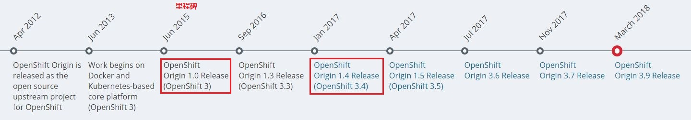
  
  2014 年 Kubernetes 诞生以后，Red Hat 决定对 OpenShift 进行重构（原先的架构不依托于 Kubernetes），正是该决定，彻底改变了 OpenShift 的命运以及后续 `PaaS` 市场的格局。  
  2015 年 6 月，Red Hat 推出了基于 `Kubernetes 1.0` 的 `OpenShift 3.0`。  
  🚀 2018 年 6 月，Red Hat 推出了基于 `Kubernetes 1.13` 的 `OpenShift 4.1`，在 OCP4 架构中引入及增强了 OCP3 中新功能。

- OpenShift 的客户端命令行工具 `oc` 命令取代 Kubernetes 的 `kubectl` 命令，相同版本下两者的使用方法与参数选项基本保持一致。
- OCP3 集群架构：
  
  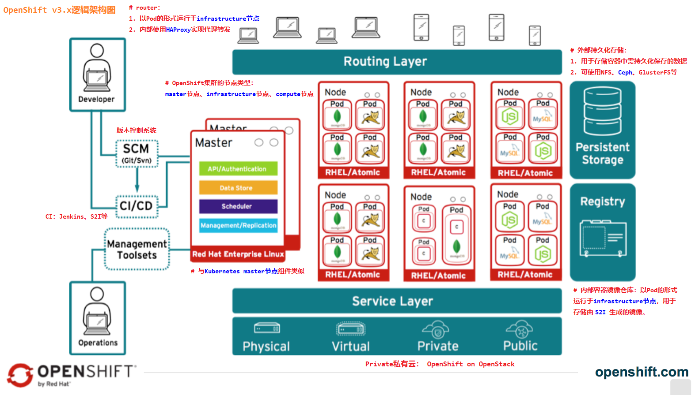

- OCP4 集群架构：
  
  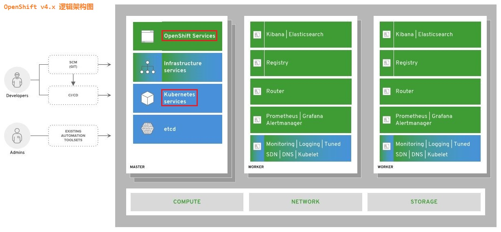
  
  OCP4 中已将 `Kubernetes service` 与 `OpenShift service` 进行解耦实现松耦合设计，使 OpenShift 集群自身的资源由自身的 service 进行管理，此处的 service 指控制平面（control plan）的服务组件与集群中的 service 资源相区别。
  
  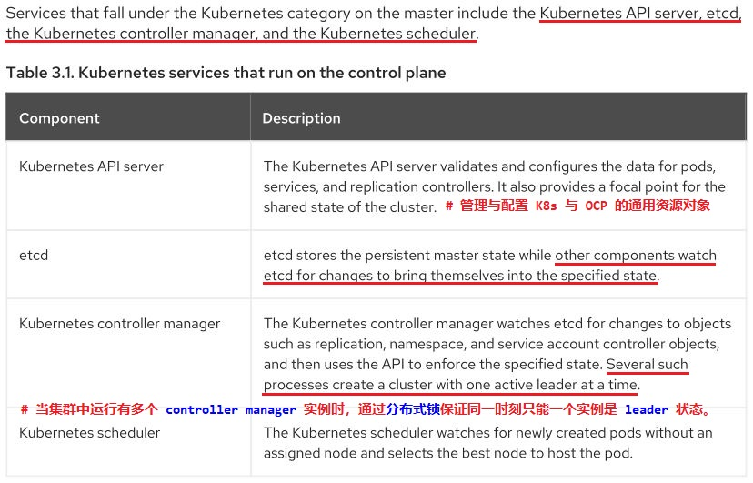
  
  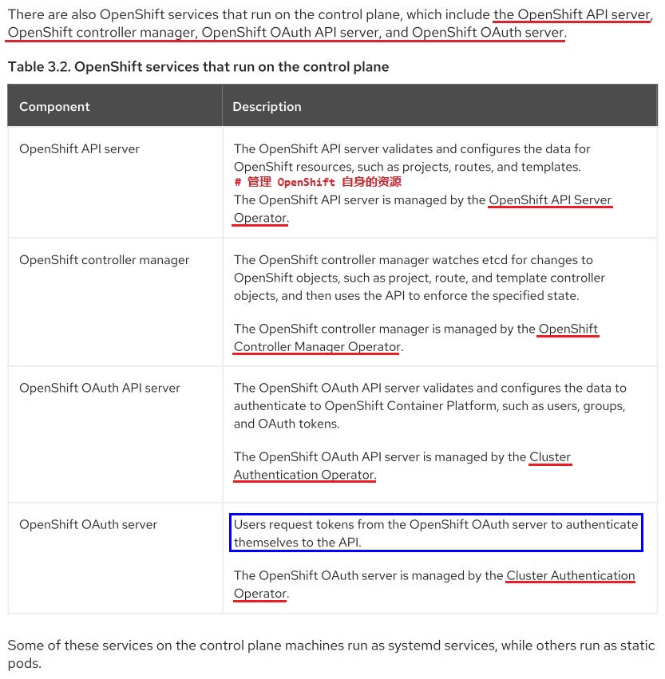

- OCP4 集群网络拓扑示例：  
  OCP3 与 OCP4 在集群 SDN 的选型上存在差异，如 OCP3 使用 `OVS` 插件实现 SDN 并且不能支持单 Pod 具有多个虚拟网络接口，而 OCP4 可使用 `OVS` 插件或 `OVN-Kubernetes` 插件并且支持单 Pod 具有多个虚拟网络接口，如下所示，OCP4 南北向流量与东西向流量拓扑。
  
  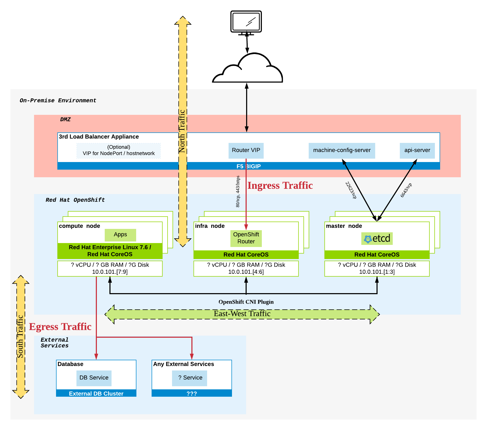

## 2. OpenShift 集群部署方法说明

- OCP3 集群部署方法：  
  - 生产环境：
    - OCP 3.4、3.5 集群部署使用 RPM 软件包，OCP 3.9、3.11 集群部署使用容器镜像。
    - 👉 OCP3 中使用 `Ansible` 部署 OpenShift。  
  - 开发与测试环境：
    - all-in-one：`AIO`（本地单节点集群），即 CRC 开发与测试环境。
    - OCP 二进制执行程序快速启动与部署
    - 👉 `minishift` 工具部署含 all-in-one 集群的虚拟机，与 `minikube` 非常类似。
  - 如下所示，minikube 在 RHEL 8.0 中的安装报错：

    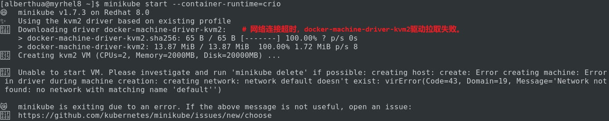

    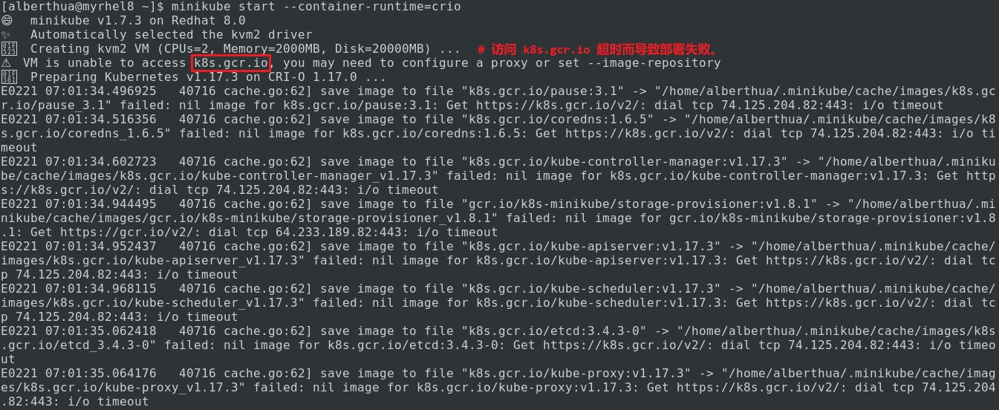

    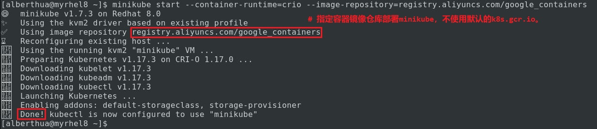

    ```bash
    $ minikube addons list
    # 查看 minikube Kubernetes 支持的插件列表
    ```

- OCP4 集群部署方法：
  - CRC 开发与测试环境：[Red Hat OpenShift Local (CRC) v2.35 部署与管理](https://github.com/Alberthua-Perl/tech-docs/blob/master/Red%20Hat%20OpenShift%20Container%20Platform/Red%20Hat%20OpenShift%20Local%20v2.35%20%E9%83%A8%E7%BD%B2%E4%B8%8E%E7%AE%A1%E7%90%86.md)
  - MicroShift 单节点集群环境（边缘计算场景）：[基于 RHEL9.3 的 Red Hat MicroShift v4.15 部署与管理](https://github.com/Alberthua-Perl/tech-docs/blob/master/Red%20Hat%20OpenShift%20Container%20Platform/%E5%9F%BA%E4%BA%8E%20RHEL9.3%20%E7%9A%84%20Red%20Hat%20MicroShift%20v4.15%20%E9%83%A8%E7%BD%B2%E4%B8%8E%E7%AE%A1%E7%90%86/%E5%9F%BA%E4%BA%8E%20RHEL9.3%20%E7%9A%84%20Red%20Hat%20MicroShift%20v4.15%20%E9%83%A8%E7%BD%B2%E4%B8%8E%E7%AE%A1%E7%90%86.md)

## 3. OpenShift 帮助与登录

- 帮助命令：
  
  ```bash
  $ oc version
  # 查看 OCP 与 K8s 版本信息
  
  $ oc <command> --help
  # 查看 oc 子命令的使用方法
  
  $ oc options
  # 查看 oc 命令行可用的选项
  
  $ oc api-resources
  # 查看当前集群中受支持的 API 资源，默认不区分是否在命名空间中。

  $ oc api-resources --namespaced=[true|false]
  # 查看命名空间内（true）或全局非命名空间（false）内的 API 资源

  $ oc api-resources --api-group=<api_group_name>
  # 指定 API 组查看其中支持的 API 资源
  $ oc api-resources --api-group=''
  # 查看核心 API 资源
  $ oc api-resources --api-group=operator.openshift.io
  # 查看 operator.openshift.io/v1 API 组的 API 资源

  $ oc api-resources --namespaced=true --api-group apps --sort-by name
  # 查看命名空间内，指定 API 组中支持的 API 资源，并根据 name 列排序。

  $ oc types
  # 查看 OCP 集群的概念与类型说明
  # 💥 注意：该子命令已在 OCP4 中不再使用！
  
  $ oc explain <resource_object>
  # 查看 OCP 集群指定资源对象的详细说明
  ```

  以下为 OCP4 (v4.14) 集群中获取的 operator.openshift.io/v1 的 API 资源：

  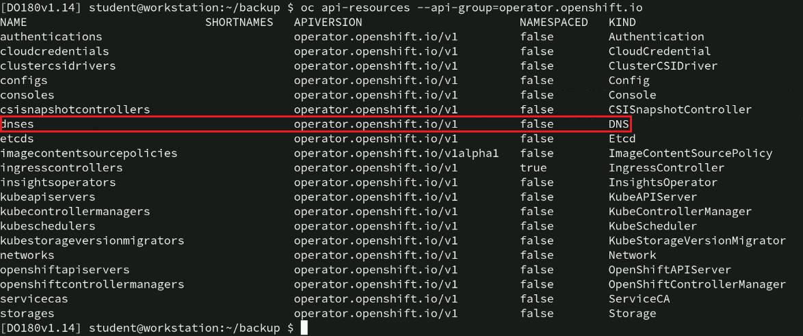

- 密码与字符串编码：
  
  ```bash
  $ authconfig --test | grep hashing
  # 查看系统支持的密码加密算法（每种系统发行版存在差异）
  
  $ openssl passwd -6 -salt <salt_value> <password>
  # 根据 salt 值通过 SHA512 哈希算法对明文密码加密，生成相应的哈希值。
  # 生成的密码与 /etc/shadow 中相应用户的密码相同
  $ openssl passwd -apr1 <password>
  # 根据 apr1 算法生成明文密码的哈希值
  $ openssl rand -base64 16 | tr -d '+=' | head -c 16
  # 对数字 16 生成 base64 编码的随机数，并取前 16 个字节。
  
  $ echo "<string>" | base64
  # 使用 base64 加密算法对字符串加密
  $ echo "<hash>" | base64 [-d|--decode]
  # 使用 base64 加密算法对哈希解密
  
  $ python -c \
    "import crypt, getpass, pwd; print crypt.crypt('<password>', '\$6\$<salt_vaule>\$')"
  # 根据 salt 值通过 SHA512 哈希算法对明文密码加密，生成相应的哈希值。
  # crypt 模块只可在 python2 环境中使用
  $ perl -e 'print crypt("<password>", "\$6\$<salt_value>\$")."\n"'
  # 使用 perl 生成明文密码的 SHA512 哈希值
  ```

- 集群登录：
  
  ```bash
  $ oc login \
    https://<hostname_of_ocp_apiserver>:8443 \
    -u <ocp_username> \
    -p <password> \
    --insecure-skip-tls-verify=true
  # 使用 OCP 集群管理员或项目用户远程登录 OCP 集群，成功登录后即可管理项目与应用。
  # oc 命令缓存用户与集群域名的凭据，并且 Web Console 控制台在 master 节点上运行。
  $ oc login https://ocp.lab.example.com:8443/console -u developer -p developer
  # 使用 OCP 集群项目用户远程登录
  # 成功登陆后用户的认证令牌（token）将保存在登录用本地用户（student）的家目录中，即 $HOME/.kube/config 中。
  
  $ oc login -u system:admin
  # OCP 集群管理员用户本地登录 master 节点，提高安全性。
  
  $ oc whoami
  # 查看当前登录 OCP 集群的项目用户
  
  $ oc logout
  # 登出 OCP 集群
  
  $ docker tag registry.lab.example.com/nginx:latest \
    docker-registry-default.apps.lab.example.com/webapp/nginx:latest
  # 更改外部容器镜像 tag 为 OCP 内部容器镜像 tag，将其推送至 OCP 内部容器镜像仓库。
  ```
  
  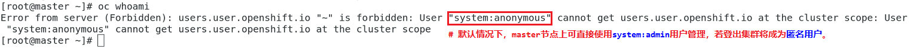
  
  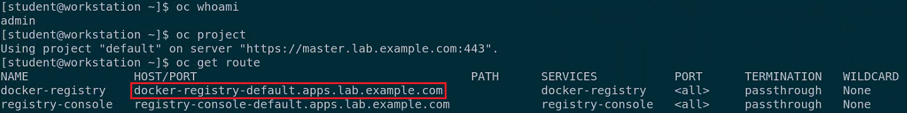

## 4. CRI-O 容器运行时相关命令

- 虽然流行的容器运行时包括 Docker、Containerd、Podman 等，但在 OpenShift 集群中的各节点上使用 CRI-O 容器运行时运行容器与 Pod。从 OCP4 开始，集群中的容器运行时均使用 CRI-O，不再使用 OCP3 中的 Docker。
- CRI-O 提供一个命令行接口可使用 `crictl` 工具管理容器与 Pod。
- 由于 OpenShift 课程环境的集群设置，可使用如下方法登录集群节点：

  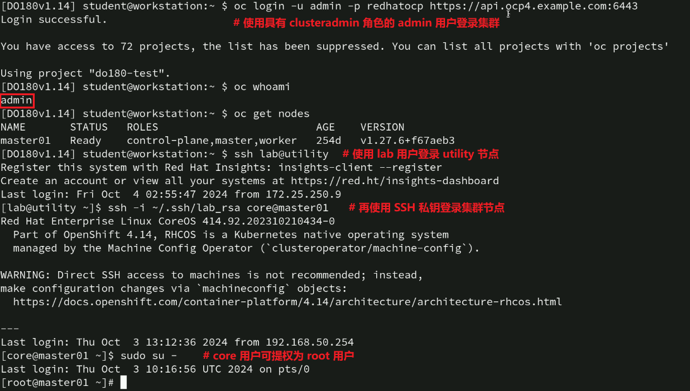

- 以上方法登录集群节点具有特殊性，而使用 `oc debug` 子命令将在指定的集群节点上启用 debug pod，通过此 pod 可对其宿主节点进行调试。

  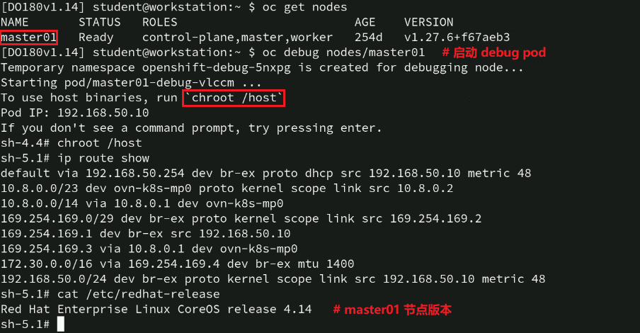

- crictl 工具使用示例：

  ```bash
  $ sudo crictl pods
  # 列举集群节点上的 pod 列表信息

  $ sudo crictl images
  # 查看集群节点上的容器镜像列表

  $ sudo crictl ps -o [json|yaml]
  # 查看集群节点上运行的容器

  $ sudo crictl inspect <container_id> | jq .info.pid
  # 获取指定容器中运行进程的 PID

  $ sudo crictl exec <container_id> <command> <arg1> <arg2> ... <argN>
  # 交互式地在指定的容器中运行命令
  $ sudo crictl exec -it <container_id> /bin/bash
  bash-4.4$ 

  $ sudo crictl logs <container_id>
  # 查看指定容器的标准输出与标准错误日志
  ```

  如下所示，crictl exec 子命令可交互式进入容器内部查看进程状态，同样也可利用 crictl 命令获取容器内进程 PID，再使用 `lsns` 与 `nsenter` 命令获取进程命名空间中的进程状态：

  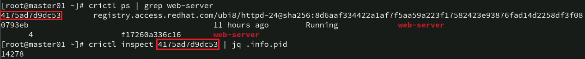

  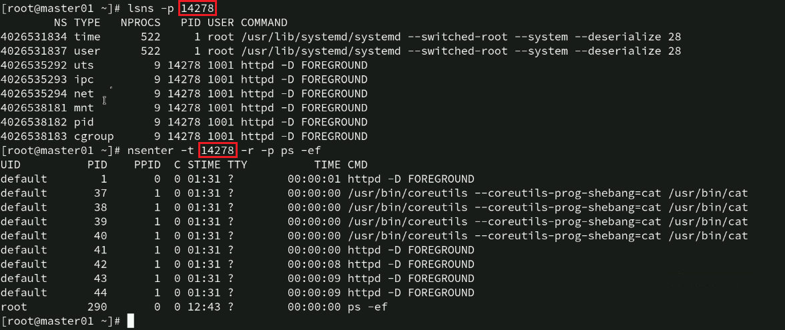

## 5. OpenShift 资源对象使用

- 常规操作命令：
  
  ```bash
  ### 获取资源对象状态 ###
  $ oc get nodes
  # 查看节点的概要信息（system:admin 用户或具有 cluster-admin 角色的用户执行）

  $ oc get pods --selector <key>=<value>
  # 根据 label 标签筛选指定的 pod

  $ oc get pod <pod_name> -n <project> | yq r - 'status.podIP'
  # 使用 yq 工具解析 pod 被分配的 IP 地址
  # 注意：新版本的 yq 工具与老版本存在兼容性问题！
  # 下载链接：https://mikefarah.gitbook.io/yq/ 与 https://kislyuk.github.io/yq/，两者不兼容！

  $ oc get pods \
    -o custom-columns=NameSpace:"metadata.namespace",\
    PodName:"metadata.name",\
    ContainerName:"spec.containers[].name",\
    Phase:"status.phase",\
    IP:"status.podIP",\
    HostIP:"status.hostIP",\
    Ports:"spec.containers[].ports[].containerPort"
  # -o custom-columns 选项指定输出格式

  $ oc get pods \
    -o jsonpath='{range .items[]}{"Pod Name: "}{.metadata.name}
    {"IP: "}{.status.podIP}
    {"Ports: "}{.spec.containers[].ports[].containerPort}{"\n"}{end}'
  # 使用 JSONPath 表达式指定输出格式

  $ oc get pods \
    -o go-template='{{range .items}}{{.metadata.name}}{{"\n"}}{{end}}'
  # 使用 Go 模版指定输出格式  
  
  $ oc get all [-n <project>]
  # 查看项目中所创建的所有资源的重要信息
  # 可指定项目名称，若不指定，则默认使用所在的项目。
  
  $ oc get <resource_type> <resource_name> -o [yaml|json] [-n <project>]
  # 查看指定资源对象的详细信息
  
  $ oc describe <resource_type> <resource_name> [-n <project>]
  # 查看指定资源的详细信息
  
  ### 创建与编辑资源对象 ###
  $ oc create -f <resource_defination_file>.json [-n <project>]
  # 以命令式 API 使用修改的资源定义文件创建新的资源
  # oc create 命令常与 oc export 命令一起使用
  
  $ oc edit <resource_type> <resource_name> [-n <project>]
  # 启用 vi 缓冲区以编辑指定资源的资源定义文件，编辑后即时生效。
  
  ### 删除资源对象 ###
  $ oc delete project <project>
  # 删除项目及其所有资源
  
  $ oc delete all --labels=<label>
  # 删除项目中所有相应标签的资源
  # 可在创建各项资源时添加标签，便于删除相应资源。

  $ oc delete pod <pod> --grace-period=<seconds>
  # pod 支持优雅终止，即在 Kubernetes 强制终止 pod 之前，pod 首先尝试终止它的进程。
  # --grace-period 选项指定 pod 被 Kubernetes 强制终止前的时间间隔

  $ oc delete pod <pod> [--grace-period=1|--now]
  # 立即删除指定的 pod

  $ oc delete pod <pod> --force
  # 强制删除指定的 pod
  # 注意：
  #   1. 若强制删除指定的 pod，Kubernetes 不等待 pod 中进程终止的确认，这将保留 pod 中的进程运行直至所在节点侦测到进程已被删除。
  #   2. 因此，强制删除 pod 可能导致不一致或数据丢失。
  ```

- 常用资源调试命令：
  
  ```bash
  $ oc exec <pod> [-c <container>] [-n <project>] -- <command> arg1 arg2 ... argN
  # 直接在 pod 中的容器内执行命令并返回结果
  # 💥 注意：
  #   1. 若忽略容器名称，Kubernetes 使用 pod 中的 `kubectl.kubernetes.io/default-container: <value>` 注释来选择容器。
  #   2. 否则，oc exec 子命令默认进入 pod 中的第一个容器执行命令，若 pod 中运行多容器，可使用 `-c, --container= ` 选项指定容器。
  
  $ oc exec <pod> [-c <container>] [-n <project>] -it -- /bin/bash
  # 以交互模式进入 pod (的指定容器) 运行环境中

  $ oc attach <pod> [-c <container>] [-n <project>] -it
  # 以交互模式进入 pod (的指定容器) 运行环境中
  
  $ oc port-forward <pod> <localhost_port>:<pod_port> [-n <project>]
  # 将本地节点的端口映射至远程 pod 的端口，不局限于 80 与 443 端口，可供开发人员使用调试。
  # 本地节点可以为 OCP 集群外节点，该方法提供了从 OCP 集群外访问 pod 的方式。
  
  $ oc rsh <pod> [-n <project>] bash -c '<command>' 
  # 使用远程 shell 会话在 pod 中运行命令，pod 中必须具有 shell 运行环境。
  
  $ oc rsh -t <pod> [-n <project>]
  # 使用远程 shell 会话交互方式进入 pod 运行环境
  # pod 中必须具有 shell 运行环境
  
  $ oc cp <path_of_file> <pod>:<path_of_file> [-n <project>]
  # 拷贝本地文件至 pod 中
  # 本地文件路径与 pod 中的文件路径都必须为文件名称，并且容器镜像中必须具有 tar 命令。 
  # 若不存在 tar 命令，oc cp 命令执行失败！
  # 
  # 拷贝本地文件至 pod 中，也可将 pod 中的文件拷贝至本地，如下所示：
  #   $ oc cp /home/developer/quote.sql quotesdb-1-fzrgd:/tmp/quote.sql 
  #   $ oc cp quotesdb-1-fzrgd:/tmp/quote.sql /home/developer/quote.sql
  # 
  # 使用场景：可用于将 pod 中的应用临时日志拷贝至本地节点的目标文件中

  $ oc volume pod <pod> [-n <project>]
  # 查看 pod 中容器的挂载点与 pvc 的对应关系
  
  $ oc volume dc <deploymentconfig> [-n <project>]
  # 查看部署配置中的 volume 信息（pvc）  
  ```

  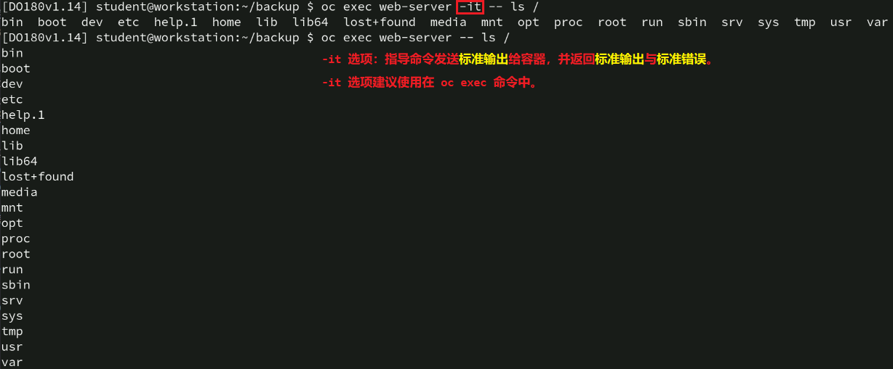

## 6. OpenShift 用户与访问控制

### 6.1 OpenShift 用户认证（Authentication）

- OCP 中的用户与组相关的资源：
  - 用户（User）：使用 `oc get users.user.openshift.io` 命令获取集群中的所有用户
  - 身份（Identity）：使用 `oc get identities.user.openshift.io` 命令获取集群中的身份信息

  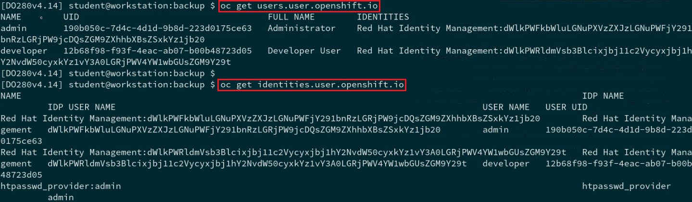

  - 服务账户（Service Account）
  - 组（Group）
  - 角色（Role）
- 认证的 API 请求：
  - 当用户向 API 发起请求，该 API 将用户与请求相关联。成功完成认证后，授权层既能接受也能拒绝该 API 请求。授权层使用基于角色的访问控制 (RBAC) 策略来决定用户的权限。
  - OpenShift API 处理认证请求的两种方式：
    - OAuth 访问 tokens
    - X.509 客户端证书
- 认证 Operator（Authentication Operator）：OCP 提供认证 Operator，它运行一个 OAuth server (openshift-authentication 项目中的 `oauth-server`)。当用户向 API 发起认证，OAuth server 为用户提供 OAuth 访问 tokens。身份提供者必须被配置，并且对 OAuth server 是可用的。OAuth server 使用一个身份提供者来验证请求者的身份。该服务器使用身份和解用户，并且为用户创建 OAuth 访问 token。在用户成功登录集群后 OpenShift 自动创建身份 (identity) 与用户 (user) 资源。

> 注意：身份作为用户与 OAuth 访问 token 的中间层，它可对接集群外部身份提供者。

- 身份提供者（Identity Providers）：
  - HTPasswd
  - Keystone v3
  - LDAP
  - GitHub or GitHub Enterprise
  - OpenID Connect
- 新安装的 OpenShift 集群使用集群管理员权限提供两种方法来认证 API 请求：
  - 1️⃣ 使用 `kubeconfig` 文件：已嵌入了永不过期的 `X.509` 客户端证书

    ```bash
    ### 方法1 ###
    $ export KUBECONFIG=/path/to/kubeconfig
    # 使用 KUBECONFIG 环境变量指定文件
    $ oc get nodes

    ### 方法2 ###
    $ oc --kubeconfig /path/to/kubeconfig get nodes
    ```

  - 2️⃣ 使用 `kubeadmin` 虚拟用户进行认证：成功认证后获取 OAuth 访问 token

    ```bash
    $ oc login -u <user_with_clusteradmin_role> -p <password> https://<apiserver_url>:<port>
    # 使用具有集群管理员权限的用户（默认为 kubeadmin）登录集群
    # 注意：若 $HOME/.kube/config 文件不存在，那么在执行该命令后将在此目录中生成该文件，其中包含集群信息、上下文信息与非集群管理员角色用户的 token 信息等。
    ```

    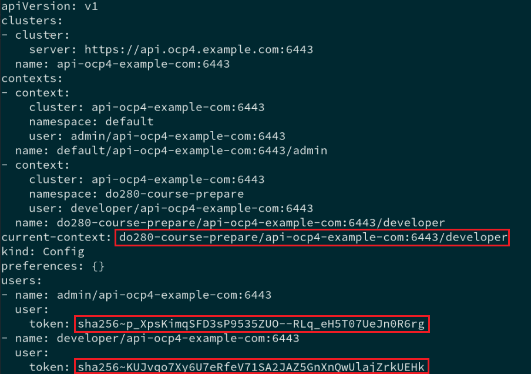

    kubeadmin 集群管理员用户的密码保存在 `kube-system` 命名空间中名为 `kubeadmin` 的 `secret` 中。因此，可使用以下方法验证密码的准确性：

    ```bash
    $ SECRET_DATA=$(oc get secret kubeadmin -n kube-system -o jsonpath='{range .items[]}{.data.kubeadmin}{"\n"}')
    # 返回以 base64 编码的 kubeadmin 集群管理员用户的加密密码
    # 注意：此密码不是明文的密码，而是通过 bcrypt 加密算法加密返回的哈希值，可根据明文密码与该哈希值进行验证。

    $ echo $SECRET_DATA | base64 -d; echo
    # 解开 base64 编码获取 bcrypt 加密过的哈希值，该哈希值可用如下程序验证。运行此程序可验证 kubeadmin 用户的密码。
    ```

    ```python
    ### file: verify_kube_passwd.py
    #!/usr/bin/env python3

    import bcrypt

    hashed_password = b'<hashed_password_from_secret>'  # 转换字符串类型为字节类型
    password_to_check = b'<kubeadmin_password>'

    if bcrypt.checkpw(password_to_check, hashed_password):
        print("kubeadmin password matched!")
    else:
        print("kubeadmin password NOT matched!")
    ```

- ✨ 多个 `kubeconfig` 配置文件的说明：
  - `$HOME/.kube/config` 文件：
    - 该 kubeconfig 文件位于集群用户的主目录下，通常是在开发者或者管理员的本地机器上。
    - 它用于用户的 `kubectl` 命令行工具与 Kubernetes 集群 API 服务器进行通信，进行资源的管理和操作。
    - 用户可以手动编辑这个文件来切换不同的 Kubernetes 集群或者更新访问凭证。
    - `$HOME/.kube/config` 文件中的凭证通常具有较为受限的权限，取决于用户的角色和权限设置。
    - 该文件是用户与 Kubernetes 集群交互的主要方式，可以通过 `kubectl config view` 命令来查看当前的配置。

    > 注意：OCP4 中若使用虚拟用户 token 的方式登录集群的话，$HOME/.kube/config 文件可不存在。当虚拟用户登录集群后将自动生成此文件。但此文件不包含集群认证证书，而包含虚拟用户的认证 token，与此文件的常规形式不同！

  - `/etc/kubernetes/kubeconfig` 文件：
    - 该 kubeconfig 文件通常存在于 Kubernetes 集群的控制平面节点（如 master 节点）上。
    - 它用于集群组件之间的通信，比如 `kube-apiserver`、`kube-controller-manager`、`kube-scheduler` 和 `etcd` 之间的认证和授权。
    - 该文件通常由集群安装工具在初始化集群时自动生成，并且不应该被手动编辑。
    - 该文件中的凭证通常具有较高的权限，因为它需要访问集群的所有资源以进行管理和调度操作。
    - 该文件的路径可能会根据集群的安装方式和配置有所不同。
  - `/etc/kubernetes/kubeconfig` 主要用于集群内部组件的通信，而 `$HOME/.kube/config` 用于用户与集群的交互。

### 6.2 OpenShift 用户授权（Authorized）

- 授权的过程由规则（rules）、角色（roles）与绑定（bindings）管理：
  - 规则（Rule）：允许对对象与组的行为
  - 角色（Role）：规则的集合。用户与组能与多个角色关联。
  - 绑定（Binding）：分配角色至用户与组。
- 基于角色的访问控制（`Role-based Access Control`, `RBAC`）：
  - OpenShift 3.0 的发布已提供了基于角色的访问控制（RBAC），而 `Kubernetes 1.6` 版本才提供该功能。
  - 用户与组通过绑定（binding）与角色（roles）相关联
- RBAC 作用域（RBAC Scope）：
  - 集群角色（Cluster Role）：具有此角色水平的用户或组能管理 OpenShift 集群
  - 项目角色（Project Role）：具有此角色水平的用户或组仅仅能管理项目水平的资源
- OCP 中的默认角色：
  - `admin`：具有此类角色的用户能管理所有项目资源，包括为其他用户提权以访问项目。
  - `basic-user`：具有此类角色的用户对项目有读取访问权限。
  - `cluster-admin`：具有此类角色的用户对集群资源具有超级用户的访问权限。这些用户能在集群上执行任何动作，对所有项目有完全的控住权。
  - `cluster-status`：具有此类角色的用户能获取集群状态信息。
  - 🧪 `edit`：具有此类角色的用户在项目中能创建、更改和删除常规应用资源，如 services 与 deployments。这些用户不能管理如 limitranges 与 quotas 等资源，并且不能管理对项目的访问权限。开发者用户常使用此类角色。
  - `self-provisioner`：具有此类角色的用户能创建项目。它是一种集群角色，而不是项目角色。
  - `view`：具有此类角色的用户能查看项目资源，但不能修改项目资源。
- OCP 中用户分类：
  - 普通用户（regular user）
  - 系统用户（system user）
  - 服务账户（service account）：
    - 服务账户是和项目相关的系统用户，是 Kubernetes 资源。工作负载能使用此系统账户来调用 Kubernetes APIs。
    - 默认情况下，服务账户没有角色。授予角色给服务账户来启用工作负载以使用指定的 APIs。
    - 服务账户代表在 pod 中运行应用的一种身份。
    - ✨ 为了授权应用访问 Kubernetes API，可执行以下内容：
      - 创建应用服务账户
      - 授权服务账户访问 Kubernetes API
      - 分配服务账户至应用 pod
    - 如果 pod 定义未指定服务账户，那么 pod 使用 `default` 服务账户。OpenShift 不为 default 服务账户授权权限。
    - 💥 不推荐为 default 服务账户授权额外的权限，因为这将为项目中的所有 pod 授权那些额外的权限，这可能不是有意的。  
- 若根据用户访问不同级别资源的权限划分，可分为：
  - 集群管理员（cluster administrator）：集群的最高权限管理员
  - 项目管理员（project administrator）：项目的最高权限管理员
  - 开发者（developer）：
    - 管理项目资源的子集
    - 资源的子集包括：buildconfig, deploymentconfig, pvc, service, secret, route
    - 该类型的用户不能为其他用户对资源进行提权，也不能管理项目级别（project-level）的资源。
- 👉 没有身份验证或身份验证无效的 API 请求由匿名系统用户（anonymous system user）作为请求进行身份验证。
- 👉 身份验证成功后，策略确定授权用户执行的操作。
- 用户与组可同时绑定一个或多个本地项目角色与集群角色。

- RBAC 常用命令：

  ```bash
  ### 普通用户 ###
  $ oc adm policy add-cluster-role-to-user cluster-admin admin
  # 为 admin 用户添加 cluster-role 集群管理员角色

  $ oc adm policy remove-cluster-role-from-user cluster-admin admin
  # 为 admin 用户移除 cluster-role 集群管理员角色

  $ oc adm policy remove-cluster-role-from-group \
    self-provisioner \
    system:authenticated:oauth
  # 从集群角色中删除自调配角色，使已认证的 OAuth 用户与组无法调配创建新项目。
  
  $ oc adm policy add-cluster-role-from-group \
    self-provisioner \
    system:authenticated \
    system:authenticated:oauth
  # 集群角色中添加自调配角色，使已认证的 OAuth 用户与组能调配创建新项目。
  ```

  ```bash
  $ oc policy add-role-to-user <role> <username> -n <project>
  # 指定项目为用户添加角色

  $ oc policy add-role-to-user basic-user developer -n wordpress
  # 为 developer 用户在 wordpress 项目中添加 basic-user 角色
  # 注意：basic-user 角色是集群角色，指定项目可限制在该项目中。
  ```

  ```bash
  $ oc adm groups new <group_name>
  # 创建新用户组
  $ oc adm groups add-user <group_name> <user_name>
  # 添加用户至指定的组中
  ```
  
  ```bash
  $ oc get clusterrole
  # 查看集群角色信息    
  $ oc describe clusterrole system:<role>
  # 查看集群角色的详细信息
  ```
  
  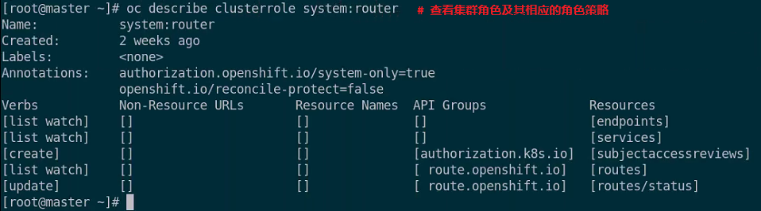
  
  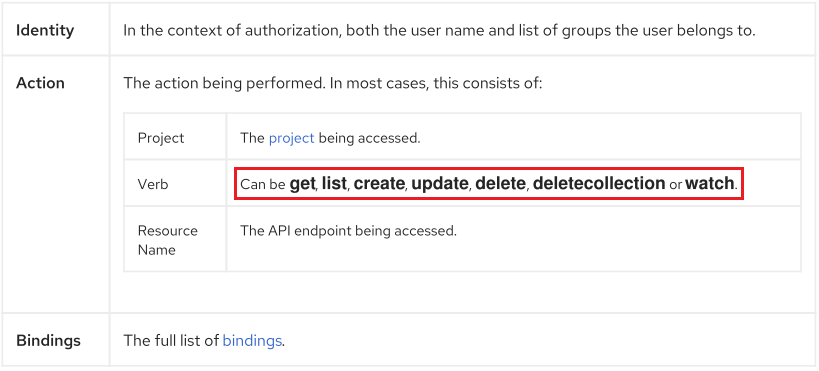
  
  ```bash
  $ oc describe clusterrole self-provisioner
  # 查看自调配角色的详细信息
  $ oc get clusterrolebinding.rbac -n default
  # 查看集群角色绑定的信息
  $ oc get rolebinding.rbac -n <project_name>
  # 查看指定项目中用户的本地项目角色绑定信息
  ```
  
  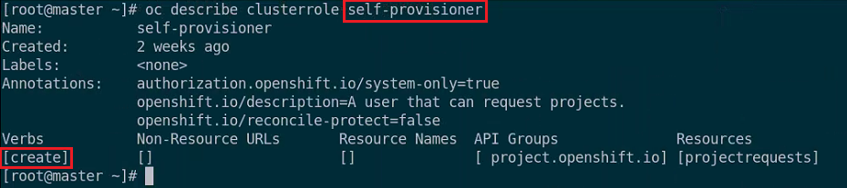

- OCP 中的 ServiceAccount 与 SCC 的关系：

  ```bash
  $ oc get deployment <deployment_name> -o yaml | \
    oc adm policy scc-subject-review [-u <username>] -f -
  # 根据 deployment 查询指定用户的安全上下文约束

  $ oc create serviceaccount <serviceaccount_name> [-n <project>]
  # 在指定项目中创建服务账户，该账户可用于pod与api-server的通信认证。
  # 注意：服务账户必须由具有项目管理员角色的用户创建
  $ oc create serviceaccount wordpress -n farm

  $ oc adm policy \
    add-scc-to-user anyuid -z <serviceaccount_name> -n <project> 
  # 使用 system:admin 用户或具有 cluster-admin 角色的用户为指定项目的服务账户添加 anyuid 安全上下文约束（SCC）
  # 该安全上下文约束可使 pod 中运行应用的用户提权至 root 权限

  $ oc set serviceaccount deployment/<deployment_name> <serviceaccount_name> -n <project>
  # 将项目中的 serviceaccount 与 deployment 关联
  # 比如通过此种方式可将关联有 SCC 的 serviceaccount 与 deployment 关联
  ```

  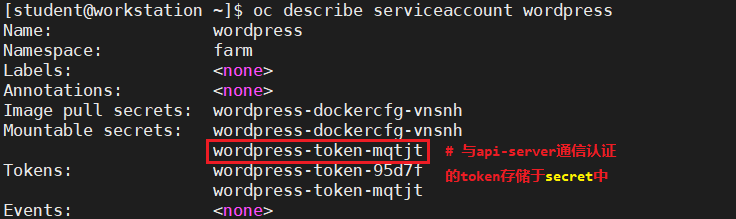

- 在不同命名空间中访问 Kubernetes API 资源：
  - 使用服务账户与不同角色的绑定可实现不用命名空间中应用 pod 对其他命名空间中资源的访问。
  - 如，使用以下步骤完成 project1 命名空间中应用 app-pod 访问 project2 命名空间中的 secret 资源：
    - project1 命名空间中创建名为 app-sa 的服务账户
    - 为 project1 命名空间中 app-pod 被分配 app-sa 服务账户
    - 在 project2 命名空间中创建 `RoleBinding`，即 `system:serviceaccount:project1:app-sa` 服务账户与 `secret-reader` 集群角色绑定。

    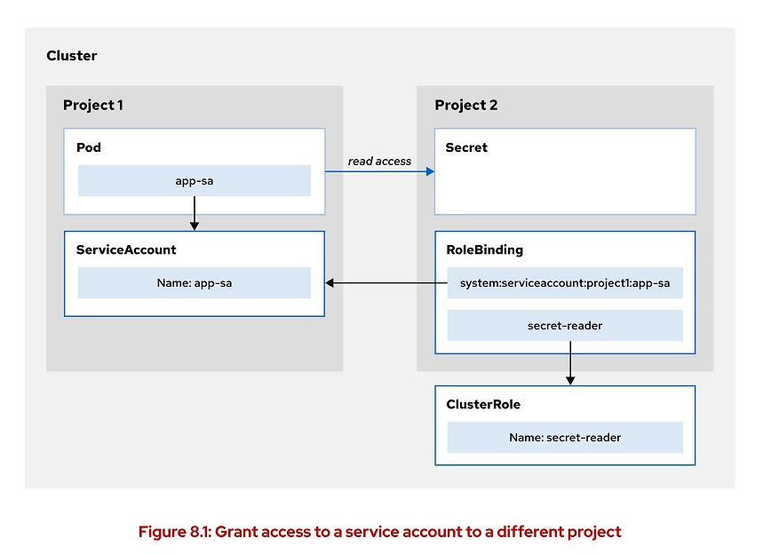

  ```bash
  $ oc adm policy add-cluster-role-to-user <cluster_role> <serviceaccount_name>
  # 为服务账户添加集群管理员角色

  $ oc adm policy add-role-to-user <role> -z <serviceaccount_name> -n <project>
  # 为指定项目中服务账户添加角色
  ```

## 7. OpenShift Pod 的调度

- 为 OCP 集群计算节点添加 label 标签：
  
  ```bash
  $ oc label node <node_fqdn> <key>=<value> [--overwrite]
  # 设置（覆盖）已存在的 node 节点标签
  
  $ oc label node node2.lab.example.com region=app --overwrite 
  # 设置（覆盖）已存在的节点标签 region 为 app
  # 设置的节点标签可被 pod 的节点选择器 Pod.spec.nodeSelector 使用，使其调度至该节点。
  ```
  
  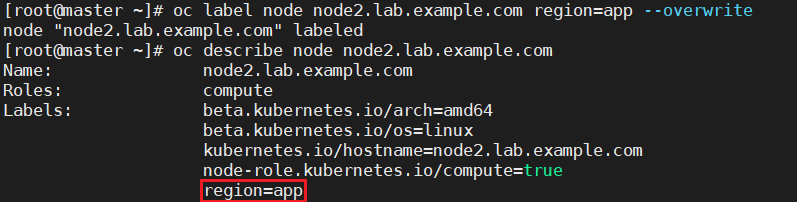

> ✅ region 为地理概念，zone 为不同的机柜/架或机房（故障恢复域）。

- 管理计算节点的 pod 可调度性：
  
  ```bash
  $ oc adm manage-node --schedulable=false <node_fqdn>
  # 设置 node 节点为 pod 不可调度状态
  ```
  
  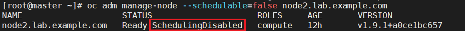
  
  ```bash
  $ oc adm manage-node <node_fqdn> --evacuate --pod-selector='<key>'='<value>'
  # 指定 pod 标签从 node 节点上迁移指定的 pod
  ```
  
  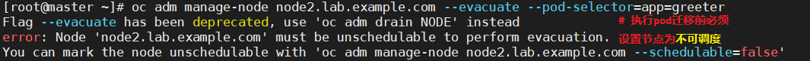
  
  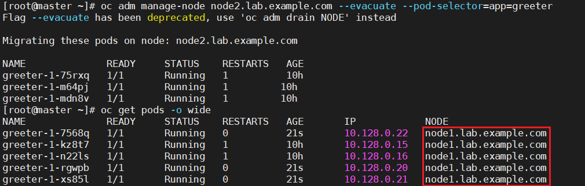
  
  ```bash
  $ oc adm drain <node_fqdn> [--delete-local-data]
  # 从 node 节点上撤离所有运行的 pod
  # 若 pod 中已挂载使用相应的 pvc，在撤离时将报错，无法卸载已使用的 pvc！
  ```
  
  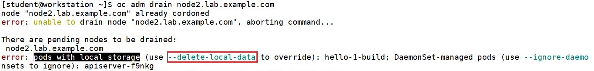
  
  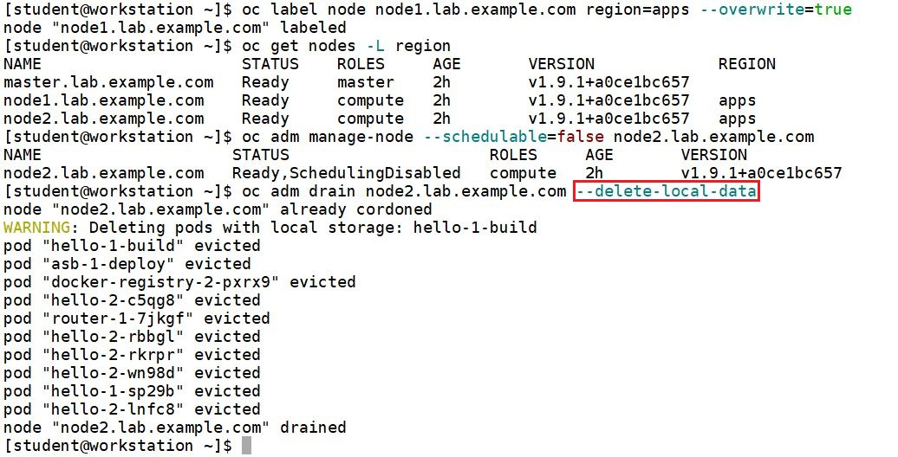

## 8. OpenShift 服务与路由使用

- 使用 oc 命令行方式创建 service：

  ```bash
  $ oc expose deployment/<deployment_name> \
    --selector <key>=<vaule> \
    --port <port> --target-port <port> --protocol [TCP|UDP] \
    --name <svc_name>
  # 使用 selector 选择器时对应的 label 必须与 pod 中的相互匹配  

  ### 示例 ###
  $ oc expose deployment/golang-codeready-workspace \
    --selector app=golang-codeready-workspace \
    --port 8080 --target-port 8080 --protocol TCP \
    --name gcw  
  ```

- 方式 1：指定 route 路由名称、对应 service 的端口号与对外暴露的 URL 以创建
  
  ```bash
  $ oc expose svc <service_name> \
    --name=<route_name> --port=<service_port> \
    --hostname=<custom_name>.<wildcard_domain> [-n <project>]
  ```

- 方式 2：直接指定 route 路由名称创建
  
  ```bash
  $ oc expose svc temp-cvt --name=ocp
  # --name        指定 route 的名称
  #               若不指定 route 的名称，则使用 application_name 代替 route_name。
  # --hostname    指定对外的公网域名
  #               默认的对外公网域名：<route_name-project_name>.<wildcard_domain>
  # 注意：可使用相同的 service 创建不同的 route 资源，而之前的 route 可不删除！
  ```

- 🚀 方式 3：创建安全边界终结型路由
  
  ```bash
  $ oc create route edge \
    --service=<service_name> --hostname=<exposed_fqdn_url> \
    --key=<ca_trusted_private_key>.key --cert=<ca_trusted_certificate>.crt
  # 使用 CA 私钥与 CA 签名的证书为 service 创建安全的边界型路由规则（secure edge-terminated）
  
  $ oc get route <route_name> [-n <project>] -o jsonpath='{..spec.host}{"\n"}'
  # 解析返回暴露的路由对应的应用 URL
  ```

- 模板（`template`）与 `Web Console` 中已嵌入 route 资源，因此可直接创建。
- 🪡 OCP 3.9 版本中删除 route 并重建后无法生效，报错 `HostAlreadyClaimed`，Bugfix 请详见 [Bug 1660598 - HostAlreadyClaimed route issue on path based route](https://bugzilla.redhat.com/show_bug.cgi?id=1660598)。
  
  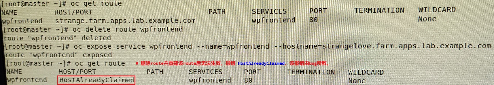
  
  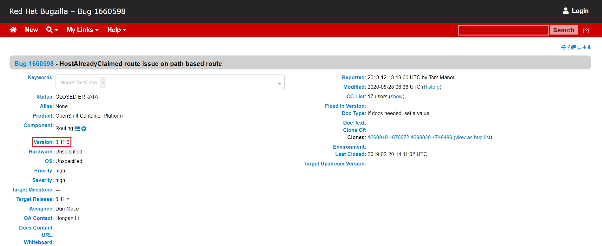

- 💎 补充：
  在 OCP4 集群中默认情况下普通用户无法访问 `openshift-console` 项目中的资源，可设置相应项目的 rolebindings 使普通用户可访问。

## 9. OpenShift 日志与事件

- 容器日志是容器的标准输出（stdout）与标准错误（stderr）
- 常规日志与事件查看：
  
  ```bash
  $ oc logs <resource_type> <resource_name> [-n <project>]
  # 查看指定资源的日志信息，该日志信息不输出至 /var/log/messages。
  
  $ oc logs <pod> [-n <project>] [-f|--follow] [--tail=N] [-c|--container=<container_name>] [-p|--previous=true]
  # 查看 pod 的运行日志
  # 重要选项：
  #   -f, --fllow 选项：追踪容器的输出日志
  #   --tail=N 选项：指定输出容器的最后几行日志
  #   -c, --container=<container_name> 选项：指定 pod 内的容器
  #   -p, --previous=[true|false] 选项：指定是否输出 pod 内前一个容器的日志
  
  $ oc get [events|ev] [-n <project>]
  # 查看 OCP 集群的事件信息，常用于 troubleshooting 排错。
  # 也可在 Web Console 的 Monitoring > Events 中查看事件信息
  ```

## 参考链接

- Architecture
  - [Red Hat OpenShift Container Platform 4.6 Architecture](https://access.redhat.com/documentation/en-us/openshift_container_platform/4.6/html-single/architecture/index)
- CRI
  - [Container Runtime Interface (CRI) CLI](https://github.com/kubernetes-sigs/cri-tools/blob/master/docs/crictl.md#container-runtime-interface-cri-cli)
  - [GitHub - cri-api](https://github.com/kubernetes/cri-api)
- Pod
  - [Kubernetes Doc - Pods](https://kubernetes.io/docs/concepts/workloads/pods/)  
- Network
  - [Kubernetes Doc - Cluster Networking](https://kubernetes.io/docs/concepts/cluster-administration/networking/)
  - [Red Hat OpenShift v3.11 東西南北向網路探討](https://blog.pichuang.com.tw/20190404-openshift-network-traffic-overview/)
  - [Red Hat OpenShift v4 東西南北向網路流](https://blog.pichuang.com.tw/20200413-openshift4-network-traffic-overview/)
  - [Chapter 5. Cluster Network Operator in OpenShift Container Platform](https://docs.redhat.com/en/documentation/openshift_container_platform/4.14/html-single/networking/index#cluster-network-operator)
  - 🔥 [About the OVN-Kubernetes network plugin](https://docs.openshift.com/container-platform/4.14/networking/ovn_kubernetes_network_provider/about-ovn-kubernetes.html)
  - 🔥 [Chapter 24. OVN-Kubernetes network plugin](https://docs.redhat.com/en/documentation/openshift_container_platform/4.14/html-single/networking/index#about-ovn-kubernetes)
- Service Discovery
  - [GitHub Doc - SkyDNS](https://github.com/skynetservices/skydns)
  - [GitHub Doc - CoreDNS](https://github.com/coredns/coredns)
- Configure Reloader
  - ✨ [GitHub Doc - Reloader: Reloader can watch changes in ConfigMap and Secret and do rolling upgrades on Pods with their associated DeploymentConfigs, Deployments, Daemonsets Statefulsets and Rollouts.](https://github.com/stakater/Reloader)
