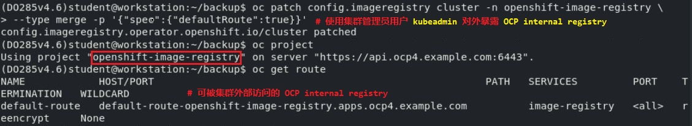

# ⭕ Red Hat OpenShift 基础架构与原理详解

## 文档说明

- 该文档作为笔者在学习与实践 OpenShift 过程中的总结与感悟，难免存在纰漏，望不吝赐教。
- 该文档主要根据 `Red Hat OpenShift Container Platform v3.9` 与 `v4.14` 环境实践。
- 以下分别称为 `OCP3` 与 `OCP4`。
- 其中涉及的选项与参数在绝大部分版本中适用，但部分版本可能略有不同，请参考实际使用版本。
- 以上两个版本在架构与资源对象概念上存在诸多相同点，若未特别说明，即两者均适用。

## 文档目录

- OpenShift 基础架构概述
- OpenShift 集群部署方法说明
- OpenShift 帮助与登录
- 🔥 OpenShift 资源对象详解
- 🧪 OpenShift 资源对象使用
- OpenShift 路由使用
- OpenShift 日志与事件
- OpenShift Pod 的调度
- OpenShift 用户与访问控制
- 参考链接

## OpenShift 基础架构概述

- 上游 `Origin` 项目与 `OpenShift` 项目的发展对应关系：
  
  
  
  2014 年 Kubernetes 诞生以后，Red Hat 决定对 OpenShift 进行重构（原先的架构不依托于 Kubernetes），正是该决定，彻底改变了 OpenShift 的命运以及后续 `PaaS` 市场的格局。  
  2015 年 6 月，Red Hat 推出了基于 `Kubernetes 1.0` 的 `OpenShift 3.0`。  
  🚀 2018 年 6 月，Red Hat 推出了基于 `Kubernetes 1.13` 的 `OpenShift 4.1`，在 OCP4 架构中引入及增强了 OCP3 中新功能。

- OpenShift 的客户端命令行工具 `oc` 命令取代 Kubernetes 的 `kubectl` 命令，相同版本下两者的使用方法与参数选项基本保持一致。
- OCP3 集群架构：
  
  

- OCP4 集群架构：
  
  
  
  OCP4 中已将 `Kubernetes service` 与 `OpenShift service` 进行解耦实现松耦合设计，使 OpenShift 集群自身的资源由自身的 service 进行管理，此处的 service 指控制平面（control plan）的服务组件与集群中的 service 资源相区别。
  
  
  
  

- OCP4 集群网络拓扑示例：  
  OCP3 与 OCP4 在集群 SDN 的选型上存在差异，如 OCP3 使用 `OVS` 插件实现 SDN 并且不能支持单 Pod 具有多个虚拟网络接口，而 OCP4 可使用 `OVS` 插件或 `OVN-Kubernetes` 插件并且支持单 Pod 具有多个虚拟网络接口，如下所示，OCP4 南北向流量与东西向流量拓扑。
  
  

## OpenShift 集群部署方法说明

- OCP3 集群部署方法：  
  - 生产环境：
    - OCP 3.4、3.5 集群部署使用 RPM 软件包，OCP 3.9、3.11 集群部署使用容器镜像。
    - 👉 OCP3 中使用 `Ansible` 部署 OpenShift。  
  - 开发与测试环境：
    - all-in-one：`AIO`（本地单节点集群），即 CRC 开发与测试环境。
    - OCP 二进制执行程序快速启动与部署
    - 👉 `minishift` 工具部署含 all-in-one 集群的虚拟机，与 `minikube` 非常类似。
  - 如下所示，minikube 在 RHEL 8.0 中的安装报错：

    

    

    

    ```bash
    $ minikube addons list
    # 查看 minikube Kubernetes 支持的插件列表
    ```

## OpenShift 帮助与登录

- 帮助命令：
  
  ```bash
  $ oc version
  # 查看 OCP 与 K8s 版本信息
  
  $ oc <command> --help
  # 查看 oc 子命令的使用方法
  
  $ oc options
  # 查看 oc 命令行可用的选项
  
  $ oc types
  # 查看 OCP 集群的概念与类型说明
  
  $ oc explain <resource_object>
  # 查看 OCP 集群指定资源对象的详细说明
  ```

- 密码与字符串编码：
  
  ```bash
  $ authconfig --test | grep hashing
  # 查看系统支持的密码加密算法（每种系统发行版存在差异）
  
  $ openssl passwd -6 -salt <salt_value> <password>
  # 根据 salt 值通过 SHA512 哈希算法对明文密码加密，生成相应的哈希值。
  # 生成的密码与 /etc/shadow 中相应用户的密码相同
  $ openssl passwd -apr1 <password>
  # 根据 apr1 算法生成明文密码的哈希值
  $ openssl rand -base64 16 | tr -d '+=' | head -c 16
  # 对数字 16 生成 base64 编码的随机数，并取前 16 个字节。
  
  $ echo "<string>" | base64
  # 使用 base64 加密算法对字符串加密
  $ echo "<hash>" | base64 -d
  # 使用 base64 加密算法对哈希解密
  
  $ python -c \
    "import crypt, getpass, pwd; print crypt.crypt('<password>', '\$6\$<salt_vaule>\$')"
  # 根据 salt 值通过 SHA512 哈希算法对明文密码加密，生成相应的哈希值。
  # crypt 模块只可在 python2 环境中使用
  $ perl -e 'print crypt("<password>", "\$6\$<salt_value>\$")."\n"'
  # 使用 perl 生成明文密码的 SHA512 哈希值
  ```

- 集群登录：
  
  ```bash
  $ oc login \
    https://<hostname_of_ocp_apiserver>:8443 \
    -u <ocp_username> \
    -p <password> \
    --insecure-skip-tls-verify=true
  # 使用 OCP 集群管理员或项目用户远程登录 OCP 集群，成功登录后即可管理项目与应用。
  # oc 命令缓存用户与集群域名的凭据，并且 Web Console 控制台在 master 节点上运行。
  $ oc login https://ocp.lab.example.com:8443/console -u developer -p developer
  # 使用 OCP 集群项目用户远程登录
  # 成功登陆后用户的认证令牌（token）将保存在登录用本地用户（student）的家目录中，即 $HOME/.kube/config 中。
  
  $ oc login -u system:admin
  # OCP 集群管理员用户本地登录 master 节点，提高安全性。
  
  $ oc whoami
  # 查看当前登录 OCP 集群的项目用户
  
  $ oc logout
  # 登出 OCP 集群
  
  $ docker tag registry.lab.example.com/nginx:latest \
    docker-registry-default.apps.lab.example.com/webapp/nginx:latest
  # 更改外部容器镜像 tag 为 OCP 内部容器镜像 tag，将其推送至 OCP 内部容器镜像仓库。
  ```
  
  
  
  

## OpenShift 资源对象详解

- master 节点：
  - OCP 集群或 Kubernetes 集群的控制节点
  - 生产环境中建议使用 3 个或奇数个 master 节点确保控制平面（control plane）的高可用性，推荐将 etcd 数据库集群单独分开。
  - OCP 3.4、3.5 的 master 节点：不运行 pod，核心组件以 `systemd` 服务的方式运行。
  - OCP 3.9、3.11 的 master 节点：可运行 pod，核心组件也以 `pod` 的方式运行。
  - master 节点执行的服务包括：
    - `apiserver`（包括 authentication/authorization）：
      - 接收、响应来自集群内部与外部的 `Restful API` 请求。
      - 处理 OCP 集群内的用户与服务的身份认证/授权服务（`oAuth`）。
    - `controller-manager`：
      控制管理器，用于实现无状态 pod 与有状态 pod 的控制管理。
    - `scheduler`：
      调度器，用于实现 pod 在各个 node 节点上的分配调度。
    - `data-store`：
      `etcd` 分布式键值型数据库，用于服务配置发现，OCP 集群中的数据存储与核心。

      

      

- compute 节点
  - OCP 集群与 Kubernetes 集群的计算节点
  - compute 节点用于运行 pod 提供服务
  - compute 节点的 docker 守护进程异常而导致 `atomic-openshift-node` 服务报错。
  - 每个节点上的 `atomic-openshift-node` 服务已集成 `kubelet` 功能。

      

    

- project：
  - 项目，也称为命名空间（namespace），OCP 集群使用项目来隔离资源（硬隔离），区别于 Linux namespace。
  - 若未将 `self-provisioner` 角色从指定用户去除，使用指定用户创建的项目，该用户即为项目的项目管理员。
  - default 项目与 openshift 项目能被所有用户使用，但只能由 `system:admin` 用户或具有 `cluster-admin` 角色的用户管理。
- image stream（`is`）、image stream tag（`istag`）：
  - 镜像流、镜像流标签：

    ```bash
    $ oc get imagestream -n openshift -o name
    # 查看 openshift 项目中所有的镜像流名称
    ```
  
  - image stream 是容器镜像在 OCP 集群中的镜像元数据拷贝，它可存储当前的与过去的容器镜像层，用于加速查询与显示容器镜像。
  - 一个 image stream 为一系列 iamge stream tags 提供默认的配置。
  - 每个 image stream tag 引用一个容器镜像流（container image stream）。
  - 每个 image stream tag 使用对应的镜像 ID（image ID），其使用 `SHA-256` 哈希唯一地标识一个不可变的容器镜像，并且不能修改镜像，相反，需创建一个具有新 ID 的新容器镜像。
  - image stream tag 保存了从 OCP external registry 或 OCP internal registry 获取的最新 image ID 的历史记录。

    
  
  - image stream tag 中当前引用的容器镜像前带 `*` 号，通常位于镜像列表的第一个。
  - 可使用 image stream tag 内的历史记录回滚到以前的镜像，如，若一个新的容器镜像导致部署错误，可回滚至之前的镜像版本。
  - 在 OCP external registry 中更新容器镜像不会自动更新 image stream tag。
  - image stream tag 将引用它获取的最后一个 image ID，这种行为对于扩展应用程序至关重要，因为它将 OpenShift 与 OCP external registry 上发生的更改隔离开来。
  - 因此，OCP external registry 中的容器镜像发生更新，需同时更新 image stream tag 以使用对应的 image ID，否则 image stream tag 依然使用原始的 image ID。
  - OpenShift 确保新部署的 pod 使用的 image ID 与第一个部署的 pod 的 image ID 是相同的。
  - `openshift` 项目中保存 S2I 使用的构建镜像（S2I builder image）的 image stream。
  - 构建镜像的组成：基础 OS 运行环境、编程语言环境、应用依赖、编程语言框架等
  - image stream 引用的容器镜像可来自 `OCP external registry` 或 `OCP internal registry`。
  - 以下可作为 OCP external registry：
    - docker.io
    - registry.access.redhat.com
    - registry.redhat.io
    - quay.io
    - 公司或组织内部的 Harbor、Red Hat Quay、registry v2、docker-distribution 等
      > 👉 关于 Red Hat Quay 的容器镜像仓库的原理与部署可参考 [此 GitHub 链接](https://github.com/Alberthua-Perl/tech-docs/blob/master/Red%20Hat%20Quay%20v3%20registry%20%E5%8E%9F%E7%90%86%E4%B8%8E%E5%AE%9E%E7%8E%B0.md)。
  
  - 以下可作为 OCP internal registry：
    > ✅ external 与 internal 相对于 OCP 集群内外而言。
    - OCP 集群内的 docker-registry pod
    - OCP 集群内的 quay pod
  
  - 从 OCP external registry 导入外部容器镜像至 OCP 集群：
    - 方式 1：
      `skopeo` 命令拷贝已从 OCP external registry 中拷贝的 `OCI` 格式目录至 OCP internal registry 中成为指定项目的 image stream，该 image stream 在项目中会自动创建（见如下补充中的示例）。
    - 方式 2：
      > 💥 若 openshift 项目中存在 image stream tag 但不引用任何镜像时，需导入 image stream tag 至容器镜像的引用。
      - oc import-image 命令创建 `image stream tag` 引用外部 `公共` 容器镜像。

        ```bash
        $ oc import-image <imagestream>:[<tag>] --confirm \
          --from <container_registry_for_imagestream> [--insecure] \
          -n <project_name>
        # 在指定项目中创建 image stream tag 引用外部容器镜像
        # 需确认容器镜像仓库是否使用 TLS 连接
        # 注意：
        #   openshift 项目中 image stream 无法使用相应 tag 的容器镜像报错处理：
        #   1. 查看集成的 OCP 外部镜像仓库中是否具有相应 tag 的容器镜像
        #   2. 删除报错的 image stream，报错信息如 "! error: Import ..."。
        #      $ oc tag -d <imagestream>:<tag> -n openshift 
        #   3. 重新导入 OCP 外部镜像仓库中的容器镜像的 metadata 至 image stream。
        #      $ oc import-image apache-httpd:2.5 --confirm \
        #        --from registry.lab.example.com:5000/do288/apache-httpd \
        #        --insecure -n openshift
        
        $ oc import-image <imagestream>[:<tag>] --confirm
        # 指定当前存在的 image stream 更新其引用至 OCP external registry 中最新的 image ID
        ```

      - oc import-image 命令创建 `image stream tag` 引用外部 `私有` 容器镜像。
        引用外部私有容器镜像时需提供 `access token` 作为 secret，这与通过外部私有容器镜像仓库中的镜像部署应用的方式相同，只是不需要链接（link）任何 service account，oc import-image 命令能在当前项目中搜寻匹配外部私有容器镜像仓库名称的 secret，如下所示：

        

      - 👨‍💻 以上示例如下：

        ```bash
        $ podman login -u alberthua quay.io
        $ oc create secret generic privateis \
          --from-file .dockerconfigjson=/run/user/1000/containers/auth.json \
          --type kubernetes.io/dockerconfigjson
        $ oc import-image nginx-ssl:1.0.1 --confirm \
          --from quay.io/alberthua/nginx-ssl:1.0.1
        ```

    - 🚀 默认情况下，oc import-image 命令使用 `--reference-policy=source` 选项，创建 image stream tag 引用 OCP external registry，不将容器镜像缓存至 OCP internal registry 中，因此，删除外部私有镜像仓库后将无法构建应用镜像。
      - 未删除外部私有镜像时，可被正确拉取构建，追踪 BUILD_LOGLEVEL=4 的 build 日志，如下所示：

        

      - 删除外部私有镜像后，将无法从外部拉取，如下所示：

        

    - 🚀 而 `--reference-policy=local` 将 OCP external registry 中的容器镜像缓存至 OCP internal registry，相当于在集群本地实现了 `镜像缓存`，可加速应用构建，即使删除外部私有镜像后也不影响应用镜像的构建，如下所示：

      

      skopeo 命令验证是否存在镜像缓存：

      

    - 👨‍💻 示例：
      使用 S2I 方式与导入的外部私有构建镜像构建 `NodeJS` 应用
      > 该示例说明以上 --reference-policy=local 选项的使用

      ```bash
      $ podman login -u alberthua quay.io
      $ oc create secret generic quaypriv \
        --from-file .dockerconfigjson=/run/user/1000/containers/auth.json \
        --type kubernetes.io/dockerconfigjson
      $ oc import-image nodejs:12-latest \
        --confirm \
        --reference-policy local \
        --from quay.io/alberthua/nodejs-12-rhel7:latest
      # 创建 image stream tag，将外部私有镜像缓存至 OCP internal registry 中。
      
      ### 注意：去删除外部私有镜像测试是否在集群内缓存了外部私有镜像
      
      $ oc secrets link builder quaypriv
      # 将名为 quaypriv 的 secret 链接至名为 builder 的 service account 上
      # 若不进行链接，将无法验证身份与拉取构建镜像
      $ oc new-app --name myapp \
        --build-env npm_config_registry=http://${RHT_OCP4_NEXUS_SERVER}/repository/nodejs \
        --build-env BUILD_LOGLEVEL=4 \
        nodejs:12-latest~https://github.com/alberthua-perl/DO288-apps#app-config \
        --context-dir app-config
      # 指定构建日志级别进行应用镜像构建与应用部署
      $ oc logs -f buildconfig/myapp
      # 可追踪查看构建过程详细日志，即可得到以上示意图。
      ```
  
  - 在 openshift 项目中的 image stream 与 template 资源在各个项目中均可共享，但只由具有 `cluster-admin` 角色的管理员用户管理。  
  - 自 OCP4 开始可使用 `Samples operator` 管理 openshift 项目并可删除由手动添加的资源。 
  - 使用来自另一个项目的 image stream（基于 private registry）构建与部署应用：
    - 方式 1：
      在每个使用 image stream 的项目中创建包含可访问私有 OCP external registry 的 access token 的 secret，并将其 link 至每个项目中的 service account。
    - 方式 2：
      仅仅在创建 image stream 的项目中创建包含可访问私有 OCP external registry 的 access token 的 secret，并配置 image stream 具有本地引用策略（`local reference policy`），即，将外部容器镜像缓存于 OCP internal registry，并为每个使用 image stream 的项目中使用 image stream 的 `service account` 授权。

      

    > ✅ 注意：
    > 可为 service account 添加 scc 与 role，也可将相关的 secret 链接至 service account。
  
  - OCP internal registry 只存储由 `S2I` 构建或 `Dockerfile/Containerfile` 构建的应用镜像，以实现一次构建多次部署。
  - OCP3 中新构建的应用镜像将存储于 default 项目中的 `docker-registry pod` 中。
  - 该 pod 根据其资源定义文件中的 pvc 将应用镜像存储于后端存储中，默认存储 provider 为 NFS，也可集成 Ceph RBD。
  - 💎 补充：OCP4 internal registry 概要
    - OpenShift 安装程序将 internal registry 配置为仅仅集群内部可被集群管理员、各项目用户或各个组件等访问。
    - 使用集群管理员（`cluster-admin`）权限即可暴露 internal registry，对外暴露的路由信息可被集群外部访问，如下所示：

      ```bash
      $ oc patch config.imageregistry cluster -n openshift-image-registry \
        --type merge -p '{"spec":{"defaultRoute":true}}'
      ```

      

    - internal registry 位于 `openshift-image-registry` 项目中，以 `image-registry pod` 的形式运行，并可通过 `cluster-image-registry-operator` 控制。

      

    > ✅ 默认 OpenShift 不允许常规用户访问 `openshift-*` 项目中的任何资源！

    - 若要使用 Linux container tools（Podman、Skopeo）来登录暴露的 internal registry，必须获得登录 OpenShift 集群用户的 `token`。

      ```bash
      $ TOKEN=$(oc whoami -t)
      # 获得登录 OpenShift 集群用户的 token
      
      $ INTERNAL_REGISTRY=$(oc get route default-route \
        -n openshift-image-registry -o jsonpath='{.spec.host}')
      # 查看 internal registry 对外暴露的 route 信息
      
      $ podman login -u <ocp_project_user> -p ${TOKEN} ${INTERNAL_REGISTRY}
      # 使用 OpenShift 集群用户与 token 登录内部镜像仓库
      
      $ skopeo inspect --creds=<ocp_project_user>:${TOKEN} \
        docker://${INTERNAL_REGISTRY}/<project>/<imagename>
      
      ### 示例 ###
      $ skopeo inspect --creds=iwootz:${TOKEN} \
        docker://${INTERNAL_REGISTRY}/iwootz-app-config/myapp
      
      $ skopeo copy --dest-creds=iwootz:${TOKEN} \
        oci:/home/student/DO288/labs/expose-registry/ubi-info \
        docker://${INTERNAL_REGISTRY}/iwootz-common/ubi-info:1.0
      # 通过认证 OpenShift 用户拷贝本地 OCI 格式目录（存储镜像的目录）至
      # internal registry 的 iwootz-common 项目目录中
      # 注意：同时在对应项目中也将自动创建同名的 image stream 引用该镜像
      ```

    - 访问 internal registry 内镜像的角色（role）：
      - `registry-viewer` and `system:image-puller`：允许用户从 internal registry 中拉取与查看容器镜像
      - `registry-editor` and `system:image-pusher`：允许用户推送并 tag 镜像至 internal registry 中
      - `registry-*` 角色为 registry 管理提供了更全面的功能，这些角色授予额外的权限，如创建新项目，但不授予其他权限，如构建和部署应用程序。OCI 标准没有指定如何管理 registry，所以管理 OpenShift internal registry 的用户需要知道 OpenShift 管理概念和 oc 命令，这使得 registry-* 不那么友好。
      - `system:*` 角色提供了将镜像拉取与推送到 internal registry 所需的最小功能，已经在项目中拥有 admin 或 edit 角色的 OpenShift 用户不需要这些 system:* 角色。
  - image stream 使用报错示例：
    - 若已存在的 image stream 报错 `! error`，可将其删除再从外部容器镜像仓库导入。
    - 删除已存在的 image stream 需指定 `tag`：

      ```bash
      $ oc tag -d <imagestream_name>:[tag] -n <project>
      # 删除指定项目中 image stream 的 image stream tag，使其可重新上传。
      ```

    

    

    

- buildconfig（`bc`）、build：
  - 构建配置、构建
  - 创建 buildconfig 的方法：
    - 直接使用 `oc new-app` 命令创建或通过 template 模板中的参数化定义创建
    - `oc create -f` 命令使用 buildconfig 的 JSON 或 YAML 资源定义文件创建
  - `oc new-app` 命令使用 `List` 资源定义文件，该文件定义 image stream、buildconfig、deploymentconfig、service，但不定义 route，必须手动定义 route 资源定义文件，或手动暴露 service 来创建 route 资源对象。
  - buildconfig 资源中重要的字段说明，如下所示：

    
  
  - OpenShift 可通过 buildconfig 手动触发构建，也可自动触发构建。
  - 在 OpenShift中，可定义构建触发器（`build trigger`），以允许平台根据特定事件（event）自动启动新的构建。
  - buildconfig 中支持的三种构建触发器：
    - Image change trigger：
      - 根据 image stream tag 引用的 S2I 构建镜像发生改变
      - Dockerfile/Containerfile 中 FROM 指令指定的父镜像发生改变而触发构建
      - S2I 构建镜像的更改将 `自动` 触发构建过程，如下所示：

        

    - Webhook trigger：
      > 关于不同类型的 webhook 触发器的使用可参考 [Chapter 8. Triggering and modifying builds](https://access.redhat.com/documentation/en-us/openshift_container_platform/4.6/html-single/builds/index#triggering-builds-build-hooks)

      - 根据 `VCS`（version control system）中构建所使用的应用源代码的改变而触发构建，可通过手动触发与自动触发两种。
      - 通过 webhook 可与外部的代码仓库、持续集成（CI）与持续开发（CD）系统集成。
      - 支持的 webhook 类型：
        - 1️⃣ Generic：
          - 该 webhook 类型为 buildconfig 触发构建的默认方式，可通过以下命令 `手动` 触发构建：

            ```bash
            curl -i -X POST -k https://<url_for_generic_webhook>
            ```

          - 也可通过 oc start-build 命令手动触发构建，如下所示：

            ```bash
            $ oc start-build <build_name> -F [-n <project>]
            # 手动启动新的 S2I 应用容器镜像的构建，并显示构建的日志信息。
            ```

            构建成功后在项目中自动创建 `image stream tag` 引用已推送至 OCP internal registry 的应用容器镜像。
            若 deploymentconfig 中也定义了该 image stream tag，那么将自动触发应用部署，直至应用 pod 的正常运行。

            ```bash
            $ oc cancel-build <build_name> [-n <project>]
            # 在应用容器镜像构建失败前取消构建
            ```

            处于 `running` 或 `pending` 状态的 build 构建可被取消。
            取消构建意味着 `build pod` 的终止，不推送新镜像至 OCP internal registry 中，deploymentconfig 也不被触发。

          > 失败的 build 构建状态：failed、canceled、error

          - 💥 `oc start-build` 构建报错示例：

            

            

        - 2️⃣ GitHub：
          - 配置 GitHub 的 webhook 功能可在代码更新时向 OpenShift 推送代码以 `自动` 触发构建。
          - 👨‍💻 示例：`Java` 应用 GitHub webhook 配置过程
            oc describe bc 获得 github 类型的 `webhook URL`，其中的 `<secret>` 字段可被 oc get bc 中 triggers 的 github `secret` 字段所替换而获得完整的 URL。

            

            对应用源代码所在的仓库设置 `Webhooks`（只需更改以下两处即可）：

            

            更改代码后提交 commit：

            

            通过 webhook 自动将代码推送至集群，若推送成功无任何报错，推送的事件信息可在 webhook 中查看到详细信息：

            

            根据源代码的更改而自动触发构建：

            

        - 3️⃣ GitLab：
          - 该类型常用于公司或组织内部离线的代码仓库，与以上 GitHub 配置方式类似，也可 `自动` 触发构建。
        - 4️⃣ BitBucket
      - oc new-app 命令默认创建了 `generic` 和 `github` webhook，这两种自动创建的触发器默认会创建对应的 secret。

        

      - OpenShift 也可为 buildconfig 添加多种 webhook 触发器，如 GitLab 等，要在 buildconfig 中添加其他类型的 webhook，需使用如下命令：

        ```bash
        $ oc set triggers bc/<buildconfig_name> --from-gitlab
        # 添加来自于 GitLab 的 buildconfig 自动构建的触发器
        $ oc set triggers bc/<buildconfig_name> --from-gitlab --remove
        # 移除来自于 GitLab 的 buildconfig 自动构建的触发器
        ```

      - 对于所有添加的 webhook，必须用一个名为 `WebHookSecretKey` 的 key 定义一个 `secret`，该值为调用 webhook 时提供的值。
      - 然后，webhook 定义必须引用这个 secret，该 secret 确保了 URL 的唯一性，防止其他人触发构建。
      - 该 key 的值（secret）将与 webhook 调用时提供的 secret 进行比较。
        > 💥 默认创建的 github webhook 不使用 WebHookSecretKey！

    - Configuration change trigger：
      buildconfig 中定义的构建用环境变量（`--build-env` 选项指定）可被注入于 build pod 中，若使用如下命令更改 buildconfig 中的环境变量，可手动触发新的构建：

      ```bash
      $ oc set env bc/<buildconfig_name> <env_var_key>=<env_var_value>
      # 设置 buildconfig 的构建用环境变量
      $ oc set env bc/<buildconfig_name> --list
      # 列出 buildconfig 中定义的环境变量
      $ oc start-build <build_name> -F 
      ```
  
  - build 资源对象以 pod 的方式运行，即，应用源代码通过 S2I 注入构建镜像后运行的 pod，用于创建 buildconfig 中 S2I 构建新的应用镜像的环境，成功构建后将触发部署应用 pod。
  - 根据一个 buildconfig 可进行 `多次 build 构建`，因此，在删除 build 时需指定 build 的名称。

    ```bash
    $ oc delete build/<build_name>
    ```
  
  - S2I 或 Dockerfile/Containerfile 应用构建日志追踪：

    ```bash
    $ oc get buildconfig
    # 查看已存在的构建配置
    
    $ oc logs -f bc/<buildconfig_name> [-n <project>]
    # 查看构建配置过程日志
    
    $ oc get builds
    # 查看 build 的构建状态
    
    $ oc logs build/<build_name>
    # 查看指定构建的日志
    
    $ oc logs <builder_pod> [-n <project>]
    # 查看构建 pod 的日志
    
    $ oc logs -f dc/<deploymentconfig> [-n <project>]
    # 查看部署过程日志
    ```
  
  - 默认情况下，oc get builds 保存最近 5 次的构建历史（无论是成功还是失败），可使用 `successfulBuildsHistoryLimit` 属性（默认值为 5）与 `failedBuildsHistoryLimit` 属性（默认值为 5）限制成功构建与失败构建的次数。
  - 如下所示，构建 `PHP` 应用的 buildconfig 资源定义文件：

    
  
  - build 构建按照时间排序，最老的构建首先被删除。
  - 出于调试与故障排除目的，可调整 build 构建过程的构建日志级别，通过向 S2I 构建镜像运行的 `build pod` 中注入 `BUILD_LOGLEVEL` 环境变量来实现，也可通过更改 buildconfig 环境变量的形式来实现。
  - 日志级别在 `0~5` 之间，0 为默认日志级别具有最少的日志信息，5 能显示最多的日志信息。
  - 调整构建日志级别的方式：
    - 方式 1：使用 oc new-app 命令创建应用时指定 `--build-env BUILD_LOGLEVEL=<number>` 选项，即可调整构建日志级别。

      

    - 方式 2：对已有的 buildconfig 设置 BUILD_LOGLEVEL 环境变量，当触发重新构建时，可查看更详细的日志信息。

      ```bash
      $ oc set env bc/<buildconfig_name> BUILD_LOGLEVEL="4"
      ```

    - 如下所示，该环境变量在 `NodeJS` 应用的 buildconfig 资源中的定义：

      
  
  - 在 OpenShift 中，S2I 可为集群提供完整的原生应用持续构建与部署的过程。
  - 🚀 关于 `S2I` 的详细内容，请参考 [S2I 基本原理与应用构建部署示例](https://github.com/Alberthua-Perl/dockerfile-s2i-demo/tree/master/golang-s2i)。
  - 常用于构建应用的语言包括但不限于 `HTML`、`PHP`、`Ruby`、`NodeJS`、`Java`、`Golang` 等，S2I 更多的使用于构建前端应用容器镜像，如各种编程语言构建的应用、`Apache HTTPD`、`Nginx` 等应用。
  - buildconfig 支持 `post-commit build hook`：
    - post-commit build hook 功能来执行构建过程中测试应用的任务，仅仅用于验证构建的应用镜像，而不更改应用镜像本身。
    - 在推送构建的应用镜像至 OCP internal registry 中与启动新的应用部署之前，build pod 中运行 post-commit build hook 定义的命令或 shell 脚本可返回退出状态码（exit code），若返回非 0 状态码，说明构建失败且不推送镜像至 internal registry，新的应用部署也不被触发，若返回 0 状态码，说明构建成功并推送镜像至 internal registry，触发新的应用部署。
    - 可使用 `oc logs bc/<buildconfig_name>` 追踪 post-commit build hook 日志。
    - 使用 post-commit build hook 的常见场景：
      - 通过 HTTP API 将构建与外部应用程序集成
      - 验证应用的非功能性需求（non-functional requirement），如应用的性能、安全性、可用性或者兼容性。
      - 向开发团队发送电子邮件，通知他们新的构建。
    - 配置 post-commit build hook 的方法：
      - 使用简单的命令行模式
      - 使用 shell 脚本模式：
        使用 `/bin/sh -ic` 命令配合脚本来实现所有的功能，如参数扩展、重定向等，并且 build pod 必须可提供 `sh` 的 shell 解释器。
- deploymentconfig（`dc`）、deploy：
  - 部署配置、部署
  - 在 Kubernetes 1.0 中并不像现在如此方便可快速部署应用，而是需要繁复的手动配置才能满足要求，而在 OpenShift 3.0 中 Red Hat 开发了 `deploymentconfig`，以提供参数化部署输入、执行滚动部署、启用回滚至先前部署状态，以及通过触发器（`trigger`）以驱动自动部署等（buildconfig 构建配置完成后触发 deploymentconfig）。  
  - 由于 buildconfig 中 imagestreamtag 的改变，deploymentconfig 或 deployment 中可探测到 imagestreamtag 的改变针对新构建应用镜像的自动重新部署。
    👉 OCP3 中 deploymentconfig 的 `imagestreamtag trigger`：

    

    👉 OCP4 中 deployment 的 `imagestreamtag trigger`：

    
  
  - deploymentconfig 中的许多功能最终成为 `Kubernetes deployment` 功能集的一部分。
    > ✅ 目前 OCP4 同时兼容 deployment 资源与 deploymentconfig 资源。
  - 使用 oc new-app 命令默认生成 `List` 资源定义文件，包含 deploymentconfig 的资源定义。
  - 支持通过 webhook 与外部的持续集成（CI）与持续开发（CD）系统集成。
  - 💎 补充：
    - OCP4 中 deploymentconfig 集成 replication controller，该控制器支持基于等值类型的标签选择器（`equality-based selector`），而 deployment 中集成 `replicaset`，该控制器支持基于集合类型的标签选择器（`set-based selector`），两者均通过与 pod 的特定标签与 pod 进行关联，实现 pod 副本数的高可用。
    - 可参考官方文档 [Understanding Deployment and DeploymentConfig objects](https://docs.openshift.com/container-platform/4.6/applications/deployments/what-deployments-are.html)
  - deploy 资源对象以 pod 的方式运行。
  - 该对象用于跟踪 deploymentconfig 生成新的 pod 的过程。
  - 若新部署的 pod 无法正确运行，删除 deploy pod 后，将自动删除正在由 deploy pod 部署的其他 pod。
- replication controller（`rc`）、replicaset：
  - 前者已集成至 deploymentconfig 中，而后者集成至 deployment 中。
  - 该资源对象保证运行的 pod 的高可用，使其当前的数量趋近于 desired 数量。
  - 若 pod 由于某些原因故障停止，该资源对象将根据配置的 pod 数量（replicas）重新部署 pod 保证不间断服务，此类 pod 为无状态应用居多。
- service：
  - 服务
  - service 资源对象处理的场景：
    - 由于 pod 经常因某些故障而重启，每次重启后其 IP 地址都将改变，因此使用 service 将一个或一组相同的 pod 进行关联。
    - service 为 pod 提供统一的入口 IP 地址，该入口地址默认为 service 的虚拟 IP 地址（`ClusterIP`）。
    - service 提供反向代理与负载均衡的功能，默认以 `Round Robin` 轮询的方式将流量转发至 pod。
  - service 的类型：`ClusterIP`、`NodePort`、`LoadBalancer`、`ExternalIPs`
    > 💥 使用 NodePort 类型 service 的资源定义文件更改后再创建 ClusterIP 类型 service 时，需删除其中的 `spec.externalTrafficPolicy` 字段，否则创建失败！
    > 
  
  - service 在 Kubernetes 中的实现方式：
    - service 提供三种代理模式：
      - `userspace`：
        - 早期的代理模式，由于性能较差该模式已废弃不再使用。
      - `iptables`：
        - OpenShift 当前默认的代理模式
        - 但是，该模式只能支持简单的负载均衡能力，若需实现复杂的负载均衡算法需引入其他方式。
      - `ipvs`：
        - 该模式自 `Kubernetes v1.11` 版本开始已达到 GA（一般可用性）水平，并在之后的版本中成为默认的 service 代理模式。
        - Kubernetes 既可使用 iptables 实现流量的转发规则，也可使用 ipvs 实现流量的负载均衡能力。
    - service 资源由 `kube-proxy` 组件实现，其虚拟 IP 地址存在于每个节点的 iptables NAT 表中，使用 `iptables -t nat -nvL` 命令即可查看指定的 ClusterIP。
    - Kubernetes 源码中定义的 service 相关的 iptables 自定义链，如下所示：

      ```go
      // 代码路径：kubernetes-1.16.1 -> pkg/proxy/iptables/proxier.go
      ...
      const (
          // the services chain
          kubeServicesChain utiliptables.Chain = "KUBE-SERVICES"
      
          // the external services chain
          kubeExternalServicesChain utiliptables.Chain = "KUBE-EXTERNAL-SERVICES"
      
          // the nodeports chain
          kubeNodePortsChain utiliptables.Chain = "KUBE-NODEPORTS"
      
          // the kubernetes postrouting chain
          kubePostroutingChain utiliptables.Chain = "KUBE-POSTROUTING"
      
          // KubeMarkMasqChain is the mark-for-masquerade chain
          KubeMarkMasqChain utiliptables.Chain = "KUBE-MARK-MASQ"
      
          // KubeMarkDropChain is the mark-for-drop chain
          KubeMarkDropChain utiliptables.Chain = "KUBE-MARK-DROP"
      
          // the kubernetes forward chain
          kubeForwardChain utiliptables.Chain = "KUBE-FORWARD"
      )
      ...
      ```

      
  
  - 🚀 OCP3 & 4.x 的网络模型继承于 Kubernetes，从内到外包含如下 4 个方面：
    - pod 内部容器间通信的网络
    - pod 与 pod 间通信的网络（同节点或跨节点）
    - pod 与 service 间通信的网络
    - 集群外部与 service 或 pod 通信的网络
  - 🚀 OCP3 OVS 网络拓扑示意：

    

    
  
  - 同一节点上 pod 间的通信示意：

    
  
  - service 从逻辑层面解决了 service 与 pod 间的网络通信问题，而 pod 与 pod 间的跨节点间通信必须使用 CNI 插件加以解决。
  - OCP3 中默认使用 `OVS` 作为 SDN 插件，其共有 3 种工作类型，包括 `ovs-subnet`、`ovs-multitenent` 与 `ovs-networkpolicy`。
  - 💎 补充：
    - OCP4 中依然默认使用 `openshift-sdn` 插件（OVS 插件）的 `ovs-networkpolicy`，以实现更加细粒度的网络资源隔离，可基于 `namespace` 级别以及 `pod` 级别。
    - ovs-subnet 将所有项目的 pod 置于扁平化（flat）网络中，彼此之间均能通信。
    - ovs-multitenant 使用 `VNID` 实现不同项目间的 pod 二层隔离，其使用 VXLAN 隧道打通 pod 间在各节点之间的联系。
    - OCP4 也可以使用 `OVN-kubernetes` 作为 SDN 插件，但需要在集群规划与部署前确定具体使用哪个 SDN 插件，一旦部署完成不可更改，并且可同时使用 `Multus CNI` 调用其他 CNI 插件使单 pod 同时具备 2 个网口，以同时满足集群的网络流量与需要较高网络性能的业务流量。
    - 可参考官方文档 [Understanding multiple networks](https://docs.openshift.com/container-platform/4.6/networking/multiple_networks/understanding-multiple-networks.html)
  - 🚀 OCP3 OVS 流表分析示意：

    
  
  - 🚀 OCP3 中访问使用 `NodePort` service 类型的 pod 跨节点流量分析：
    以下为 iptables NAT 表与 OVS 流表部分条目，并且 OCP3 集群使用 ovs-subnet SDN 插件，无 `networkpolicy` 策略存在。

    
  
  - service 与 pod 的关联方式：
    service 通过 `selector` 与具有相同 `label` 的 pod 关联，将固定的 IP 地址与 pod 解耦，提高 pod 部署的灵活性，OCP 可根据 scheduler 调度器将 pod 部署至不同的 node 节点上，根据 replication controller 部署相应副本数量的 pod，保证 pod 的服务高可用，此类 pod 应用一般为无状态类型服务。
    > 💥 无论 OCP 集群使用 `ovs-subnet` 或 `ovs-multitenent` 类型的 SDN 插件，同一项目的 pod 间可直接通信，无需使用 service！
  - service 作为前端 pod 访问后端 pod 的入口点，实现服务发现。
  - 前端应用 pod 使用后端应用的 `service 环境变量` 来发现后端应用 pod，或通过 `SkyDNS` 的 `SRV 记录` 实现前端应用对后端应用的服务发现。
  - 对于项目内的每个 service，将自动定义环境变量，并注入到同一项目中的所有 pod 中。
  - service 环境变量的服务发现方式包括：
    - *svc_name*_SERVICE_HOST：service 的 IP 地址
    - *svc_name*_SERVICE_PORT：service 的 TCP 端口号
      > 💥 使用 service 环境变量实现服务发现时，必须先创建后端 service，再创建启动前端 pod，才能实现后端 service 环境变量的注入。
  - `SkyDNS` 服务发现方式：
    - SkyDNS 进程集成于 OpenShift master 与 node 进程中，无需进一步额外配置。
    - SkyDNS 将每个 service 动态分配一个 `FQDN` 格式的 `SRV 记录`：`*svc_name*.*project_name*.svc.cluster.local`
      > ✅ 在应用 pod 中使用 DNS 查询来实现服务发现，可在 pod 启动后再查找创建的 service。
  - service 的虚拟 IP 地址与 pod 的 IP 地址面向 OCP 集群内部，OCP 集群外部不可访问，若使外部能够访问，需要使用 `route` 资源进行暴露。
  - OCP 中建议将 service 整合入 deploymentconfig 中，而 Kubernetes 中建议将 service 定义在 deployment 中。
  - service 的拓展：
    - 使用原生 `kube-proxy` 实现的 service 与自研的 service 解决方案的响应对比：

      

    - 因此，目前开源社区使用 `eBPF` 技术为基础，开发的 `Cilium` CNI 插件可不使用 service 以实现其功能，在流量转发方面性能得到极大的提升。
- route：
  - 路由
  - 可借助 service 实现 OCP 集群内前后端 pod 间的通信，而 OCP 集群外部对内部 pod 的访问默认需要使用 default 项目的 `router pod` 来实现。
  - OCP 集群外部通过泛域名解析（wildcard）指向特定 `infra` 节点（前端可加负载均衡与高可用），router pod 需指定在该 infra 节点上运行，其 IP 地址与 infra 节点绑定。
  - router pod 以 `HAProxy` 的方式实现。
  - 默认情况下，OCP 集群中的所有项目的 route 规则都将注入到 default 项目中的 router pod 中。
  - router pod 可将外部流量直接转发到 OCP 集群中的应用 pod 上。
  - router pod 只使用相应的 service 在 `etcd` 中查询对应 pod 的 `endpoint`，直接转发流量至 pod。
  - router 路由原理架构示例：

    

- pod：
  - pod 是 Kubernetes 集群与 OCP 集群中容器运行的原子单位（最小粒度）
  - 单个 pod 中可以运行单个或多个容器，它们共享 `network namespace` 与 `volume`。
  - 在 pod 中可存储临时数据（ephemeral storage），但在 pod 重启后将丢失全部数据，因此 pod 在某些场景下需使用永久存储（persistent storage）。
  - pod 日志处理方式：
    - 容器化的应用应将其日志发送至标准输出（standard output），若容器化的应用将日志发送至日志文件，该方式与非容器化应用一致。
    - 保存于容器临时存储中的日志将随容器的销毁而丢失。
    - OpenShift 集群提供可选的基于 `EFK`（Elasticsearch、Fluentd、Kibana） 的日志子系统，该日志子系统提供了长期存储与检索 OpenShift 集群节点与应用日志的能力。
    - 应用应该充分利用 EFK 的优势，将其日志以标准输出的形式发送给 EFK，以达到收集与处理日志的能力。
      > 🤔 是否可以采用 Fluentd + Loki 的轻量级日志采集方案？
      > 📝 Kubernetes 官方推荐的日志架构可参考 [此链接](https://kubernetes.io/zh/docs/concepts/cluster-administration/logging/)。
- label：
  - 标签
  - 基于等值类型的标签
    > OCP4 中支持基于集合类型的标签
  - OCP 集群中的各种资源使用 label 标签进行匹配
- persistent volume（pv）：
  - 持久卷
  - 持久卷属于 OCP 集群资源，必须使用 `system:admin` 管理员用户或具有 `cluster-role` 角色的用户进行管理、创建与删除。
  - pv 资源定义中默认使用 `NFS` 服务端提供 NFS 存储，可为 pod 提供永久存储。
  - pv 的访问模式：
    > 注意：`NFS` 均支持以下三种模式

    
  
  - 持久卷存储等级（persistent volume storage class）定义后端存储的类型与等级，由 `storageClassName` 属性定义。

    

  - pv 回收策略：`PersistentVolume.spec.persistentVolumeReclaimPolicy` 属性

    

    - `retain`（默认方式）：pv 中的数据将保留，管理员需手动处理该卷。
      若需清除 pv 中的数据，可执行以下操作：
      👉 手动删除 pv。
      👉 手动清理后端存储卷中数据，以免数据被重用。
      👉 手动删除后端存储卷。
      👉 创建新的 pv 以重用之前的数据。
    - `recycle`：
      👉 通过执行 rm -rf 命令删除卷上所有数据，使得卷可被新 pvc 使用。
      👉 目前只有 NFS 与 hostPath 支持该回收模式。
      > 💥 pv 与 pvc 可绑定成功，但不代表 pv 使用的后端存储可正常使用！
- persistent volume claim（pvc）：  
  - 持久卷声明  
  - 持久卷声明属于项目（或命名空间）资源，使用项目用户即可管理 pvc。  
  - pv 与 pvc 通过访问模式（`accessMode`）与存储大小（`storage`）进行匹配。  
  - 若存在相同访问模式与存储大小的 pv，pvc 在使用时将随机使用 pv，但第一次匹配成功使用后将持久使用该 pv。  
  - pv 与 pvc 的使用方法：
    - NFS 存储卷共享（属组与权限）
    - pv 资源定义与创建
    - pvc 资源定义与创建 
  - 更改 dc 或 pod 资源定义的 `persistentVolumeClaim.claimName` 属性值以创建 pod 资源
  - OCP 部署过程中定义 NFS 存储作为 OCP internal registry 的存储后端：

    
  
  - OCP 集群 default 项目中定义的 pv 与 pvc 的关系：

    

    

- secret：  
  - 该资源对象保存 OCP 集群中的敏感数据，如密码、token 凭据等，将敏感数据与 pod 解耦。
  - 数据使用 `base64` 编码存储在 secret 资源对象中。
  - secret 资源对象可在命名空间中共享。
  - 当来自 secret 的数据被注入到容器中时，数据被解码（decode），或者作为文件挂载，或者作为环境变量注入到 pod 中。
  - 创建与使用 secret 资源对象：
    若使用 Web 控制台创建 secret 资源对象，由于使用 `base64` 编码该资源对象，需对其解码才能注入 secret 的值，而使用 CLI 创建的方式如下所示：

    ```bash
    $ oc create secret --help
    # 查看创建 secret 的方法
    ```

    

    ```bash
    $ oc create secret generic <secret_name> \
      --from-literal='<key1>'='<value1>' ... --from-literal='<keyN>'='<valueN>'
    # 创建 secret 资源使敏感数据与 pod 解耦
    
    $ oc create secret generic <secret_name> \
      --from-file .dockerconfigjson=<access_token_file> \
      --type kubernetes.io/dockerconfigjson
    # 使用登录用 token 创建可访问外部私有镜像仓库的 secret 资源
    
    ### 示例 ###
    $ oc create secret generic mysql \
      --from-literal='database-user'='mysql' \
      --from-literal='database-password'='redhat' \
      --from-literal='database-root-password'='do285-admin'
    # 创建 secret 资源以存储 MySQL 相关的用户名与密码，该 secret 可被其他资源所引用。
    
    $ oc create secret generic quayio \
      --from-file .dockerconfigjson=/run/user/1000/containers/auth.json
      --type kubernetes.io/dockerconfigjson
    # 使用 podman 登录 Quay 的认证 token 创建 secret 资源，可使用该资源链接至
    # service account 以拉取私有镜像。
    
    ### secret 通过链接（link）与 service account 关联 ###
    $ oc secrets link <serviceaccount_name> <secret_name> --for=pull
    # 将拉取外部私有镜像所需的 secret（包含拉取所需的 token）链接至项目中指定的
    # service account（默认为 default），该 service account 在创建 pod 时即可
    # 拉取镜像，否则 pod 创建失败。 
    ```

    OCP3 中若应用已部署，但需将创建的 secret 资源对象注入应用 pod 中，可参考如下命令，而在 OCP4 中使用 deployment 资源对象代替 deploymentconfig 资源对象即可：

    ```bash
    $ oc create secret generic myappfilesec \
      --from-file ~/DO288-apps/app-config/myapp.sec
    # 使用指定的文件创建 secret 资源，其中资源定义的 data 字段中 key 为文件的名称，
    # value 为文件中的内容。
    
    $ oc set volume dc/myapp --add \
      -t secret -m /opt/app-root/secure \
      --name myappsec-vol --secret-name myappfilesec
    # OCP3 中以卷挂载的方式将 secret 资源（指定的文件）挂载至 pod 的
    # /opt/app-root/secure/ 目录中
    # 由于 deploymentconfig 中 ConfigChange 将触发应用 pod 的重新部署
    ```

    除了以上 CLI 方式外，还可使用 YAML 文件定义的方式创建 secret 资源对象，但在 YAML 文件中标准的 `data` 字段需使用 `base64` 编码的值，因此，该标准方法不能用于 `template` 模板中，可使用 `stringData` 字段替换 data 字段，并且使用明文的值替换 base64 编码的值，但是该替代语法永远不会保存在 OpenShift 的 `etcd` 数据库中。
  - 💎 补充：
    👨‍💻 示例：OCP 4.6 中使用 secret 拉取外部私有容器镜像
    由于需在 OpenShift 集群中使用 Quay.io 中的私有镜像 `quay.io/alberthua/ubi-sleep:1.0`，若不使用登录用户认证将导致应用部署失败，如下所示：

    

    因此，在项目中创建 secret 并将其链接至名为 default 的 `service account`，实则是为 service account 添加对应的 `imagePullSecrets`，如下所示：

    

    ```bash
    $ echo ${XDG_RUNTIME_DIR}
      /run/user/1000
    # 默认的容器镜像仓库认证文件路径前缀
    
    $ oc create secret generic quayio \
      --from-file .dockerconfigjson=${XDG_RUNTIME_DIR}/containers/auth.json \
      --type kubernetes.io/dockerconfigjson
    # 使用 podman 登录容器镜像仓库的 token 创建 secret
    
    $ oc secrets link default quayio --for=pull
    
    $ oc new-app --name sleep \
      --docker-image=quay.io/${RHT_OCP4_QUAY_USER}/ubi-sleep:1.0
    # 成功拉取镜像并部署
    ```

    

    

    secret 中通过 base64 编码的数据可通过 `echo <base64_string> | base64 -d` 命令进行解码查看原始数据。  
  - 每个项目中默认的 secret 与 service account（sa） 的关联：
    - 必须指定 sa 以运行 pod，若未指定将使用 default sa。
    - sa 中包含两个 secret，并且每个 secret 分别具有一个 token。
    - token分别用于：
      👉 pod 与 apiserver 间的认证通信
      👉 从 OCP internal registry 中拉取已构建的应用镜像

      

    - pod 运行后将 secret 挂载至 `/var/run/secrets/kubernetes.io/serviceaccount/` 目录中。
    - 该目录中的 token 即为 sa 中的 secret 对应的 token。

      

      

- configuration map（configmap）：
  - 该资源对象类似于 secret 资源对象，但它们存储的是不敏感的数据。
  - configmap 资源对象可用于存储细粒度（`fine-grained`）信息，如独立的属性，或粗粒度（`coarse-grained`）信息，如整个配置文件和 JSON 数据。
  - 可使用 OpenShift CLI 或 Web 控制台创建 configmap 与 secret 资源，可在 pod 规范和 OpenShift 中自动引用它们。
  - secret 资源对象与 configmap 资源对象的特点：
    - 均可以独立地被定义（definition）与被引用（referenced）
    - 出于安全原因，为这些资源挂载的卷由临时文件存储（tmpfs）支持，不存储在节点上。
    - 它们均作用于所在的命令空间（namespace）
  - 创建与使用 configmap 资源：

    ```bash
    $ oc create configmap --help
    # 查看创建 configmap 的多种方式
    ```

    

    ```bash
    $ oc create configmap <configmap_name> \
      --from-literal='<key1>'='<value1>' ... --from-literal='<keyN>'='<valueN>'
    # 创建 configmap 资源，并可使用于 deploymentconfig 中。
    
    ### 示例 ###
    $ oc create configmap myappconf \
      --from-literal APP_MSG="Test Message"
    ```

    ```bash
    $ oc set env dc/<deploymentconfig_name> --from=configmap/<configmap_name>
    # OCP3 中将 configmap 资源定义的配置以环境变量的方式通过 deploymentconfig 
    # 注入至应用 pod 中
    
    ### 示例 ###
    $ oc set env dc/myapp --from=configmap/myappconf
    # OCP3 中通过 deploymentconfig 向已部署的应用 pod 中注入 configmap，在 pod 中
    # 以环境变量的方式存在。
    ```

    ```bash
    $ oc rollout latest dc/<deploymentconfig_name>
    # OCP3 中 dc 将根据 REVISION 中的版本更新至最新版本，pod 将重新部署至最新版本。
    
    $ oc rollback 
    # OCP3 中 oc rollout/rollback 都是针对 dc 来实现
    ```
  
  - 如下所示，由于注入 configmap 与更改 dc 配置导致两次触发 dc 部署全新的 pod：

    
  
  - 🚀 将 secret 与 configmap 资源注入应用 pod 的方式：
    - OpenShift 将其作为环境变量（`environment variables`）注入到容器中，在容器中以环境变量的形式存在。
    - OpenShift 通过挂载卷（`volume`）的方式将其注入到容器中，在容器中以挂载卷的形式存在。
      > 还可将正在运行的应用程序的部署配置（deploymentconfig）更改为引用 configmap 资源或 secret 资源，然后 OpenShift 自动重新部署应用程序并使数据对容器可用。
  - 💎 补充：
    OCP4 中将 secret 与 configmap 资源对象注入应用 pod 的方式：

    

    使用卷挂载的方式注入 secret 或 configmap 资源对象中的应用数据时，需指定 `-m` 选项对应的 pod 中挂载的路径。  
  - 选取应用 pod 环境变量或卷挂载方式的参考：
    - 若应用只有少数可以从 `环境变量` 中读取或通过命令行传递的简单配置变量，那么可以使用环境变量从 configmap 和 secret 资源对象中注入数据，环境变量是注入数据的首选方法。
    - 另一方面，若应用有大量的配置变量，或正在迁移大量使用配置文件的遗留应用，则使用 `卷挂载` 方法，而不是为每个配置变量创建一个环境变量。
    - 如，若应用需要从本地节点文件系统上的特定位置获得一个或多个配置文件，则应该使用配置文件创建 secret 或 configmap，并将它们挂载到容器临时文件系统中应用所需的路径下。
- OCP 中特有的资源对象：buildconfig、deploymentconfig、route、template
- 外部访问 OCP 集群内应用的方式：NodePort、Route、Ingress（OCP4 已支持）、port-forward
- OCP 资源之间的关系与工作流程：
  
  

## OCP 资源对象操作命令

- 常规操作命令：
  
  ```bash
  $ oc get nodes
  # 查看节点的概要信息（system:admin 用户或具有 cluster-admin 角色的用户执行）
  
  $ oc get all [-n <project>]
  # 查看项目中所创建的所有资源的重要信息
  # 可指定项目名称，若不指定，则默认使用所在的项目。
  
  $ oc get <resource_type> <resource_name> -o [yaml|json] [-n <project>]
  # 查看指定资源对象的详细信息
  
  $ oc describe <resource_type> <resource_name> [-n <project>]
  # 查看指定资源的详细信息
  
  $ oc create -f <resource_defination_file>.json [-n <project>]
  # 以命令式 API 使用修改的资源定义文件创建新的资源
  # oc create 命令常与 oc export 命令一起使用
  
  $ oc edit <resource_type> <resource_name> [-n <project>]
  # 启用 vi 缓冲区以编辑指定资源的资源定义文件，编辑后即时生效。
  
  $ oc delete project <project>
  # 删除项目及其所有资源
  
  $ oc delete all --labels=<label>
  # 删除项目中所有相应标签的资源
  # 可在创建各项资源时添加标签，便于删除相应资源。
  ```

- 常用资源调试命令：
  
  ```bash
  $ oc exec <pod> [-n <project>] -- <command>
  # 直接在 pod 中执行命令并返回结果
  
  $ oc exec -it <pod> [-n <project>] -- /bin/bash 
  # 以交互模式进入 pod 运行环境中
  
  $ oc exec -it -p <pod> -c <container> [-n <project>] -- /bin/bash
  # 以交互模式进入指定 pod 的指定容器运行环境中
  
  $ oc volume pod <pod> [-n <project>]
  # 查看 pod 中容器的挂载点与 pvc 的对应关系
  
  $ oc volume dc <deploymentconfig> [-n <project>]
  # 查看部署配置中的 volume 信息（pvc）
  
  $ oc port-forward <pod> <localhost_port>:<pod_port> [-n <project>]
  # 将本地节点的端口映射至远程 pod 的端口，不局限于 80 与 443 端口，可供开发人员使用调试。
  # 本地节点可以为 OCP 集群外节点，该方法提供了从 OCP 集群外访问 pod 的方式。
  
  $ oc rsh <pod> [-n <project>] bash -c '<command>' 
  # 使用远程 shell 会话在 pod 中运行命令，pod 中必须具有 shell 运行环境。
  
  $ oc rsh -t <pod> [-n <project>]
  # 使用远程 shell 会话交互方式进入 pod 运行环境
  # pod 中必须具有 shell 运行环境
  
  $ oc cp <path_of_file> <pod>:<path_of_file> [-n <project>]
  # 拷贝本地文件至 pod 中
  # 本地文件路径与 pod 中的文件路径都必须为文件名称，并且容器镜像中必须具有 tar 命令。 
  # 若不存在 tar 命令，oc cp 命令执行失败！
  # 
  # 拷贝本地文件至 pod 中，也可将 pod 中的文件拷贝至本地，如下所示：
  #   $ oc cp /home/developer/quote.sql quotesdb-1-fzrgd:/tmp/quote.sql 
  #   $ oc cp quotesdb-1-fzrgd:/tmp/quote.sql /home/developer/quote.sql
  # 
  # 使用场景：可用于将 pod 中的应用临时日志拷贝至本地节点的目标文件中
  ```

## OCP route 路由使用示例

- 方式 1：指定 route 路由名称、对应 service 的端口号与对外暴露的 URL 以创建
  
  ```bash
  $ oc expose svc <service_name> \
    --name=<route_name> --port=<service_port> \
    --hostname=<custom_name>.<wildcard_domain> [-n <project>]
  ```

- 方式 2：直接指定 route 路由名称创建
  
  ```bash
  $ oc expose svc temp-cvt --name=ocp
  # --name        指定 route 的名称
  #               若不指定 route 的名称，则使用 application_name 代替 route_name。
  # --hostname    指定对外的公网域名
  #               默认的对外公网域名：<route_name-project_name>.<wildcard_domain>
  # 注意：可使用相同的 service 创建不同的 route 资源，而之前的 route 可不删除！
  ```

- 🚀 方式 3：创建安全边界终结型路由
  
  ```bash
  $ oc create route edge \
    --service=<service_name> --hostname=<exposed_fqdn_url> \
    --key=<ca_trusted_private_key>.key --cert=<ca_trusted_certificate>.crt
  # 使用 CA 私钥与 CA 签名的证书为 service 创建安全的边界型路由规则（secure edge-terminated）
  
  $ oc get route <route_name> [-n <project>] -o jsonpath='{..spec.host}{"\n"}'
  # 解析返回暴露的路由对应的应用 URL
  ```

- 模板（`template`）与 `Web Console` 中已嵌入 route 资源，因此可直接创建。
- 💥 OCP 3.9 版本中删除 route 并重建后无法生效，报错 `HostAlreadyClaimed`，Bugfix 请详见 [Bugfix: route HostAlreadyClaimed](https://bugzilla.redhat.com/show_bug.cgi?id=1660598)。
  
  
  
  

- 💎 补充：
  在 OCP4 集群中默认情况下普通用户无法访问 `openshift-console` 项目中的资源，可设置相应项目的 rolebindings 使普通用户可访问。

## OCP 日志与事件命令

- 常规日志与事件查看：
  
  ```bash
  $ oc logs <resource_type> <resource_name> [-n <project>]
  # 查看指定资源的日志信息，该日志信息不输出至 /var/log/messages。
  
  $ oc logs <pod> [-n <project>]
  # 查看 pod 的运行日志
  
  $ oc get [events|ev] [-n <project>]
  # 查看 OCP 集群的事件信息，常用于 troubleshooting 排错。
  # 也可在 Web Console 的 Monitoring > Events 中查看事件信息
  ```

## OCP pod 的调度示例

- 为 OCP 集群计算节点添加 label 标签：
  
  ```bash
  $ oc label node <node_fqdn> <key>=<value> [--overwrite]
  # 设置（覆盖）已存在的 node 节点标签
  
  $ oc label node node2.lab.example.com region=app --overwrite 
  # 设置（覆盖）已存在的节点标签 region 为 app
  # 设置的节点标签可被 pod 的节点选择器 Pod.spec.nodeSelector 使用，使其调度至该节点。
  ```
  
  

> ✅ region 为地理概念，zone 为不同的机柜/架或机房（故障恢复域）。

- 管理计算节点的 pod 可调度性：
  
  ```bash
  $ oc adm manage-node --schedulable=false <node_fqdn>
  # 设置 node 节点为 pod 不可调度状态
  ```
  
  
  
  ```bash
  $ oc adm manage-node <node_fqdn> --evacuate --pod-selector='<key>'='<value>'
  # 指定 pod 标签从 node 节点上迁移指定的 pod
  ```
  
  
  
  
  
  ```bash
  $ oc adm drain <node_fqdn> [--delete-local-data]
  # 从 node 节点上撤离所有运行的 pod
  # 若 pod 中已挂载使用相应的 pvc，在撤离时将报错，无法卸载已使用的 pvc！
  ```
  
  
  
  

## OCP 用户与基于角色的访问控制

- 用户与组（users and groups）、角色（roles）
- OCP 中用户分类：
  - 普通用户（regular user）
  - 系统用户（system user）
  - 服务账户（service account）
- 若根据用户访问不同级别资源的权限划分，可分为：
  - 集群管理员（cluster administrator）：
    - 集群的最高权限管理员
  - 项目管理员（project administrator）：
    - 项目的最高权限管理员
  - 开发者（developer）：
    - 管理项目资源的子集
    - 资源的子集包括：buildconfig, deploymentconfig, pvc, service, secret, route
    - 该类型的用户不能为其他用户对资源进行提权，也不能管理项目级别（project-level）的资源。
- 基于角色的访问控制（`RBAC`）：
  - OpenShift 3.0 的发布已提供了基于角色的访问控制（RBAC），而 `Kubernetes 1.6` 版本才提供该功能。
  - 用户与组通过绑定（binding）与角色（roles）相关联
- OCP 定义的两种策略：
  - 角色是策略的集合
  - 集群策略（cluster policy）：administration-related
  - 本地项目策略（local policy）：project-related

    

- 用户与组可同时绑定一个或多个本地项目角色与集群角色。
  
  ```bash
  $ oc adm policy add-cluster-role-to-user cluster-admin admin
  # 为 admin 用户添加 cluster-role 集群管理员角色
  ```
  
  ```bash
  $ oc adm policy remove-cluster-role-from-group \
    self-provisioner \
    system:authenticated:oauth
  # 从集群角色中删除自调配角色，使已认证的 oAuth 用户与组无法调配创建新项目。
  
  $ oc adm policy add-cluster-role-from-group \
    self-provisioner \
    system:authenticated \
    system:authenticated:oauth
  # 集群角色中添加自调配角色，使已认证的 oAuth 用户与组能调配创建新项目。
  
  $ oc get clusterrole
  # 查看集群角色信息
  ```
  
  ```bash
  $ oc describe clusterrole system:<role>
  # 查看集群角色的详细信息
  ```
  
  
  
  
  
  ```bash
  $ oc describe clusterrole self-provisioner
  # 查看自调配角色的详细信息
  $ oc get clusterrolebinding.rbac -n default
  # 查看集群角色绑定的信息
  $ oc get rolebinding.rbac -n <project_name>
  # 查看指定项目中用户的本地项目角色绑定信息
  ```
  
  
  
  ```bash
  $ oc create serviceaccount <serviceaccount_name> [-n <project>]
  # 在指定项目中创建服务账户，该账户可用于pod与api-server的通信认证。
  # 注意：服务账户必须由具有项目管理员角色的用户创建
  $ oc create serviceaccount wordpress -n farm
  ```
  
  
  
  ```bash
  $ oc adm policy \
    add-scc-to-user anyuid -z <serviceaccount_name> -n <project> 
  # 使用 system:admin 用户或具有 cluster-admin 角色的用户为指定项目的服务账户添加 anyuid 的安全上下文（SCC）
  # 该安全上下文可使 pod 中运行应用的用户提权至 root 权限
  ```

## 参考链接

- [Red Hat OpenShift Container Platform 4.6 Architecture](https://access.redhat.com/documentation/en-us/openshift_container_platform/4.6/html-single/architecture/index)
- [GitHub Doc - SkyDNS](https://github.com/skynetservices/skydns)
- [GitHub Doc - CoreDNS](https://github.com/coredns/coredns)
- [Red Hat OpenShift v3.11 東西南北向網路探討](https://blog.pichuang.com.tw/20190404-openshift-network-traffic-overview/)
- [Red Hat OpenShift v4 東西南北向網路流](https://blog.pichuang.com.tw/20200413-openshift4-network-traffic-overview/)
