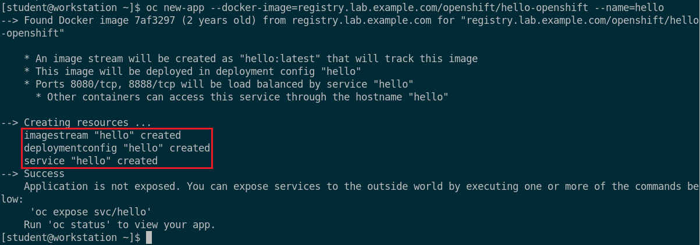
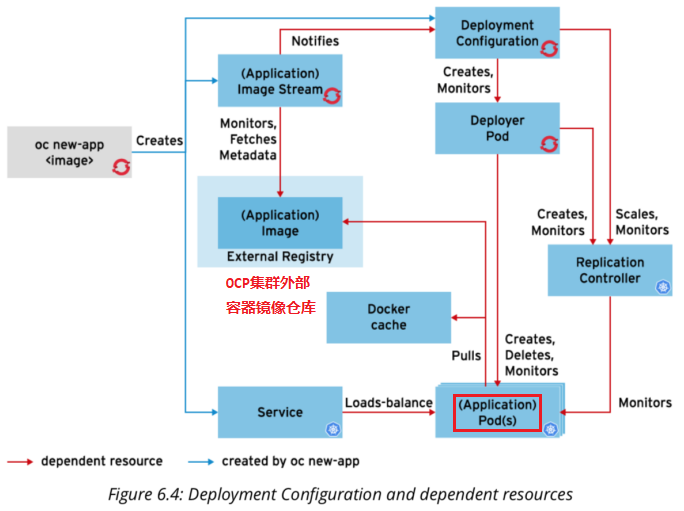
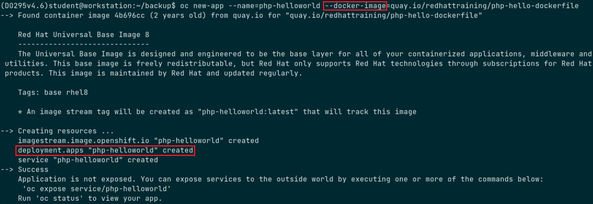
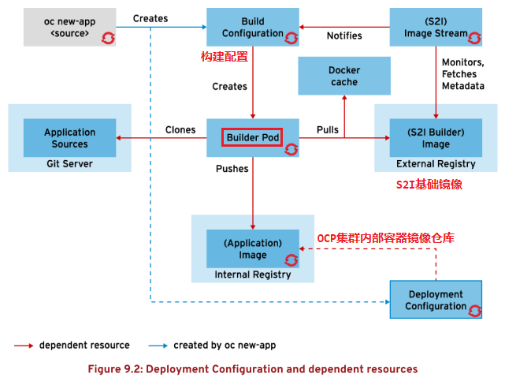
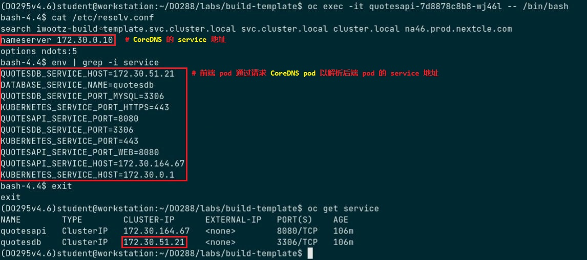
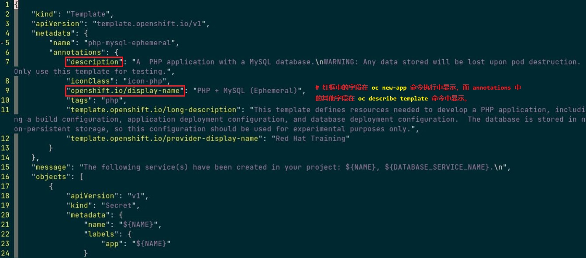

# 🚀 Red Hat OpenShift v3 与 v4 应用构建与部署详解

- OCP project 操作相关命令：
  
  ```bash
  $ oc projects
  # 查看所有已存在的可用项目，当前所在的项目前具有 "*" 标识。
  # 该命令只能由 master 节点的 system:admin 管理员用户或具有 cluster-role 角色的用户执行。
  
  $ oc project
  # 查看当前所在的项目
  
  $ oc project <project_name>
  # 切换至指定的项目
  
  $ oc new-project <project_name> --description='<description_string>'
  # 创建项目与相应描述内容
  # OCP 使用项目进行资源隔离，即项目为命名空间（namespace）。
  
  $ oc status -v
  # 查看当前所在项目的详细状态，包括 bc 与 dc 状态等。
  ```

- 👉 使用 `容器镜像` 创建应用 pod 流程：
  
  ```bash
  $ oc new-app --list
  # 查看 OCP 集群中已存在的模板（template）与镜像流（imagestream）
  
  $ oc new-app \
    --name=<application_name> \
    --docker-image=<container_registry_url>/<repository>/<image_name>:[tag]
  # 使用已有的容器镜像创建应用，并指定应用名称。
  ```
  
  
  
  
  
  💎 补充：
  
  - 由于 OCP 4.x 已兼容 Kubernetes 的 `deployment` 资源（`api-resources` 中可获知），因此在使用 `--docker-image` 选项直接构建应用时使用 `deployment.apps`。

    
  
  - 而 OCP 3.x 未集成 deployment 资源，使用以上选项构建应用时依然使用 `deploymentconfig` 资源实现。

- 👉 使用 `Containerfile` 或 `Dockerfile` 构建应用容器镜像并创建 pod：
  
  ```bash
  $ oc new-app \
    --name=<application_name> \
    --strategy docker \
    <git_repository_url_of_dockerfile> [--insecure-registry]
  # 以 Dockerfile 所在的 Git 仓库的方式创建应用
  # 注意：
  #   1. Dockerfile 中 FROM 指令指向的容器镜像仓库，需注意是否使用 SSL 协议，即是否使用
  #      --insecure-registry 命令行选项。
  #   2. 如下所示：
  #      $ oc new-app --name=echo --strategy docker \
  #        --insecure-registry http://services.lab.example.com/rhel7-echo
  ```

- 👉 使用 `应用源代码` 以 `S2I` 的方式注入构建镜像创建应用 pod：
  
  📌 方式 1：
  
  > 使用非 openshift 项目中的 imagestream 时，只能使用 `~` 方法创建应用！
  
  ```bash
  $ oc new-app \
    --name=<application_name> \
    <imagestream_name>:[tag]~<git_repository_url_of_source> \
    --labels=app=<application_name>
  # 以 S2I 源代码注入的方式创建应用
  
  ### 示例 ###
  $ oc new-app \
    --name=hello \
    php:5.5~http://workstation.lab.example.com/php-helloworld \
    --labels=app=hello \
    -o json > /tmp/app-s2i.json
  # 可将其定义的资源模板重定向至指定的 JSON 文件而不创建资源
  # 之后可直接使用该 JSON 文件创建各资源
  
  $ oc new-app \
    --name=hello \
    workstation.lab.example.com:5000/openshift3/php-55-rhel7:latest~
    http://workstation.lab.example.com/php-helloworld \
    --labels=app=hello
  # 使用外部容器镜像仓库的镜像与源代码创建应用
  
  $ oc new-app \
    --name=<application_name> \
    <imagestream_name>:[tag] <git_repository_url_of_source>#<branch>
    --context-dir <application_dir_of_branch>
  # 指定构建 imagestream、tag 及 GitHub 的代码库分支，使用该分支中的一个应用目录进行构建。
  
  ### 示例 ###
  $ oc new-app \
    --name=php-helloworld \
    php:7.3 https://github.com/Alberthua-Perl/DO180-app#s2i \
    --context-dir php-helloworld
  # 使用 GitHub 仓库中的 DO180-app s2i 分支构建 php-helloworld 应用
  # 该方法已在 OCP 4.x 中验证
  ```
  
  💎 补充：
  
  - 👨‍💻 示例：在 OCP 4.x 中使用 `--context-dir` 选项

    
  
  - 👨‍💻 示例：在 OCP 4.x 中使用 `--build-env` 选项

    ```bash
    $ oc new-app --name myapp \
      --build-env npm_config_registry=http://${RHT_OCP4_NEXUS_SERVER}/repository/nodejs \
      nodejs:12~https://github.com/${RHT_OCP4_GITHUB_USER}/DO288-apps#app-config \
      --context-dir app-config
    # 将环境变量注入至 S2I 构建镜像中用于构建应用
    # --build-env 选项指定环境变量用于注入至 S2I 构建镜像中，此处 npm_config_registry
    # 环境变量将被注入至 nodejs:12 imagestream 指向的 S2I 构建镜像中。
    # 同时需指定源代码地址及 app-config 分支，并且可通过 --context-dir 选项指定源代码目录
    # 上下文中的指定构建目录。 
    ```

    

    以上示例中使用的 `nodejs:12 imagestream`，其指向 S2I 构建镜像 `registry.redhat.io/rhscl/nodejs-12-rhel7`，其中包含的环境变量部分来自于基础构建镜像 `quay.io/centos7/s2i-base-centos7`，而 `npm_config_registry` 环境变量将直接在构建镜像中设置 nodejs registry 地址。

    

    

    
  
  > ✅ 以上的 nodejs 构建镜像的构建方式可参考 [该 RHSCL 的 GitHub 链接](https://github.com/sclorg/s2i-nodejs-container/tree/master/12)。
  
  📌 方式 2：
  
  ```bash
  $ oc new-app \
    --name=<application_name> \
    --strategy source \
    -i <imagestream_name>:[tag] \
    --code <git_repository_url_of_source> 
  # 以 S2I 源代码注入的方式创建应用
  ```
  
  📌 方式 3：
  
  ```bash
  $ oc new-app \
    --name=<application_name> \
    --strategy source \
    <git_repository_url_of_source> 
  # 以 S2I 源代码注入的方式创建应用
  # 未指定 imagestream 时，将自动识别 openshift 项目中相应的 S2I 构建镜像（builder image）。 
  # 该命令将尝试根据 Git 代码仓库根目录中存在的特定文件来确定使用哪一种语言的构建镜像。
  ```
  
  📌 `oc new-app` 命令常用选项：
  
  ```bash
  --name                        指定构建的应用及其相关资源的名称
  --strategy [docker|source]    指定 S2I 构建过程中使用的构建策略，
                                包括 Dockerfile 文件（docker）、源代码注入（source）。
  --docker-image                指定构建应用所使用的容器镜像    
  -i, --image-stream            指定构建应用时的 imagestream 名称
  --code                        使用源代码方式构建应用
  --labels                      指定构建的应用具有的标签
  --template                    使用模板文件创建各应用资源，见下图示例。
  -p, --param                   指定模板文件中定义的环境变量，该变量可覆盖模板文件
                                中定义的变量。
  --insecure-registry           指定使用的容器镜像仓库未使用 SSL 连接
  ```
  
  📌 使用 S2I 源代码注入创建应用 pod 流程：
  
  

- 👉 使用 `template` 模板定义文件创建各应用资源：
  - 该方法常用于部署构建多应用的项目中，需处理好多个应用之间的服务发现问题。
  - oc new-app 命令行中可指定应用的名称（`--name` 选项）、模板名称（`--template` 选项）与命令行参数（`--param`, -p 选项）。
  - `-p` 选项：指定命令行中的额外参数，可覆盖模板文件中定义的 parameters 参数（模板中的参数可被作为模板中 env 环境变量使用）。
  - 使用 template 模板相关命令：

    ```bash
    $ oc get templates [-n <project>]
    # 查看指定项目中的 OCP 资源定义模板，使用 oc get all 命令无法获取。
    
    $ oc create -f <template>.json [-n <project>]
    # 上传 OCP 资源定义模板至指定项目中
    # 企业生产环境中常使用 template 模板部署应用
    
    $ oc describe templates <template> [-n <project>] 
    # 查看指定项目中 OCP 资源定义模板的参数定义
    
    $ oc process -f <template>.json | oc create -f -
    # 使用 template 模板文件部署应用资源
    # 注意：template 模板文件中可直接定义 pvc 与 route
    ```
  
  - 💎 补充：
    - `OCP 4.x` 中使用 `template` 模板构建 MySQL 数据库应用（单 pod 应用）：

      

    - `OCP 4.x` 中使用 template 模板构建 `php` 与 `mysql` 的多 pod 应用：

      

      

      前端 php 应用发现后端 mysql 应用的方式，CoreDNS 解析过程见前文所述：

      

      若 pod 中不具有相应的网络调试工具，可使用如下方式进行前后端 pod 的网络调试：

      

      定义以上应用的 template 模板（JSON 格式）部分如下所示：

      
