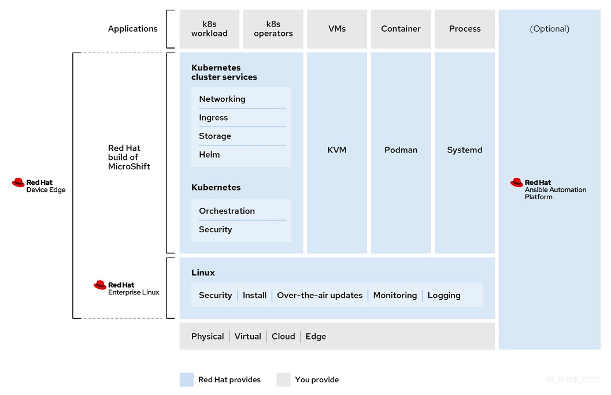
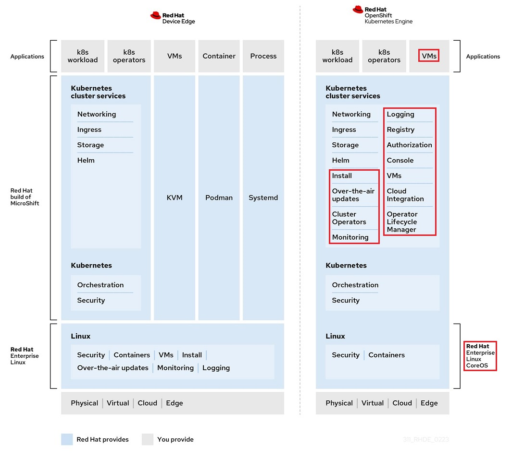
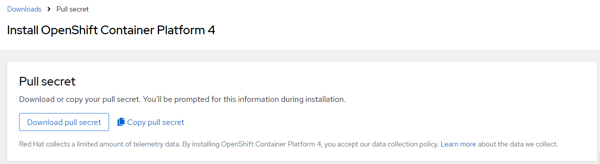
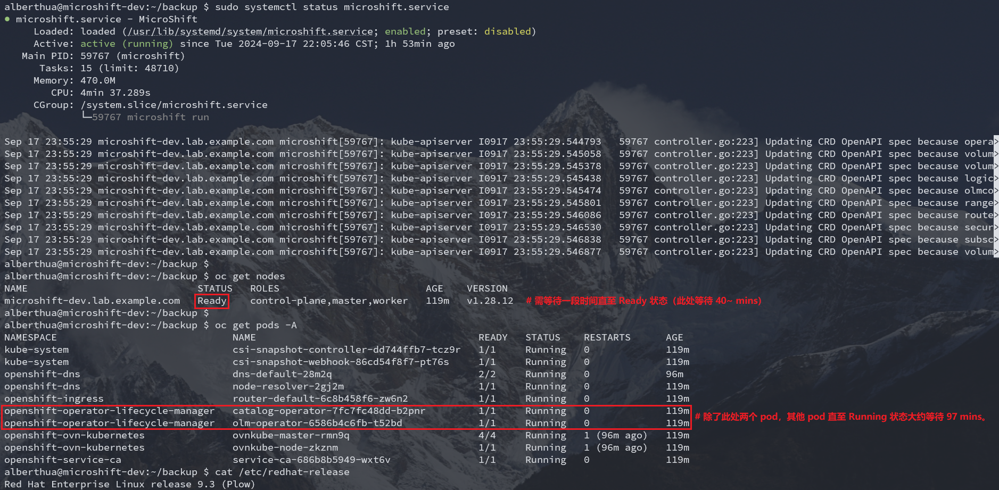
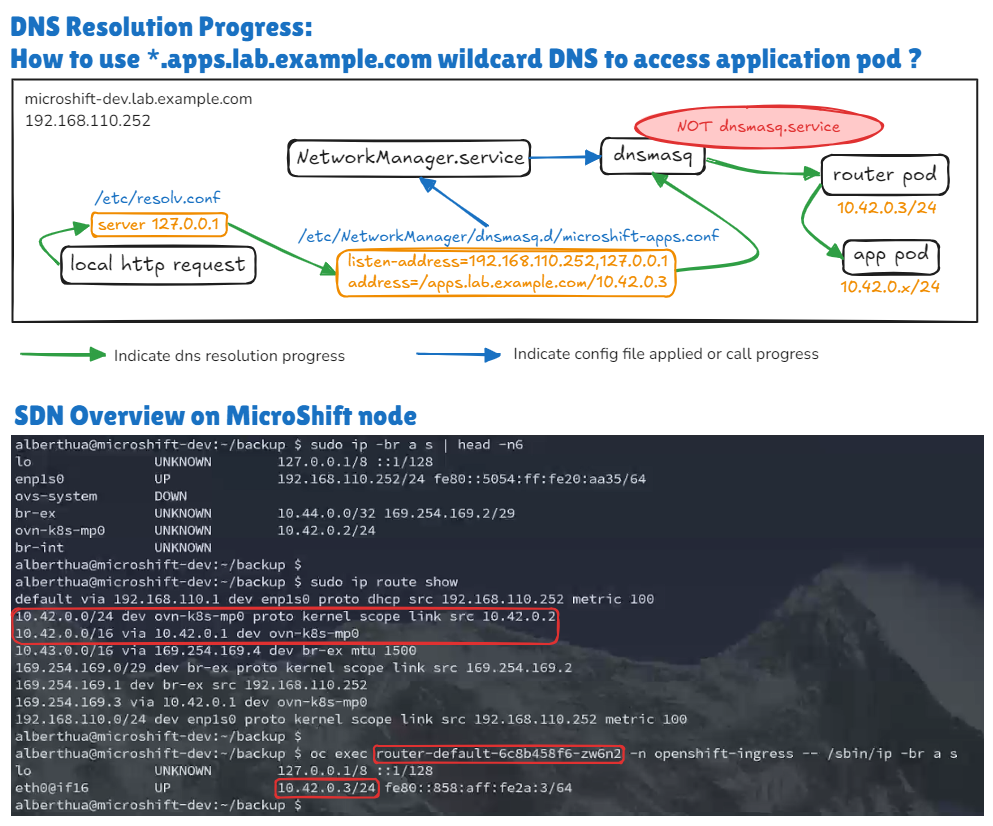
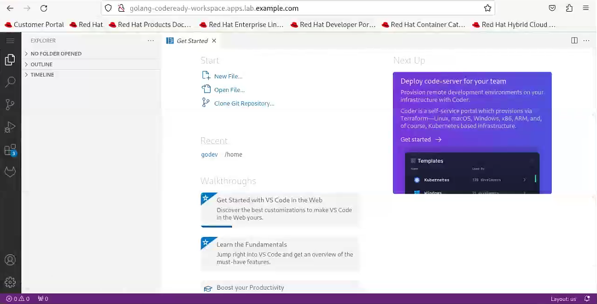

# 🐱‍🏍 基于 RHEL9.3 的 Red Hat MicroShift v4.15 部署与管理

## 文档说明

- Demo 环境说明
- MicroShift 概览与架构
- MicroShift 部署方式详解
- Wildcard DNS 在 MicroShift 中的应用
- MicroShift 应用管理示例
- 参考链接

## Demo 环境说明

- 操作系统：Red Hat Enterprise Linux release 9.3 (Plow)
- 系统安装模式：Server with GUI
- 内核版本：5.14.0-362.8.1.el9_3.x86_64
- microshift 版本：microshift-4.15.31-202409051643.p0.g0a62298.assembly.4.15.31.el9.x86_64
- microshift-olm 版本：microshift-olm-4.15.31-202409051643.p0.g0a62298.assembly.4.15.31.el9.x86_64
- microshift-gitops 版本：microshift-gitops-1.12.1-4.el9.x86_64

## MicroShift 概览与架构

- MicroShift 概览（低资源环境与低硬件配置）：
  - 运行在云中相同的 Kubernetes 工作负载，但在边缘运行。
  - 解决严重网络约束的环境挑战，如低速连接或无连接。
  - 通过在边缘设备上直接安装系统镜像，使边缘设备更加易于访问。
  - MicroShift 具有单节点部署的简洁性，以及在资源约束位置计算所需的功能和服务。
  - 可在不同的主机上有多个部署，创建每个应用程序所需的特定系统镜像。
- MicroShift 架构：
  - MicroShift 是一个单节点容器运行时，旨在将使用容器的好处扩展到低资源的边缘环境。
  - 由于 MicroShift 主要是部署应用程序的平台，因此仅包含在边缘和小容量计算环境中操作所必须的 API 及功能。

    

- 💥 与 OpenShift Kubernetes Engine 的主要区别：
  - 安装了 MicroShift 的设备可自我管理
  - 与基于 `RPM-OStree` 的系统（RedHat CoreOS）兼容
  - 仅使用基本功能的 API
  - 从 OpenShift CLI (oc) 启用命令子集
  - 不支持添加 worker 节点的工作负载高可用性（HA）或横向扩展

    
  
  - 除架构上的差异外，部分集群资源对象与 oc 子命令的使用也存在变化，如，无法使用 oc new-project 子命令创建项目，MicroShift 不具有 `imagestream` 资源对象等。

## MicroShift 部署方式详解

- MicroShift 使用 Red Hat 提供的 RPM 软件包安装部署，需要具有相关软件订阅频道的权限方可下载。
- 虽然 Red Hat OpenShift Local (CRC) 可提供较为完整的 OpenShift 集群功能，但其不能在生产环境中使用，只适用于开发及测试环境。
- MicroShift 作为轻量级的 OpenShift 集群可在单节点上运行，可满足边缘计算场景的需求与服务。
- 此处使用的环境与软件包版本见 `Demo 环境说明`。
- 部署过程如下所示：
  - 启用所需的软件订阅频道：

    ```bash
    $ sudo subscription-manager register  # 使用订阅用户名与密码将主机注册至订阅服务器
    $ sudo subscription-manager list --available  # 查看可用的软件订阅
    $ sudo subscription-manager attach --pool=2c94a1c28bd4a831018bf0bfb68b3099  # microshift 所在的 pool
    $ sudo subscription-manager attach --pool=2c94d9658d9ea93e018da64a01e64bca  # microshift-gitops 所在的 pool
    $ sudo subscription-manager repos \
      --enable rhocp-4.15-for-rhel-9-$(uname -m)-rpms \
      --enable fast-datapath-for-rhel-9-$(uname -m)-rpms  # 启用 microshift 的软件仓库
    $ sudo subscription-manager repos \
      --enable gitops-1.12-for-rhel-9-$(uname -m)-rpms  # 若在 microshift 中需要 GitOps 功能，需启用此软件仓库。
    ```
  
  - 安装 microshift 软件包：

    ```bash
    $ sudo dnf install -y microshift  # 安装 microshift 软件包
    ```

  - 使用订阅账户登录 [Red Hat Hybrid Cloud Console](https://console.redhat.com/openshift/install/pull-secret) 下载 `pull-secret` 容器镜像拉取密钥文件。将此文件同步至 microshift 节点。

    
  
  - 将 pull-secret.txt 文件拷贝至 microshift 节点的 /etc/crio 目录中，并更新其属组与权限：

    ```bash
    $ sudo cp pull-secret.txt /etc/crio/openshift-pull-secret
    $ sudo chown root:root /etc/crio/openshift-pull-secret
    $ sudo chmod 600 /etc/crio/openshift-pull-secret
    ```
  
  - 关闭 firewalld 服务避免干扰 microshift 集群网络：

    ```bash
    $ sudo systemctl disable --now firewalld.service
    ```
  
  - **【可选步骤】** 安装 Operator Lifecycle Manager (OLM) 软甲包：
    安装 microshift 软件包时，不会默认安装 OLM，需手动安装此 RPM 软件包。

    ```bash
    $ sudo dnf install -y microshift-olm
    $ sudo systemctl restart microshift.service
    # 安装完成后需重启服务，将自动拉取 olm 容器镜像并运行 pod。
    # olm pod 使用 deployment 资源定义
    ```
  
  - **【可选步骤】** 安装 GitOps ArgoCD 清单：
    - 可使用 OpenShift GitOps 轻量级版本管理应用，此过程安装基本的 GitOps 功能，ArgoCD CLI 目前在 MicroShift 中不可用。
    - 安装完成后需重启服务，将自动拉取 argocd 容器镜像并运行 pod。

      ```bash
      $ sudo dnf install -y microshift-gitops
      $ sudo systemctl restart microshift.service
      ```
  
  - 启动 microshift 服务：
    - 保证部署节点的网络可用，启动服务后将使用 pull-secret.txt 文件拉取部署所需的容器镜像至 root 用户命名空间中。
    - 可使用 `sudo crictl images` 或 `sudo podman images` 查看已拉取的容器镜像
    - 第一次启动此服务，将拉取容器镜像并启动各组件，需要经历一段时间等待，直至节点状态为 Ready，所有的 pod 为 Running 状态，才表明 microshift 集群可用。而后续启动集群可快速就绪。

    ```bash
    $ sudo systemctl enable microshift.service
    $ sudo systemctl start microshift.service
    ```

    

    - 以上返回结果中还包含 microshift-olm 的两个 pod。排除这两个 pod 外，其余 microshift 集群相关的 pod 在此场景中耗时 97 分钟就绪，而这两个 pod 就绪总共耗时 119 分钟。在启动 microshift 服务后，将会有较长的一段时间使集群节点处于 NotReady 的状态，这是由于集群 openshift-dns 命名空间中的 `dns-default` pod 未就绪而造成的。直至此 pod 正常运行，集群节点即为 Ready 状态。`dns-default` pod 中运行 coredns 进程，而 `ovnkube-master` pod 中运行 ovn-northd、nbdb、sbdb 等进程，`ovnkube-node` pod 中运行 ovn-controller 进程。
    - 若 microshift 集群状态正常后，可启用 microshift-olm 与 microshift-gitops 服务。待所有 pod 全部就绪后将返回如下状态：

    ```bash
    $ oc get nodes
    NAME                             STATUS   ROLES                         AGE   VERSION
    microshift-dev.lab.example.com   Ready    control-plane,master,worker   2d    v1.28.12
    $ oc get pods -A  # 此处集群已运行一定时间
    NAMESPACE                              NAME                                          READY   STATUS    RESTARTS   AGE
    kube-system                            csi-snapshot-controller-dd744ffb7-tcz9r       1/1     Running   1          2d
    kube-system                            csi-snapshot-webhook-86cd54f8f7-pt76s         1/1     Running   2          2d
    openshift-dns                          dns-default-28m2q                             2/2     Running   3          47h
    openshift-dns                          node-resolver-2gj2m                           1/1     Running   1          2d
    openshift-gitops                       argocd-application-controller-0               1/1     Running   0          21h
    openshift-gitops                       argocd-redis-769db95b95-gg4xs                 1/1     Running   0          22h
    openshift-gitops                       argocd-repo-server-f9b57f9f9-p5pkh            1/1     Running   0          22h
    openshift-ingress                      router-default-6c8b458f6-zw6n2                1/1     Running   3          2d
    openshift-operator-lifecycle-manager   catalog-operator-7fc7fc48dd-b2pnr             1/1     Running   2          2d
    openshift-operator-lifecycle-manager   olm-operator-6586b4c6fb-t52bd                 1/1     Running   2          2d
    openshift-ovn-kubernetes               ovnkube-master-rmn9q                          4/4     Running   5          2d
    openshift-ovn-kubernetes               ovnkube-node-zkznm                            1/1     Running   2          2d
    openshift-service-ca                   service-ca-686b8b5949-wxt6v                   1/1     Running   1          2d
    ```

    - 💥 openshift-gitops 命名空间中的 `argocd-application-controller` pod 使用 statefulset 资源定义，并且其容器镜像拉取策略为 `Always`，建议将其更改为 `IfNotPresent`，否则在每次集群启动时都将去拉取镜像。若集群节点无法连接外网，该镜像无法拉取将造成 ArgoCD 无法正常使用。

      
  
  - 停止 microshift 服务：

    ```bash
    $ sudo systemctl stop microshift.service
    ```

    即使 microshift 服务停止运行，但是集群节点上的工作负载可能继续运行。如下方法停止工作负载：

    ```bash
    $ sudo crictl ps -a  # 查看全部的工作负载，使用 podman 命令无效。
    $ sudo systemctl stop kubepods.slice  # 停止部署的工作负载
    ```

## Wildcard DNS 在 MicroShift 中的应用

- 部署在 OpenShift 中的应用可使用泛域名解析（Wildcard DNS）的方式进行访问，因此，在本 Demo 中使用 `lab.example.com` 作为 DNS 查询域名，`apps.lab.example.com` 作为应用的 DNS 查询域名后缀。只有使用正确的 DNS 查询方式才能访问部署的应用。
- 由于此处 MicroShift 部署于 RHEL9 中，可直接使用系统自带的 `NetworkManager.service` 服务与 `dnsmasq` 组件来完成泛域名解析。
  
  ```bash
  $ sudo vim /etc/NetworkManager/dnsmasq.d/microshift-apps.conf
    listen-address=192.168.110.252,127.0.0.1  # 指定监听的 IPv4 地址，分别对外以及本地监听 53/tcp, 53/udp 端口。
    address=/apps.lab.example.com/10.42.0.3  # 设置泛域名解析的域名后缀与对应的 IPv4 地址，此处的地址为 openshift-ingress 命名空间中 router pod 的地址。
  $ sudo vim /etc/NetworkManager/conf.d/microshift-nm-dnsmasq.conf
    [main]
    dns=dnsmasq  # 指定 NetworkManager.service 调用的 DNS 服务类型
  $ sudo systemctl restart NetworkManager.service  # 重启此服务将调用 dnsmasq 进程，使泛域名解析生效。
  $ sudo ps -ef | grep -E "NetworkManager|dnsmasq"
  root        1322       1  0 Sep18 ?        00:00:09 /usr/sbin/NetworkManager --no-daemon
  dnsmasq     1363    1322  0 Sep18 ?        00:00:00 /usr/sbin/dnsmasq --no-resolv --keep-in-foreground --no-hosts --bind-interfaces --pid-file=/run/NetworkManager/dnsmasq.pid --listen-address=127.0.0.1 --cache-size=400 --clear-on-reload --conf-file=/dev/null --enable-dbus=org.freedesktop.NetworkManager.dnsmasq --conf-dir=/etc/NetworkManagednsmasq.d
  # 注意：不可使用 dnsmasq.service 服务，因为上述 dnsmasq 进程由 NetworkManager.service 服务调用，再次启动将产生冲突！
  ```

- MicroShift 中使用泛域名解析访问应用的过程可参考下图，而集群中的 SDN 组件也参与此访问过程。通过以上配置可使用应用通过发布的 URL 进行访问。

  > 注意：在 /etc/resolv.conf 文件中 nameserver 的顺序，可将解析外部的 nameserver 置于最前方，127.0.0.1 置于后方。
  
  

## MicroShift 应用管理示例

MicroShift 部署成功并正常运行后，可部署应用以测试集群是否可正确提供服务。由于 MicroShift 不具有 `imagestream` 资源定义而无法实现从 `oc new-app` 子命令以源代码注入构建镜像，从而生成部署镜像的过程。因此，此处使用已构建成功的容器镜像通过 `deployment` 资源定义文件的方式实现应用的部署。
此应用提供了 Golang 开发环境的 workspace，可让开发者在云上使用开发环境，随申请随发布。

```bash
$ oc create namespace initial-test  # 创建应用所在的命名空间
$ oc config set-context --namespace=initial-test --current  # 切换命名空间上下文
$ oc config get-contexts  # 获取当前命名空间上下文列表
$ oc project initial-test  # 切换应用所在的项目
$ oc create serviceaccount golang-codeready-workspace  # 创建指定的 serviceaccount 资源
$ oc adm policy add-scc-to-user anyuid -z golang-codeready-workspace  # 为 serviceaccount 资源添加 anyuid 类型的 SCC
$ vim golang-codeready-workspace-deployment.yml
```

```yaml
# Note: define resource type in Kubernetes and OpenShift environment
apiVersion: v1
kind: Service
metadata: 
  labels: 
    name: golang-codeready-workspace
  name: golang-codeready-workspace
  namespace: initial-test  ##CHANGE ME
spec: 
  ports:
    # the port that this service should serve on
    - port: 8080
      protocol: TCP
      targetPort: 8080
  # label keys and values that must match in order to receive traffic for this service
  selector: 
    app: golang-codeready-workspace
  type: ClusterIP
---  
apiVersion: apps/v1
kind: Deployment
metadata:
  labels:
    app: golang-codeready-workspace
  name: golang-codeready-workspace
  namespace: initial-test  ##CHANGE ME
spec:
  replicas: 1
  selector:
    matchLabels:
      app: golang-codeready-workspace
  template:
    metadata:
      creationTimestamp: null
      labels:
        app: golang-codeready-workspace
    spec:
      containers:
      - image: quay.io/alberthua/golang-code-server:v1.1
        imagePullPolicy: IfNotPresent
        name: golang-codeready-workspace
        ports:
        - containerPort: 8080
          protocol: TCP
      restartPolicy: Always
      schedulerName: default-scheduler
      securityContext: {}
      terminationGracePeriodSeconds: 30
      serviceAccount: golang-codeready-workspace  ##CHANGE ME
      serviceAccountName: golang-codeready-workspace  ##CHANGE ME
      # JUST use this file in OpenShift environment:
      #   1. create service account: $ oc create serviceaccount <name> -n <namespace>
      #   2. add anyuid scc to service account: $ oc adm policy add-scc-to-user anyuid -z <serviceaccount> -n <namespace>
```

```bash
$ sudo podman pull quay.io/alberthua/golang-code-server:v1.1  # 拉取公共的应用容器镜像
$ oc apply -f ./golang-codeready-workspace-deployment.yml  # 声明式创建 deployment 与 service 资源
$ oc get all
NAME                                              READY   STATUS    RESTARTS   AGE
pod/golang-codeready-workspace-6b895cc4cb-pq5mg   1/1     Running   1          2d5h

NAME                                 TYPE        CLUSTER-IP     EXTERNAL-IP   PORT(S)    AGE
service/golang-codeready-workspace   ClusterIP   10.43.237.59   <none>        8080/TCP   2d5h

NAME                                         READY   UP-TO-DATE   AVAILABLE   AGE
deployment.apps/golang-codeready-workspace   1/1     1            1           2d5h

NAME                                                    DESIRED   CURRENT   READY   AGE
replicaset.apps/golang-codeready-workspace-6b895cc4cb   1         1         1       2d5h
$ oc expose service golang-codeready-workspace --hostname=golang-codeready-workspace.apps.lab.example.com  # 创建应用路由
$ oc get route
NAME                         HOST                                              ADMITTED   SERVICE                      TLS
golang-codeready-workspace   golang-codeready-workspace.apps.lab.example.com   True       golang-codeready-workspace
```

MicroShift 集群节点本地打开浏览器使用应用 URL 即可访问此 workspace。



## 参考链接

- [GitHub: microshift](https://github.com/openshift/microshift)
- [Red Hat build of MicroShift 4.15](https://docs.redhat.com/en/documentation/red_hat_build_of_microshift/4.15)
- [Catalog of Container images](https://catalog.redhat.com/software/containers/explore)
- [MicroShift Introduction](https://www.openshift-anwender.de/wp-content/uploads/2022/04/MicroShift-Open-Demo.pdf)
- [GitHub: golang-codeready-workspace-deployment.yml](https://github.com/Alberthua-Perl/go-kubernetes-learn-path/blob/hotfixes/golang-codeready-workspace-deployment.yml)
- [Why I got Failed to allocate directory watch: Too many open files?](https://askubuntu.com/questions/1472428/why-i-got-failed-to-allocate-directory-watch-too-many-open-files)
- [Failed to allocate directory watch](https://blog.differentpla.net/blog/2022/12/14/failed-allocate-directory-watch/)
