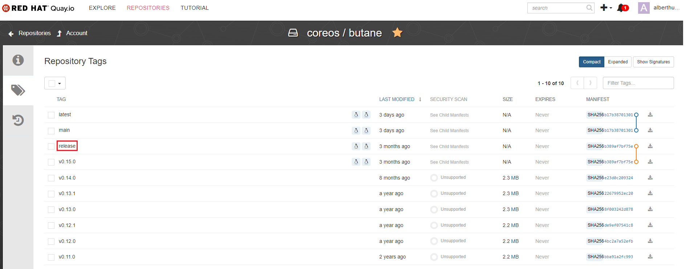
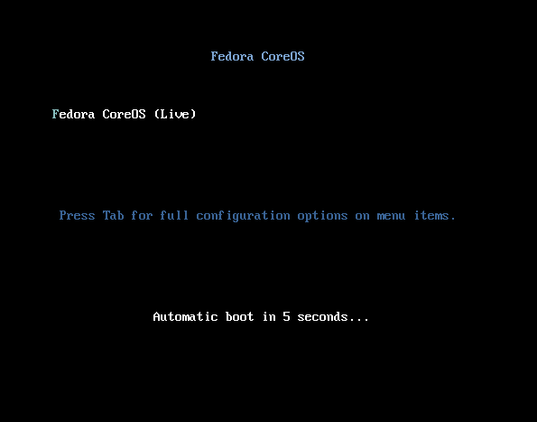

# 📦 Fedora CoreOS 及 RHCOS 概述与应用

## 文档目录

- 关键技术点
- Fedora CoreOS 及 RHCOS 介绍与特性
- Ignition 在 FCOS 或 RHCOS 中的工作特点
- Ignition 对 OpenShift 4 集群主机的处理顺序
- Fedora CoreOS 的安装环境与工具说明
- Fedora CoreOS 的定制化安装与验证
- 参考链接

## 关键技术点

- 以下技术点在文中将根据 Fedora CoreOS 及 RHCOS 中展开说明：  
  - ignition; butane; ignition-validate  
  - ostree; rpm-tree; zincati; bootupd

## Fedora CoreOS 及 RHCOS 介绍与特性

- 在 OpenShift 4 安装过程会自动安装 CoreOS 的商业版 Red Hat Enterprise Linux CoreOS（简称 `RHCOS`）。根据 OpenShift 4 的文档说明，RHCOS 无法独立运行安装，它必须和 OpenShift 4 一起运行（因此 RHCOS 没有单独的订阅）。
- 😃 不过好在 CoreOS 还提供了可以独立运行的社区版 `Fedora CoreOS`（简称 `FCOS`）可以完全免费使用。由于 FCOS 可以无需 OpenShift 4 也可以独立安装运行，因此使用 FCOS 作为研究环境，而相关操作基本都可适用 RHCOS 环境。
- FCOS/RHCOS 是 Red Hat 在收购 CoreOS 公司后结合 `CoreOS Container Linux` 和 `Fedora Atomic Host` 的优点推出的新一代容器操作系统，其目标是提供最佳的容器主机，从而能安全、大规模地运行容器化的工作负载。
- FCOS/RHCOS 将 [Ignition](https://github.com/coreos/ignition)（点火） 与 rpm-ostree 等技术相集成，是一个自动更新的、最小的、整体的、对运行容器和 Kubernetes 进行了优化的操作系统，因为它们更符合 "不可变架构"（`Immutable Infrastructure`）理念，因此成为 Red Hat 推荐的 OpenShift 4 底层操作系统。
- FCOS/RHCOS 的安装及配置过程和一般的 RHEL 稍有差别，需要通过 Ignition 配置文件在安装的时候初始化网络、存储、内核、用户等方面的配置。
- FCOS 的设计理念：  
  - 🐳 由于容器允许将工作负载重复部署到生产环境中，并自动扩展以满足需求。容器提供的隔离意味着主机操作系统可以很小，它只需要一个 `Linux kernel`、`systemd`、`container runtime` 和一些附加服务（如 SSH 服务器）。  
  - FCOS 是专门为容器工作负载而设计的，无需定期维护，可以使用最新的操作系统改进、bug 修复和安全自动更新，其使用 Ignition 为自身提供服务，使用 `Podman` 和 `Moby` 运行容器，并使用 `rpm-ostree` 自动进行原子更新。
  
  > ❗ 注意：
  > 1. FCOS 支持 `CRI-O` 作为容器引擎，常用于 OpenShift 4 的底层容器运行时，一般不直接使用 CRI-O 运行容器，OpenShift 4 可通过 `CRI` 接口创建与管理 Pod。
  > 2. 可通过 `crictl` 命令行工具创建与管理容器及 Pod，但一般情况下用于容器或 pod 的调试而非容器或 pod 的创建。

- FCOS 调配不可变架构：  
  - 在系统首次引导（`first boot`）阶段，FCOS 使用 Ignition 调配系统。  
  - Ignition 读取用户提供的数据或远程 URL 地址提供的 Ignition 配置文件，并且使用它创建磁盘分区、文件系统、用户、受信任的用户 SSH 公钥、文件与系统单元文件（systemd units）等。  
  - 调配主机的方式：
    - 编辑基于 YAML 格式的 `Fedora CoreOS Config`（FCC）文件，该文件指定主机的期望配置，FCC 支持所有的 Ignition 功能，也提供额外的语法。
    - 使用 `Fedora CoreOS Config Transpiler (Butane)` 工具将 FCC 文件（`.fcc`）转换为 Ignition 配置文件（`.ign`）。
    - 启动 FCOS 主机并将 Ignition 配置文件同步至主机中调配系统的安装。

    > 💁‍♂️ 调配主机的方法：
    > 1. 使用 PXE 引导并与指定 Ignition 配置文件调配安装主机。
    > 2. 将 Ignition 配置文件同步至使用 FCOS live ISO 引导启动的主机中，再使用 `coreos-installer` 工具调配安装主机（本文使用此方法）。
  
  - FCOS 被设计为不可变架构。在主机被调配之后，不应该更改 /etc 目录或重新配置主机，相反，更改 FCC 文件并且使用该文件调配替换的主机。
  - 🐳 这种方式与容器管理相似：容器镜像不可被原地更新，而是重头构建与重新部署。该方式在负载增加时容易横向扩容。只需简单地使用相同的 Ignition 配置文件来启动其他主机。
- [FCOS 发布版本](https://getfedora.org/en/coreos/download?tab=metal_virtualized&stream=stable&arch=x86_64)：
  
  
  
  - `testing stream`：
    当前 Fedora 发行版的常规快照，加上更新。
  - ❤ `stable stream`：
    在测试版本可用两周后，它被发送到稳定流，在测试中发现的 `bug` 将在发布稳定流之前被修复。
  - `next stream`：
    即将发布的 Fedora 版本的常规快照，允许有额外的时间测试较大的更改。
  👉 每个 stream 每 2 周发布一次，更新内容会从一个 stream 推广到另一个 stream（`next -> testing -> stable`）。这样落地在 stable stream 中的更新就有机会经过长时间的测试。
  👉 所有三个 stream 都收到了安全更新和关键的错误修复，并旨在安全地用于生产使用。大多数机器应该运行 `stable stream`，因为它接受最多的测试。但是，用户应该在 next stream 上运行他们的部分节点，并向问题跟踪器报告问题。这有助于确保只影响特定工作负载或特定硬件的 bug 在稳定之前得到修复。
- RHCOS 的关键特性：
  - 系统基于 RHEL 开发
  - 可控制的不可变架构（`controlled immutability`）
  - 默认使用 `CRI-O` 容器运行时
  - 可使用容器工具集管理容器或 Pod（包括 `podman`、`skopeo` 与 `crictl` 等）
  - 🔥 使用 `rpm-ostree` 实现事务性更新升级
  
  > ❗ 注意：
  > 1. `OSTree` 是一个用于对基于 Linux 的操作系统进行版本更新的系统，它可以被视为 "面向操作系统二进制文件的 git"，它被 endless OS、Flatpak、Fedora、CentOS、Atomic Host 和 GNOME 等项目用来持续交付，有关 OSTree 更多详细的说明可参考 [libostree 官方文档](https://ostreedev.github.io/ostree/)。
  > 2. rpm-ostree 是一个混合镜像/包系统，以命令行与守护进程的方式运行，可将软件包以分层的形式构建在 OSTree 之上，将软件包作为系统的扩展，关于 rpm-ostree 更多详细的说明可参考 [rpm-ostree 官方文档](https://coreos.github.io/rpm-ostree)。
  > 3. FCOS 中的 `zincati` 服务（`zincati.service`）可检测系统的状态，通过 `rpm-ostreed` 守护进程进行更新，若其发现具有新的系统更新将自动更新系统，可将该服务关闭以禁用此功能。
  
  - 🔥 针对 `fireware` 与 `bootloader` 的 `bootupd` 更新器
  > 注意：bootupd 可以守护进程 `bootupd.service` 的方式运行
  - OpenShift 4 集群通过 `Machine Config Operator (MCO)` 更新 RHCOS

## Ignition 在 FCOS 或 RHCOS 中的工作特点

- Ignition 是由 FCOS/RHCOS 使用的在系统初始化配置过程（`initramfs`）中操纵磁盘的工具，其可完成常见的磁盘任务，包括磁盘分区、格式化分区、写文件与配置用户等。
- 在系统首次引导时（first boot），Ignition 读取安装介质或所指定的 Ignition 配置文件所在的路径。
- ✨ Ignition 的调配方式：
  Ignition 配置文件（Ignition config file）或称点火配置文件
- Ignition 配置与 `cloud-init` 或 `Linux Anaconda kickstart` 配置系统极其相似，但其具有自身的特点：
  - 由于 Ignition 能进行磁盘分区、设置文件系统与执行主机永久文件系统的其他改变，因此，在安装 FCOS/RHCOS 过程中 Ignition 运行于与系统相隔离的 `initial RAM disk` 中。与之相对的，cloud-init 作为初始化系统的一部分不能容易地实现磁盘的分区。
  - ✨ Ignition 与 cloud-init 对比：

    | 组件名称/对比类别  | 工作阶段     | 工作次数 | 功能实现    | 常用场景 |
    | ---------- | -------- | ---- | ------- | ---- |
    | Ignition   | 首次引导安装期间 | 一次   | 系统磁盘操作等 | 安装部署 |
    | cloud-init | 任意系统引导期间 | 多次   | 系统配置等   | 系统配置 |
  
  - Ignition 用于初始化系统而不是更改已存在的系统，OpenShift 4 使用 `Machine Config Operator` 完成所有主机的配置。
  - Ignition 以声明式方式（declarative configuration）检查配置中的所有配置项目以满足指定的要求。
  - ✨ 在 Ignition 完成主机配置后，kernel 保持运行但丢弃 initial RAM disk，并且转向（pivot to）磁盘上已安装的系统中。无需系统重启，所有的系统服务与其他特性即可启动。
  - 由于 Ignition 通过声明式配置将主机调整为指定的状态，因此不能存在具有部分配置的主机，若在部署 OpenShift 4 集群时存在部分配置的主机，该主机将无法加入集群，需更换新的主机再次调配加入集群。
  - 若存在问题的 Ignition 配置引起主机配置的失败，Ignition 将不再尝试使用相同的配置来调配另一台主机。
  - 由于 Ignition 可使用完整的空磁盘，它能实现 cloud-init 无法完成的任务，如使用 PXE 引导从空磁盘调配裸机系统。

## Ignition 对 OpenShift 4 集群主机的处理顺序

- 在 OpenShift 4 集群中的 RHCOS 主机上 Ignition 的处理涉及以下步骤：
  - 1️⃣ 控制平面主机（`control plane machines`）从引导主机（`bootstrap machine`）获取 Ignition 配置文件，而工作主机（`worker machines`）从控制平面主机获取 Ignition 配置文件。
  - 2️⃣ Ignition 在主机上创建磁盘分区、文件系统、目录与链接，它支持 RAID 阵列但不支持 LVM 逻辑卷。
  - 3️⃣ Igition 在 initramfs 中挂载 root 持久化文件系统于 `/sysroot` 目录并在 `/sysroot` 目录中工作。
  - 4️⃣ Ignition 配置所有定义的文件系统并恰当地挂载它们。
  - 5️⃣ Ignition 运行 `systemd` 临时文件以填充在 `/var` 目录中的所需文件。
  - 6️⃣ Ignition 运行其配置文件来配置用户、systemd 单元文件与其他配置文件。
  - 7️⃣ Ignition 卸载在 initramfs 中挂载的持久化系统中的所有组件。
  - 8️⃣ Ignition 启动新主机的初始化过程，启动系统引导阶段的所有其他的服务。
- 处理结束后，主机已做好加入集群的准备并且无需重启，与前文所述相同。

## Fedora CoreOS 的安装环境与工具说明

- FCOS 支持在多种 IaaS 环境下运行。
- Fedora CoreOS live ISO 版本：fedora-coreos-36.20220906.3.2-live.x86_64.iso
- Butane 工具：
  - linux 版本：[0.15.0](https://github.com/coreos/butane/releases/download/v0.15.0/butane-x86_64-unknown-linux-gnu)
  - 该工具来源于 [coreos/butane](https://github.com/coreos/butane) 项目
  - `Butane` 以前称为 Fedora CoreOS 配置转换器（Fedora CoreOS Config Transpiler，`FCCT`），它可将 Butane 配置文件（Butane Config）或称 FCC 文件转换为 Ignition 配置文件（Ignition Config），该文件为 `JSON` 格式将被 FCOS 主机在首次引导调配时使用，可用于创建磁盘分区、文件系统、用户、受信任的用户 SSH 公钥、文件与系统单元文件（systemd units）等。
  - ✨ 其中 Butane 配置文件为 `YAML` 格式，关于该文件不同版本的配置规范（configuration specifications）请参考该 [链接](https://github.com/coreos/butane/blob/main/docs/specs.md)。
  - ✨ Butane 配置文件使用示例请参考该 [Examples](https://github.com/coreos/butane/blob/main/docs/examples.md)。
  - 可在自己指定的节点（非 FCOS 主机）上安装 butane，安装方式包括 butane 容器镜像（`quay.io/coreos/butane:release`）、rpm 软件包或独立的二进制文件（standalone binary），此处使用以上链接的独立二进制文件进行安装。

    
  
  - butane 的使用方法可参考该 [链接](https://github.com/coreos/butane/blob/main/docs/getting-started.md)。
- ignition-validate 工具：
  - linux 版本：[2.14.0](https://github.com/coreos/ignition/releases/download/v2.14.0/ignition-validate-x86_64-linux)
  - 该工具来源于 [coreos/ignition](https://github.com/coreos/ignition) 项目
  - 该工具用于对 Ignition 配置文件的格式与合法性字段的验证，若语法不合规将无法在 FCOS 中使用 `coreos-installer` 于系统首次引导时安装。

## Fedora CoreOS 的定制化安装与验证

- 准备 HTTP 服务器、Ignition 配置文件与相关配置文件（非 FCOS 节点）：
  
  > ❗ 注意：
  > 1. 本文安装采用基于 KVM 虚拟机模拟裸金属安装环境。
  > 2. 关于 `butane` 工具与 `ignition-validate` 工具的安装如前文所述。
  > 3. 💁‍♂️ 本文使用 FCOS live ISO 的方式引导并使用其中的 coreos-installer 工具调配安装主机，若使用 PXE 方式引导安装请参阅官方文档。
  
  ```bash
  $ sudo yum install httpd
  $ sudo systemctl enable --now httpd.service
  # 安装与启动 httpd 服务并设置为开机自启
  $ ssh-keygen -N '' -t rsa -f ~/.ssh/core_fcos_login
  # 创建用于 SSH 免密登录 FCOS 的公私钥，此处将该 SSH 公钥拷贝至 Butane 配置文件
  # 的 ssh_authorized_keys 字段中。
  $ mkdir ~/fcos && cd ~/fcos
  $ vim fcos-customized-config.yml
  # 创建 Butane 配置文件
  ```
  
  ```yaml
  # 该配置文件可参看前文 GitHub Butane 的 Examples 或 Fedora CoreOS 官方文档
  # 的 Storage 部分进行编辑。
  variant: fcos
  version: 1.1.0
  # 创建自定义用户、密码、home 家目录与配置 SSH 免密登录的公钥
  passwd:
    users:
      - name: core
        ssh_authorized_keys:
          - ssh-rsa AAAAB3Nz...jnXfG+Uj godev@cloud-ctl.domain12.example.com
        # 由于 FCOS/RHCOS 在安装完成后无法使用密码直接登录，该公钥用于 core 用户的
        # SSH 免密登录。
      - name: cloud-admin
        password_hash: $y$j9T$j0ODWvNUDSXcEcwpDH141.$dvAEVxBHUWbW/NnPd90qkg0Haq6vgkcKF151jvLDgYA
        # 明文密码 redhat 通过 hash 加密的密文
        # 虽然该用户已配置密码，但无法通过 SSH 远程登录，该密码只允许本地控制台登录。
        home_dir: /opt/cloud-admin
        no_create_home: false
        groups:
          - wheel
        shell: /bin/bash
        # 注意：当任何用户 SSH 远程登录失效时，可用该用户本地登录并提权！
  storage:
    # 将本地指定目录中的文件内容注入 FCOS 的对应文件中，需使用 butane 工具的
    # --files-dir 选项。
    files:
      - path: "/etc/NetworkManager/system-connections/Wired connection 1.nmconnection"
        contents:
          local: ./Wired_connection_1.nmconnection      
        mode: 0600
        # FCOS 的网络接口配置
      - path: /etc/hostname
        contents:
          local: ./hostname
        mode: 0644
        # FCOS 的主机名配置
    # 将 FCOS 的 /dev/vdb 进行分区并挂载至 /var 目录，主要用于容器与镜像的存储。
    # 注意：Ignition 不支持对 FCOS/RHCOS 的 LVM 逻辑卷功能！
    disks:
      - device: /dev/vdb
        wipe_table: true
        partitions:
          - number: 1
            label: var
    filesystems:
      - path: /var
        device: /dev/disk/by-partlabel/var
        format: xfs
        wipe_filesystem: true 
        label: var
        with_mount_unit: true
  ```
  
  以上 YAML 文件可点击 [此处](https://github.com/Alberthua-Perl/sc-col/tree/master/fedora-coreos-36) 获得。
  
  ```bash
  $ cat ./hostname
    fcos36-cloud.lab.example.com
  $ cat ./Wired_connection_1.nmconnection 
    [connection]
    id=Wired connection 1
    type=ethernet
    autoconnect-priority=-999
    interface-name=ens3
  
    [ethernet]
  
    [ipv4]
    address1=192.168.110.13/24,192.168.110.1
    dns=192.168.110.1;
    method=manual
  
  $ butane --files-dir . \
    --pretty --strict \
    --output fcos-customized-config.ign fcos-customized-config.yml
  # 在当前目录中根据 Butane 配置文件转换为 Ignition 配置文件
  $ ignition-validate fcos-customized-config.ign
  # 验证 Ignition 配置文件语法的合法性，若无返回则验证通过，该文件可用于 FCOS 的安装。
  $ sudo cp fcos-customized-config.ign /var/www/html/
  # 拷贝该文件至 HTTP 服务器的根目录中用于 FCOS 中 coreos-installer 工具的下载
  # 读取与系统安装。
  ```

- 创建 FCOS 虚拟机并使用 FCOS live ISO 引导安装，如下所示：
  
  
  
  
  
  👉 `core` 用户可 `sudo` 免密提权为 root 用户。
  👉 使用 `core` 用户正常登录后，再使用 `ip -br a s` 命令查看主机的 IP 地址（一般可通过 `DHCP` 自动获取），若无与 HTTP 服务器通信的 IP 地址，将无法下载 Ignition 配置文件而安装失败，可通过如下命令临时配置加以生效：
  
  ```bash
  $ sudo ip address add 192.168.110.13/24 dev ens3
  # 需根据实际场景调整 IP 地址与对应的网络接口
  ```
  
  👉 使用 FCOS live ISO 自带的 `coreos-installer` 工具根据 Ignition 配置文件安装部署，如下所示：
  
  
  
  ```bash
  $ sudo coreos-installer install \
    --insecure-ignition \
    --ignition-url http://192.168.110.130/fcos-customized-config.ign \
    /dev/vda
  # 下载 Ignition 配置文件并将根系统安装于 /dev/vda 中
  # 此安装过程根据所配置的内容不同耗时也将不同（笔者环境中安装较快）
  $ sudo reboot
  # 重启系统
  ```

- 登录 FCOS 验证安装状态：
  
  ```bash
  $ ssh -i ~/.ssh/core_fcos_login core@fcos36-cloud
    Fedora CoreOS 36.20221001.3.0
    Tracker: https://github.com/coreos/fedora-coreos-tracker
    Discuss: https://discussion.fedoraproject.org/tag/coreos
  
    Last login: Mon Oct 24 14:07:00 2022 from 192.168.110.130
    [core@fcos36-cloud ~]$ sudo -i
    [root@fcos36-cloud ~]# id cloud-admin
    uid=1001(cloud-admin) gid=1001(cloud-admin) groups=1001(cloud-admin),10(wheel)
    [root@fcos36-cloud ~]# su - cloud-admin
    [cloud-admin@fcos36-cloud ~]$ sudo -i
    [sudo] password for cloud-admin: 
    [root@fcos36-cloud ~]# lsblk --paths
    NAME        MAJ:MIN RM  SIZE RO TYPE MOUNTPOINTS
    /dev/sr0     11:0    1 1024M  0 rom  
    /dev/vda    252:0    0   10G  0 disk 
    |-/dev/vda1 252:1    0    1M  0 part 
    |-/dev/vda2 252:2    0  127M  0 part 
    |-/dev/vda3 252:3    0  384M  0 part /boot
    `-/dev/vda4 252:4    0  9.5G  0 part /sysroot/ostree/deploy/fedora-coreos/var
                                         /usr
                                         /etc
                                         /
                                         /sysroot
    /dev/vdb    252:16   0   10G  0 disk 
    `-/dev/vdb1 252:17   0   10G  0 part /var 
  # Ignition 配置文件中的配置在 FCOS 中已生效
  ```

- 由于 FCOS 中使用 `rpm-ostree` 进行软件包的管理，若需安装额外的软件包，可使用如下方式：
  
  ```bash
  $ sudo rpm-ostree install \
    podman skopeo buildah cri-o cri-tools vim-enhanced
  # 安装容器与镜像管理工具
  $ sudo systemctl status crio.service
  # 查看 CRI-O 守护进程状态，可通过 crictl 命令测试管理容器。
  ```

## 参考链接

- [Introducing Fedora CoreOS](https://fedoramagazine.org/introducing-fedora-coreos/)
- [Getting started with Fedora CoreOS](https://fedoramagazine.org/getting-started-with-fedora-coreos/)
- [Fedora CoreOS 入门 | Linux 中国](https://mp.weixin.qq.com/s/Vf6TvGSi5sNnMjT5QldUQg)
- ❤ [Fedora CoreOS Documentation](https://docs.fedoraproject.org/en-US/fedora-coreos/)
- [Red Hat Enterprise Linux CoreOS (RHCOS)](https://docs.openshift.com/container-platform/4.11/architecture/architecture-rhcos.html)
- ❤ [How to customize Fedora CoreOS for dedicated workloads with OSTree](https://developers.redhat.com/blog/2020/03/12/how-to-customize-fedora-coreos-for-dedicated-workloads-with-ostree#)
