# OpenShift v4.x all-in-one (AIO) 部署与配置

## 文档说明

- OS 版本：Red Hat Enterprise Linux release 8.0 (Ootpa)
- OpenShift 版本：`4.3.0`
- 该文档用于指导 OCP 4.x 各版本的 AIO 的部署，并在 `4.3.0` 与 `4.8.3` 中验证依然适用，此处使用 4.3.0 示意。
- 参看文档：`https://computingforgeeks.com/setup-local-openshift-cluster-with-codeready-containers/`
- 若硬件资源无法满足 OCP 4.x 集群的部署，可采用 AIO 的方式部署并测试验证。

## 文档目录

- [OpenShift v4.x all-in-one (AIO) 部署与配置](#openshift-v4x-all-in-one-aio-部署与配置)
  - [文档说明](#文档说明)
  - [文档目录](#文档目录)
  - [部署方法与资源概述](#部署方法与资源概述)
  - [部署与验证集群](#部署与验证集群)

## 部署方法与资源概述

- 该 OpenShift v4.3.0 集群使用 `Red Hat CodeReady Containers（CRC）`部署为最小化的开发或测试用 all-in-one 集群。
- Red Hat CodeReady Containers 是常规的 OpenShift 安装工具，但需注意以下几方面：
  - 该工具部署的集群是单节点的 master 与 worker 节点。
  - 默认禁用 monitoring Operator。
  - Red Hat CodeReady Containers 部署的 OpenShift v4.3.0 集群运行于 `Red Hat CoreOS` 虚拟机中。
  - 使用 `cockpit` 查看该 KVM 虚拟机必须满足的最小硬件需求：4 vCPUs、8GB 内存、35GB 磁盘

    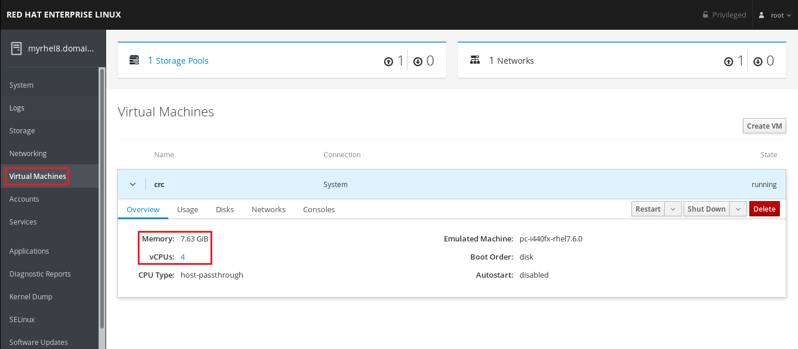

    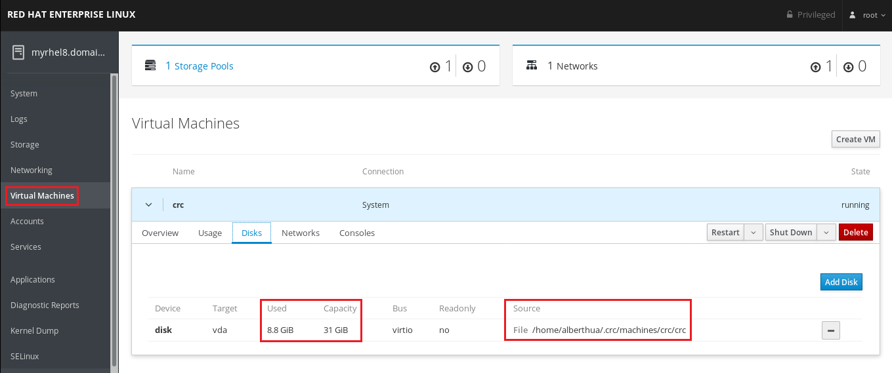

    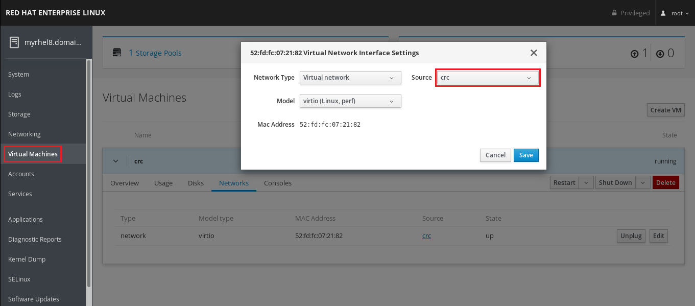

    > 📌 注意：
    > 1. 使用 RHEL 8 Web concole 查看 KVM 虚拟机详细信息时，需安装 `cockpit-machines` 软件包。         $ sudo dnf install -y cockpit-machines
    > 2. 该软件包安装成功后，将在 Web concole 上显示 KVM 虚拟机控制 Tab。

## 部署与验证集群

- 安装所需软件包：

  ```bash
  $ sudo dnf install -y qemu-kvm libvirt virt-install NetworkManager
  $ sudo systemctl enable --now libvirtd
  ```

- 安装 `CodeReady Containers`：

  ```bash
  $ wget https://mirror.openshift.com/pub/openshift-v4/clients/crc/latest/crc-linux-amd64.tar.xz
  # 下载最新版本的 CRC 二进制安装包
  
  $ tar -Jxvf crc-linux-amd64.tar.xz
  $ sudo cp crc-linux-1.6.0-amd64/crc /usr/local/bin
  # 解压 CRC 二进制软件包并拷贝至 /usr/local/bin 目录中
  
  $ crc version
  # 查看 CRC 与 OpenShift 版本
  ```
  
  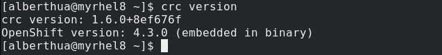

- 部署 OCP 集群：

  ```bash
  $ crc setup
  # 设置主机系统环境以满足 CodeReady Containers 虚拟机运行
  ```

  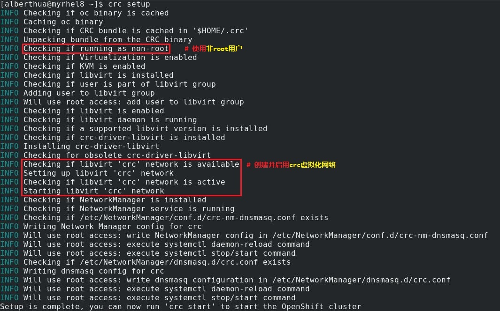

  ```bash
  $ crc start
  # 主机系统环境配置完成后启动 OCP 集群，该过程将持续数分钟。
  # OCP 集群启动后，可使用预定义的 developer 开发者用户或 kubeadmin 管理员用户登录。
  ```

  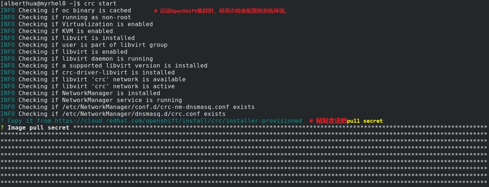

  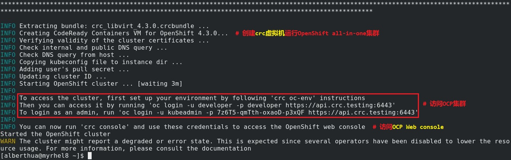

  > 📌 注意：
  > 1. 安装过程中需要合法的 `OpenShift user pull secret`。
  > 2. 该 pull secret 可从以下 URL 获取：
  >
  >    https://cloud.redhat.com/openshift/install/crc/installer-provisioned
  >
  >    登录该URL请启用 Red Hat Proxy，否则极可能登录失败！
  >
  >    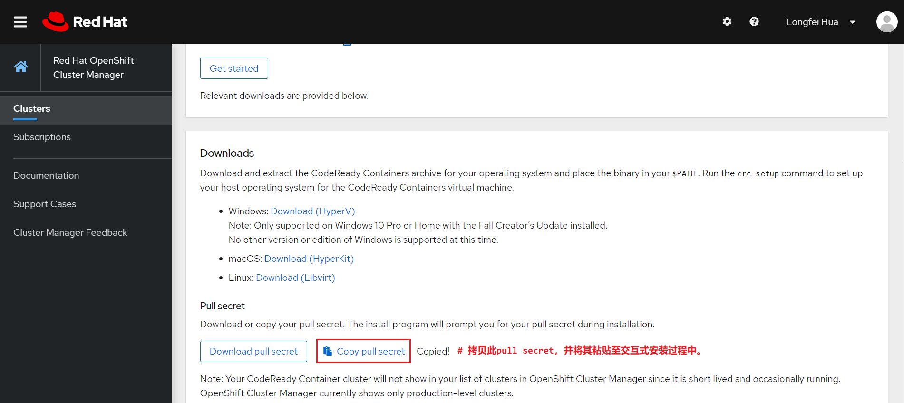

- 部署后配置：

  ```bash
  $ crc oc-env
  # 配置环境变量以访问 OCP 集群
  
  $ vim ~/.bashrc
  # 配置用户环境变量
  $ source ~/.bashrc
  ```
  
  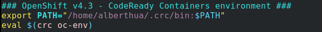
  
  ```bash
  $ cp /home/alberthua/.crc/machines/crc/kubeconfig ~/.kube/config
  # 拷贝 OCP 集群配置文件以使用命令访问集群
  ```
  
- 访问 OCP 集群并验证组件：

  ```bash
  $ oc login -u developer -p developer https://api.crc.testing:6443
  # 使用 developer 开发者用户登录 OCP 集群 
  
  $ oc login -u kubeadmin -p <password> https://api.crc.testing:6443
  # 使用 kubeadmin 管理员用户登录 OCP 集群
  ```
  
  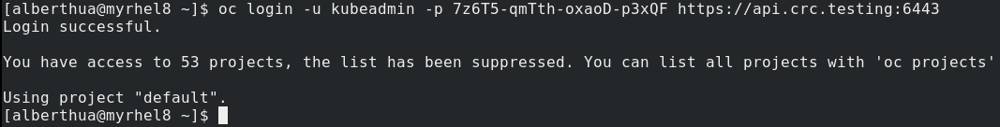

  > 📌 注意：
  > 查看kubeadmin管理员用户密码，如下所示：`$ cat ~/.crc/cache/crc\*/kubeadmin-password`

  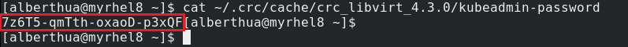

  ```bash
  $ oc cluster-info
  # 查看 OCP 集群信息
  ```
  
  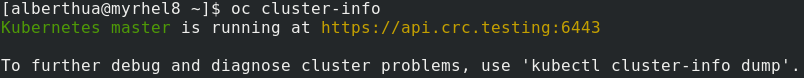
  
  ```bash
  $ oc config view
  # 查看 OCP 集群配置
  ```
  
  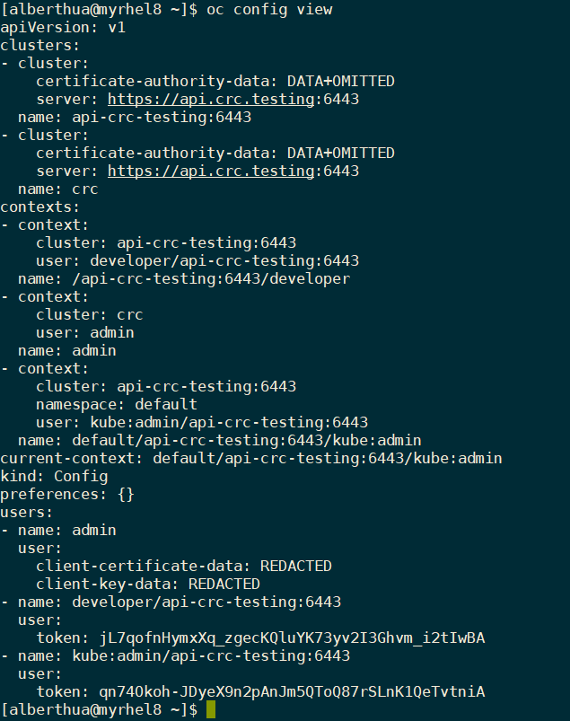
  
  ```bash
  $ oc get clusteroperator
  # 查看 OCP 集群 Operator
  # monitoring operator 默认情况下禁用
  ```
  
  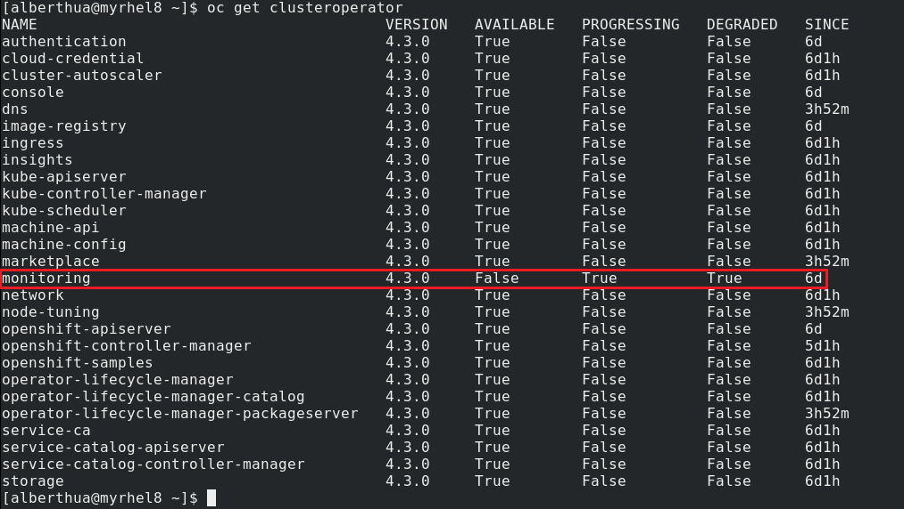
  
- 访问 OCP 集群 Web console：

  ```bash
  $ crc console
  # 使用 Web console 登录 OCP 集群
  ```

  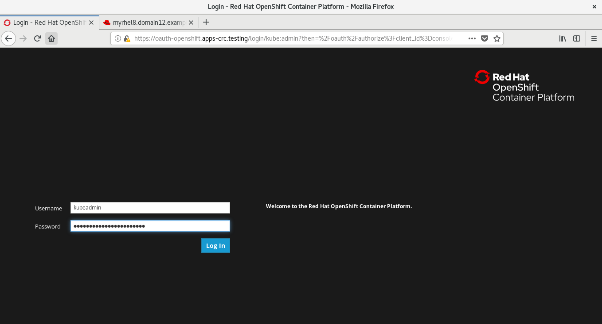

  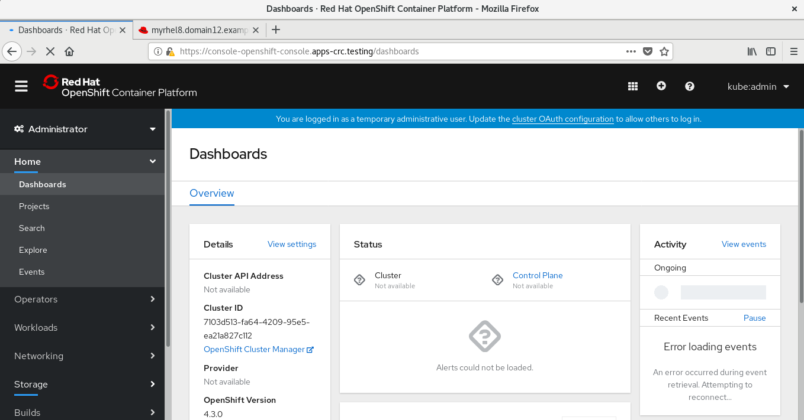

- 停止与删除 OCP 集群：

  ```bash
  $ crc stop
  # 停止 CodeReady Containers 虚拟机，即停止 OCP 集群。
  
  $ crc delete 
  # 删除已有的 CodeReady Containers 虚拟机，即删除 OCP 集群。
  ```
