# ⭕ S2I 基本原理与应用构建部署示例

[](https://quay.io/repository/alberthua/golang-builder)

## 文档说明

- OS 版本：
  - Red Hat Enterprise Linux Server release 7.5 (Maipo)
  - Red Hat Enterprise Linux Server release 8.4 (Ootpa)
- OCP 版本：
  - Red Hat OpenShift Container Platform 3.9.14（以下称 OCP 3.9）
  - Red Hat OpenShift Container Platform 4.6.19（以下称 OCP 4.6）
- GitWeb 版本：gitweb-1.8.3.1-13.el7.noarch
- S2I 版本：source-to-image-v1.3.1-a5a77147-linux-amd64
- 关于 S2I 的中文文档相对较少，且相关文档中的构建步骤与说明语焉不详，因此该文档以 Apache HTTPD 与 Golang 应用为例完整地说明如何构建 S2I 构建镜像与应用镜像，以及如何集成至不同版本的 OpenShift 中进行应用构建与部署。
- 该文档将 S2I 的功能在 OCP 3.9 与 OCP 4.6 平台中进行测试验证，需要注意的是在大版本的小版本间可能也会存在差异，此处仅提供解决思路。
- 在 OCP 4.6 中的测试验证以 `💎 补充` 的方式展示，若未做说明，则示例依然在 OCP 3.9 上测试运行。
- 示例中的源代码与脚本在 OCP 3.9 与 OCP 4.6 平台中均适用。

## 文档目录

- S2I 基本原理
- S2I 的使用方式
- 使用外部自定义 S2I 脚本构建 Apache HTTPD 应用镜像
- 创建自定义 S2I 构建镜像：Golang 构建镜像
- 创建自定义应用镜像：创建 Golang 应用镜像
- OpenShift 集成构建与部署 Golang 应用
- 参考链接

## S2I 基本原理

- 源代码构建（source to image, `S2I`）是 OpenShift 中常用的一种构建策略，也是 Red Hat 提供的镜像构建开源工具。
- S2I 将基础镜像与应用源代码利用一套约定的规则与构建流程，最终构建出用户需要的应用镜像。
- 在 S2I 构建中，当源代码变动时，用户无须重新使用 `docker build` 或 `podman build` 命令来构建应用镜像，而是由 S2I 工具自动执行代码变更后的构建过程。

> 💥 OCP 4.6 中 S2I 构建应用镜像的过程与 OCP 3.9 中存在显著差异，见下文示例。

- 因此，使用 S2I 工具可以得到与源代码实时保持一致的应用镜像，让应用镜像的构建变的更加方便和简单。
- S2I 的构建过程包含 3 个基本元素：
  - 应用源代码
  - S2I 构建镜像（`S2I builder image`）
  - S2I 脚本（`s2i/bin/{assemble,run,usage,save-artifacts}`）
- 用于创建 S2I 构建镜像的目录结构，如下所示：
  
  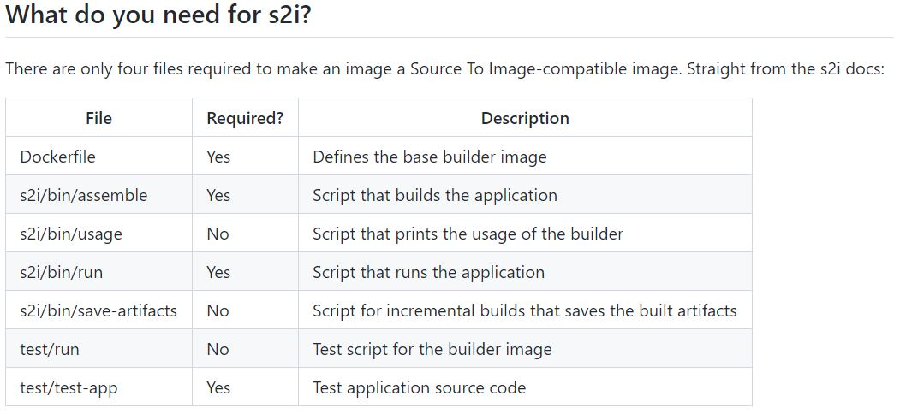
  
  > 👉 后文中的示例将详细说明并使用以下文件
  
  - `Dockerfile`：
    用于定义如何创建 S2I 构建镜像，可将 S2I 脚本注入构建镜像中。
  - `s2i/bin/assemble`：
    该脚本用于在源代码注入 S2I 构建镜像时指导其如何注入与编译，此时的 S2I 构建镜像中已包含编译运行环境或应用框架等。
  - `s2i/bin/usage`：
    该脚本用于在 Dockerfile 创建的 S2I 构建镜像运行退出时执行 usage 脚本中的指令。
  - `s2i/bin/run`：
    该脚本用于指导源代码构建后如何加载应用镜像以运行应用。
  - `s2i/bin/save-artifacts`：
    该脚本用于多次源代码构建过程中的依赖项缓存打包，加速之后的应用构建。
  - `test/{run,test-app}`：
    用于测试测试用源代码
- 使用 S2I 构建应用镜像的流程：
  👉 基础镜像 -> Dockerfile（注入 S2I 脚本） -> S2I 构建镜像（包含 S2I 脚本）
  👉 应用源代码 -> `s2i 命令直接构建` & `oc new-app 命令调用 S2I 构建` -> 应用镜像
  
  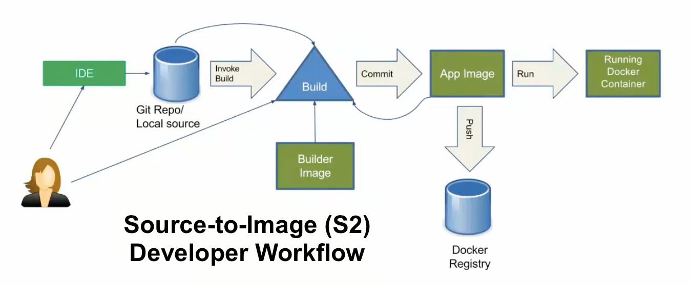

## S2I 的使用方式

- S2I 构建的核心在于 S2I 构建镜像的选取及构建，以下将介绍如何获取与构建 S2I 构建镜像。
- 获取 S2I 构建镜像的方式：
  1️⃣ 使用自定义 Dockerfile 对来自于 DockerHub、Quay.io 或其他镜像站点的基础镜像进行 S2I 构建镜像的构建。
  2️⃣ 直接使用由 Red Hat `RHSCL` 提供的 `registry.redhat.io/rhscl/*` 仓库中的镜像，此类镜像一般通过 Red Hat 镜像安全评级，可直接作为 S2I 构建镜像（默认包含 S2I 脚本）。

> 💥 由 RHSCL 提供的 S2I 构建镜像一般都由 docker 镜像格式封装，这点至关重要，因为 OCP 4.6 及更早的版本中使用 oc import-image 创建 image stream tag 引用镜像只支持 docker 镜像格式的镜像。

- 通过 S2I 构建镜像构建应用的 3 种方式：
  - 使用以上第一种自定义 S2I 构建镜像进行应用镜像的构建
  - 使用以上第二种由 RHSCL 提供的 S2I 构建镜像
    查看该类型 S2I 构建镜像中 S2I 脚本的存储路径，其中包括 assemble、run 与 usage 脚本，可用如下命令：

    ```bash
    $ podman inspect \
      --format='{{ index .Config.Labels "io.openshift.s2i.scripts-url" }}' \
      registry.redhat.io/rhscl/php-73-rhel7:latest
      image:///usr/libexec/s2i
    
    $ skopeo inspect docker://registry.redhat.io/rhscl/php-73-rhel7:latest \
      | grep io.openshift.s2i.scripts-url
          "io.openshift.s2i.scripts-url": "image:///usr/libexec/s2i",  
    ```
  
  - 基于以上第二种类型的镜像，通过位于外部源代码目录中的 `.s2i/bin/assemble` 与 `.s2i/bin/run` 的自定义脚本进行应用镜像的构建，该脚本可覆盖原始镜像中的默认 S2I 脚本。

## 使用外部自定义 S2I 脚本构建 Apache HTTPD 应用镜像

- 如上所述，可以直接使用来自于 RHSCL 的 S2I 构建镜像进行应用镜像的构建，但有时用户需对其中的 S2I 脚本进行修改后才能满足自身应用的需求，因此，S2I 提供可以在不直接更改 S2I 构建镜像内部默认脚本的情况下，使用外部的自定义 S2I 脚本即可覆盖镜像内的脚本，实现应用镜像的构建。
- 👨‍💻 示例：
  使用外部自定义 S2I 脚本覆盖 rhscl/httpd-24-rhel7 镜像中的脚本以构建应用镜像
  
  > 该示例在 OCP 3.9 与 OCP 4.6 中均已测试验证
  
  - `registry.redhat.io/rhscl/httpd-24-rhel7:latest` 中包含默认的 S2I 脚本，若用户具有自定义需求，直接使用将无法在构建应用镜像时实现更多的自定义配置，因此可在注入其中的源代码目录中创建 `.s2i/bin/assemble` 与 `.s2i/bin/run` 脚本以实现自定义。
  - 构建上述 S2I 构建镜像的 Dockerfile 可参考 [此处](https://github.com/sclorg/httpd-container/blob/master/2.4/Dockerfile)，而包含的 S2I 脚本可参考 [此处](https://github.com/sclorg/httpd-container/tree/master/2.4/s2i/bin)。
  - 创建源代码与自定义 S2I 脚本，位于 [该 GitHub 链接](https://github.com/Alberthua-Perl/DO288-apps/tree/main/s2i-scripts)：

    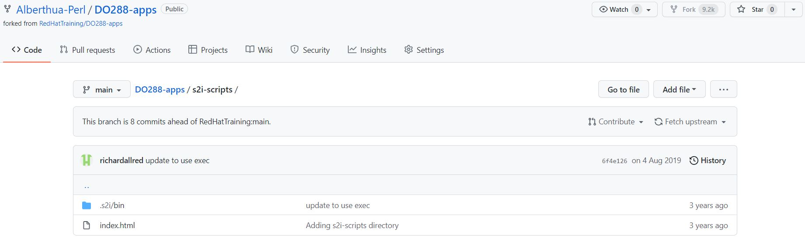
  
  - 其中 .s2i/bin/assemble 脚本如下所示：

    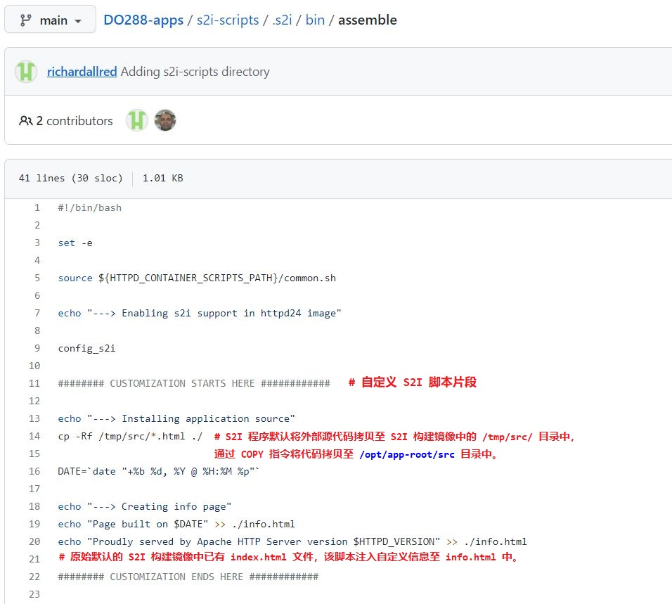
  
  - 根据以上脚本，使用 oc new-app 命令构建应用镜像并部署应用时，可追踪到自定义脚本中注入的日志信息，如下所示：

    ```bash
    $ oc new-app --name bonjour \
      httpd:2.4~https://github.com/Alberthua-Perl/DO288-apps \
      --context-dir s2i-scripts
    # 使用包含自定义 S2I 脚本的源代码目录构建应用镜像并部署应用
    ```

    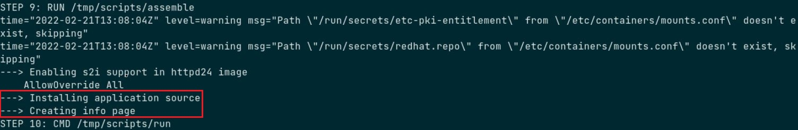

## 创建自定义 S2I 构建镜像：Golang 构建镜像

- 对于以上第一种使用自定义 Dockerfile 构建的 S2I 构建镜像而言，开发者在将其部署于 OpenShift 集群之前需要使用集群外的 `s2i` 命令行工具对其进行应用镜像的构建与测试，测试通过后才能将其用于 OpenShift 集群中的应用构建与部署。
- 该示例中未使用来自于 RHSCL 中的镜像，而是使用 DockerHub 中的 `golang:1.12` 为基础镜像创建 S2I 构建镜像，以作为 Golang 应用的构建环境。
- 如下所示，生成 Dockerfile 与 S2I 脚本模板，均存储于 `golang-s2i` 目录中，该目录无需提前创建。
  
  ```bash
  $ s2i create <s2i_builder_image_name> <directory>
  # 使用 s2i 命令创建 S2I 构建镜像的构建目录的骨架
  ```
  
  ```bash
  ### 示例 ###
  $ s2i create golang-builder $HOME/golang-s2i
  $ tree $HOME/golang-s2i
    $HOME/golang-s2i
    ├── Dockerfile
    ├── Makefile
    ├── README.md
    ├── s2i
    │   └── bin
    │       ├── assemble
    │       ├── run
    │       ├── save-artifacts
    │       └── usage
    └── test
        ├── run
        └── test-app
            └── index.html
  
    4 directories, 9 files
  ```

- 更改原始 Dockerfile 模板用于创建 S2I 构建镜像，如下所示：
  
  ```dockerfile
  # repository cloned from https://github.com/clcollins/golang-s2i.git
  # golang-builder
  FROM golang:1.12
  LABEL maintainer "Longfei Hua <hualongfeiyyy@163.com>"
  
  # environment variable GOCACHE=/tmp seted to avoid write errors when
  # running the build as a user other than root
  # 
  # environment variable SOURCE_DIR=/go/src/app depends on base image
  # GOPATH=/go environment variable in golang:1.12 base image 
  ENV CGO_ENABLED=0 \
      GOOS=linux \
      GOCACHE=/tmp \
      STI_SCRIPTS_PATH=/usr/libexec/s2i \
      SOURCE_DIR=/go/src/app
  
  LABEL io.k8s.description="Builder image for compiling and testing Go applications" \
        io.k8s.display-name="golang-builder" \
        io.openshift.s2i.scripts-url=image://${STI_SCRIPTS_PATH}
  
  # Copy the s2i scripts into the golang image
  # These scripts describe how to build & run the application, and extract artifacts 
  # for downstream builds
  COPY ./s2i/bin/ ${STI_SCRIPTS_PATH}
  # Must add exec permission otherwise build failed during 's2i build', and run application
  # container will fail.
  RUN chmod +x ${STI_SCRIPTS_PATH}/assemble ${STI_SCRIPTS_PATH}/run ${STI_SCRIPTS_PATH}/usage
  
  # The $SOURCE_DIR is dependent on the upstream golang image, based on the 
  # $GOPATH, etc. variable set there
  #
  # Allow random UIDs to write to the $SOURCE_DIR (for OKD/OpenShift)
  RUN mkdir -p $SOURCE_DIR && \
      chmod 0777 $SOURCE_DIR
  
  WORKDIR $SOURCE_DIR
  
  # Drop root (as is tradition)
  USER 1001
  
  # usage script just print regular messages
  CMD ["/usr/libexec/s2i/usage"]
  ```

- 更改原始 `s2i/bin/assemble` 脚本，如下所示：
  
  ```bash
  #!/bin/bash -e
  #
  # S2I assemble script for the 'golang-builder' image.
  # The 'assemble' script builds your application source so that it is ready to run.
  #
  # For more information refer to the documentation:
  #    https://github.com/openshift/source-to-image/blob/master/docs/builder_image.md
  #
  
  set -o errexit
  
  # If the 'golang-builder' assemble script is executed with the '-h' flag, print the usage.
  if [[ "$1" == "-h" ]]; then
      exec /usr/libexec/s2i/usage
  fi
  
  # Restore artifacts from the previous build (if they exist).
  #
  # assemble script builded in 'goland-builder' image, and run by s2i command call.
  # current directory is workdir $SOURCE_DIR(/go/src/app).
  if [ "$(ls /tmp/artifacts/ 2>/dev/null)" ]; then
    echo "---> Restoring build artifacts..."
    mv /tmp/artifacts/. ./
  fi
  
  # s2i copy application source into image /tmp/src/ directory.
  # And then copy application source to golang $SOURCE_DIR(/go/src/app).
  echo "---> Installing application source..."
  cp -Rf /tmp/src/. ./
  
  echo "---> Downloading dependencies..."
  go get -v
  
  # The -o app is important, as we have set this in the 
  # s2i/bin/run script, allowing it to run whatever app was
  # generated by the build below
  echo "---> Building application from source..."
  go build -v -o app -a -installsuffix cgo
  # app is the name of golang application which is in run script.
  
  #echo "---> Running tests..."
  #go test -v -o app_test.go
  ```
  
  `s2i/bin/run` 脚本如下所示：
  
  ```bash
  #!/bin/bash -e
  #
  # S2I run script for the 'golang-builder' image.
  # The run script executes the server that runs your application.
  #
  # For more information see the documentation:
  #    https://github.com/openshift/source-to-image/blob/master/docs/builder_image.md
  #
  
  exec app
  ```

- 以上 golang-s2i 目录中的 Dockerfile 与 S2I 脚本可参考 [该 GitHub 链接](https://github.com/Alberthua-Perl/dockerfile-s2i-demo/tree/master/golang-s2i)。

- docker build 命令创建 Golang 构建镜像：
  
  ```bash
  $ sudo docker build -t goland-builder:v1.0 $HOME/golang-s2i
  ```
  
  💎 补充：
  - RHEL 8 或 OCP 4.x 中使用 podman 命令创建 Golang 构建镜像：

    ```bash
    $ podman build -t goland-builder:v1.0 $HOME/golang-s2i
    ```
  
  > ✅ Dockerfile 定义如何创建构建镜像，封装 S2I 脚本而不触发其执行，只有使用 s2i 命令创建应用镜像时才调用脚本进行源代码编译与构建。

- 创建的构建镜像应符合以下几个标准，使其满足通用的编译构建环境：
  - 通用原则：
    - 构建镜像一般应包含常见的应用编译工具，以及默认的构建与运行脚本。
    - 构建镜像并非只针对于具体某个项目，而是面向某种类型的项目，如针对 Python 类应用的构建镜像。
    - 这样才可以规范应用构建的流程，减少项目中构建流程的管理工作。
  - 简洁原则：
    - 构建过程中不要引入无关的文件，构建完成后要及时清除构建过程中生成的临时文件及应用源代码。
  - 安全原则：
    - 避免使用 root 用户，同时不要过度放开文件的权限。

## 创建自定义应用镜像：创建 Golang 应用镜像

- 该示例将部署基于 Golang 的 web server，源代码位于 [该 GitHub 链接](https://github.com/Alberthua-Perl/go-kubernetes-learn-path/blob/main/goSimpleWebServer.go)。

- 使用 s2i 命令构建应用镜像：
  
  ```bash
  $ s2i build [<source_code_dir>|<source_code_url>] \
    <s2i_builder_image>:[tag] <application_image>:[tag]
  # 使用应用源代码与 S2I 构建镜像构建应用镜像
  ```

- s2i 命令将触发构建镜像中的 S2I assemble 与 run 脚本编译应用程序。
  
  ```bash
  $ s2i build $HOME/backup/gopl.io golang-builder:v1.0 go-web-server:v1.0
  ---> Installing application source...
  ---> Downloading dependencies...
  net
  net/textproto
  crypto/x509
  ...
  app
  ---> Building application from source...
  errors
  internal/cpu
  math/bits
  runtime/internal/atomic
  ...
  app
  Build completed successfully
  ```

- 运行构建的容器化 Golang 应用：
  
  ```bash
  $ sudo docker run -d --rm --name=go-web-server -p 9090:9090 go-web-server:v1.0
  ```

- 💎 补充：
  - `s2i build` 命令需要使用本地 Docker 服务，因为它直接使用 `Docker API` 通过 `socket` 套接字来创建 S2I 构建镜像，而在 RHEL 8 与 OCP 4.x 中底层容器运行时默认使用 `CRI-O` ，因此在使用该命令时将运行失败，这与 OCP 3.x 中使用 s2i build 命令的行为存在较大差异，报错如下所示：

    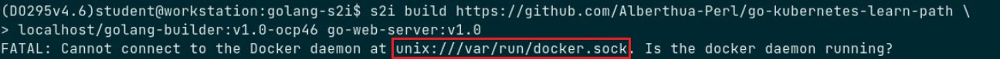
  
  - 若在 RHEL 8 与 OCP 4.x 中使用 s2i build 命令，可添加 `--add-dockerfile` 选项，那么该命令将应用源代码克隆至该 Dockerfile/Containerfile 所在的目录中，并生成新的用于创建应用镜像的 `Dockerfile/Containerfile`，新生成的 Dockerfile/Containerfile 中包括 S2I 构建镜像与源代码的信息，s2i 不再调用 Docker API 而需要开发人员再手动使用 `podman build` 命令调用新生成的 Dockerfile/Containerfile 重新构建应用镜像。
  - 以上说明，可参考如下：

    ```bash
    $ s2i build [<source_code_dir>|<source_code_url>] \
      <s2i_builder_image>:[tag] <application_image>:[tag] \
      --add-dockerfile /path/to/dockerfile_or_containerfile
    ```

    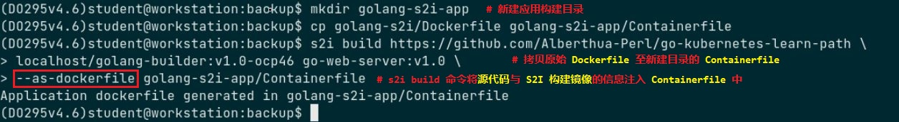

    在该示例中，笔者使用 Containerfile 用于 podman build 构建。

    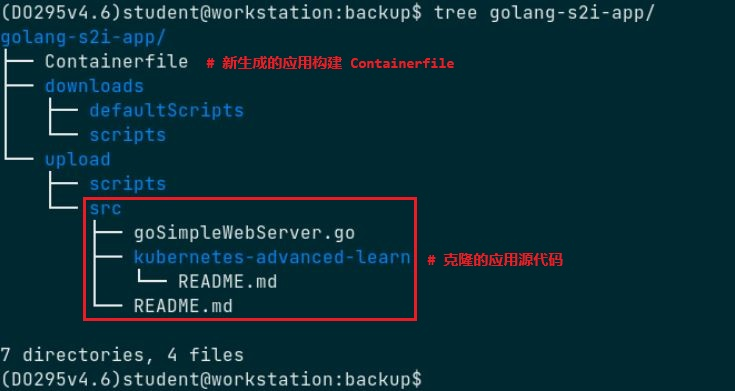

    新生成的 Containerfile 用于创建应用镜像：

    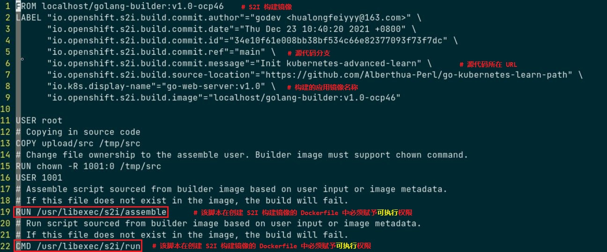

    使用 podman 命令与 Containerfile 所在目录的上下文构建应用镜像，用于后续的与 OCP 4.6 的兼容性测试。

    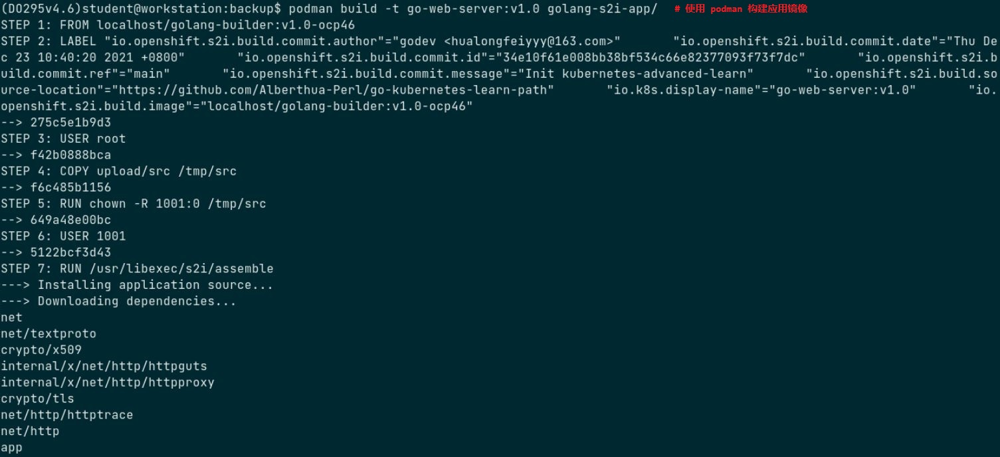

    podman run 命令使用新生成的应用镜像进行测试：

    ```bash
    $ podman run -d \
      -u 1234 --name=go-web-server -p 9090:9090 go-web-server:v1.0
    # 使用 -u 选项指定随机用户运行应用，测试是否可像 OpenShift 中一样使用随机用户。
    $ curl http://127.0.0.1:9090
      Test S2I process!
    ```
  
  - 应用正常运行说明创建的 S2I 构建镜像可被 OpenShift 集群正常使用，因此，将 `golang-builder:v1.0-ocp46` 推送至 Quay.io 的私有镜像仓库中，也可将该镜像推送至 DockerHub 的私有镜像仓库中。

    ```bash
    $ podman login -u alberthua quay.io
    $ skopeo copy \
      containers-storage:localhost/golang-builder:v1.0-ocp46 \
      docker://quay.io/alberthua/golang-builder:v1.0-ocp46
    # 将存储于本地镜像缓存中的 S2I 构建镜像上传至 Quay 中
    ```
  
  - 💥 特别重要：
    - podman build 构建的容器镜像默认采用 `OCI` 镜像格式存储，而 docker build 构建的容器镜像默认采用 `docker` 镜像格式存储。
    - `DockerHub` 与 `Quay.io` 中的容器镜像格式取决于被推送的该镜像自身的构建方式，而与存储的容器镜像仓库类型无关。
    - 可分别使用 docker build 与 podman build 构建 S2I 构建镜像 golang-builder，以获得两种不同的封装格式，可使用 `podman inspect` 识别镜像格式：

      ```bash
      $ podman inspect \
        <container_image_registry_url>/<user_or_org>/<repository>:[tag] \
        | jq .[0].ManifestType
      # 查看指定容器镜像使用的镜像封装格式  
      ```

      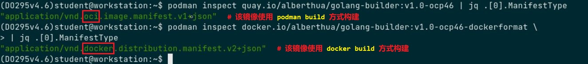 

    - 🤘 这里要特别注意的是，若要将 S2I 构建镜像使用 OpenShift 的 oc import-image 命令创建 image stream tag 的引用，需要区分镜像的封装格式：

      - `OCP 4.6` 或更早版本的 `openshift-apiserver` 只能处理 `docker` 镜像格式封装的镜像，因此，在创建 S2I 构建镜像时需使用 `Docker` 容器运行时。

      - `OCP 4.7` 及以上版本的 `openshift-apiserver` 能处理 `OCI` 镜像格式封装的镜像，因此，在创建 S2I 构建镜像可直接使用 `podman build` 命令。

      - 若未使用对应镜像格式的镜像，如 oc import-image 命令将 DockerHub 中的 OCI 镜像格式的镜像导入 OCP 4.6 集群中时，将直接报错 `Import failed (NotFound)`，即使可手动在 DockerHub 中找到该镜像。

      > 以上 OCP 4.x 版本间差异可参考 [该 Red Hat Customer Portal 链接](https://access.redhat.com/solutions/4933011)。

## 🚀 OpenShift 集成构建与部署 Golang 应用

- 笔者环境中使用的 OCP 3.9 集群中已集成 `docker-distribution` 容器镜像仓库以及基于 Web 的 `GitWeb` 代码仓库。

> 👉 注意：容器镜像仓库与代码仓库均运行于本地 registry.lab.example.com 节点上

- 以上的容器镜像仓库为公共镜像仓库可直接拉取镜像，无需进行用户的验证与授权，因此在 OCP 构建应用镜像时无需创建 `secret` 资源对象，若使用 DockerHub、Quay.io (Quay)、Harbor 等私有镜像仓库拉取镜像时，需创建并使用拉取镜像所对应的 secret，否则应用构建（build）过程将失败。
- 上传应用源码至 GitWeb 的相应代码 repository 中：
  
  ```bash
  $ scp -r $HOME/gopl.io/.git/* root@registry:/var/www/git/gopl.io/
  # GitWeb 仓库中的源代码只存储 .git 目录中的文件与目录
  ```

- 推送构建镜像至容器镜像仓库中，并在 `openshift` 项目中创建 `imagestreamtag` 资源：
  
  ```bash
  $ sudo docker tag golang-builder:v1.0 registry.lab.example.com/golang-builder:v1.0
  $ sudo docker push registry.lab.example.com/golang-builder:v1.0
  $ oc login -u admin -p redhat https://master.lab.example.com
  $ oc import-image golang-builder:v1.0 \
    --confirm --from registry.lab.example.com/golang-builder:v1.0 \
    -n openshift
  # 对于 openshift 项目而言必须使用 OCP admin 集群管理员用户创建 imagestreamtag
  ```

- 使用 oc new-app 命令创建 buildconfig、imagestream 与 deploymentconfig 资源：
  
  ```bash
  $ oc new-app \
    --name=go-web-server \
    golang-builder:v1.0~http://services.lab.example.com/gopl.io
    --> Found image 22c67f5 (9 hours old) in image stream "openshift/golang-builder" under tag 
        "v1.0" for "golang-builder:v1.0"
  
        golang-builder 
        -------------- 
        Builder image for compiling and testing Go applications
  
        * A source build using source code from http://services.lab.example.com/gopl.io will 
          be created
          * The resulting image will be pushed to image stream "go-web-server:latest"
          * Use 'start-build' to trigger a new build
        * This image will be deployed in deployment config "go-web-server"
        * The image does not expose any ports - if you want to load balance or send traffic to 
          this component
          you will need to create a service with 'expose dc/go-web-server --port=[port]' later
  
    --> Creating resources ...
        imagestream "go-web-server" created
        buildconfig "go-web-server" created
        deploymentconfig "go-web-server" created
    --> Success
        Build scheduled, use 'oc logs -f bc/go-web-server' to track its progress.
        Run 'oc status' to view your app.
  ```

- 定义应用的 service 资源：
  
  ```yaml
  apiVersion: v1
  kind: Service
  metadata:
    annotations:
      openshift.io/generated-by: OpenShiftNewApp
    labels:
      app: go-web-server
    name: go-web-server
    namespace: golang-s2i-app
  spec:
    ports:
    - name: 9090-tcp
      port: 9090
      protocol: TCP
      targetPort: 9090
    selector:
      app: go-web-server
      deploymentconfig: go-web-server
    sessionAffinity: None
    type: ClusterIP
  status:
    loadBalancer: {}
  ```
  
  ```bash
  $ oc apply -f go-web-server-svc.yml
  $ oc expose svc go-web-server --hostname=go-web-server.apps.lab.example.com
  # 创建 route 资源对象，使应用可被外部访问。
  ```

- 应用的可用性测试，如下所示：
  
  ```bash
  $ curl http://go-web-server.apps.lab.example.com
    Test S2I process!
  ```

- 💎 补充：OCP 4.6 中集成构建与部署 Golang 应用
  - 以上的 Golang 应用在 OCP 3.9 中的集成构建与部署可在 OCP 4.6 中测试验证。
  - 构建与部署过程如下所示：
    - 在使用 Docker 容器运行时的节点上运行：

      ```bash
      $ sudo docker login -u alberthua docker.io
      $ sudo docker tag \
        golang-builder:v1.0-ocp46-dockerformat \
        docker.io/alberthua/golang-builder:v1.0-ocp46-dockerformat
      $ sudo docker push \
        docker.io/alberthua/golang-builder:v1.0-ocp46-dockerformat
      # 推送创建的 S2I 构建镜像至 DockerHub 的个人仓库中
      ```

    - 使用个人账号登录 DockerHub 将该 S2I 构建镜像设置为 `private` 私有镜像。

      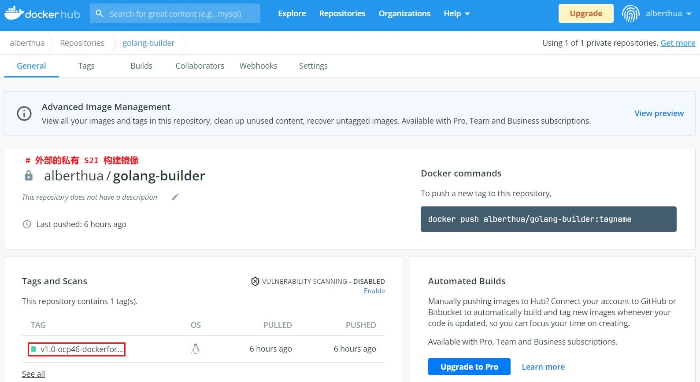

    > 此处设置为 private 的目的在于演示如何导入外部的私有容器镜像。

    - 登录 OCP 4.6 集群执行以下步骤：

      ```bash
      $ podman login -u alberthua docker.io
      # 创建登录与认证 DockerHub 的 token，用于 OCP 创建 secret 资源对象。
      
      $ oc login -u <developer_user> -p <password> <api_for_ocp_master>
      $ oc new-project s2i-go-app
      $ oc create secret generic dockerhub \
        --from-file .dockerconfigjson=/run/user/1000/containers/auth.json \
        --type kubernetes.io/dockerconfigjson
      $ oc import-image golang-builder:v1.0-ocp46-dockerformat --confirm \
        --from docker.io/alberthua/golang-builder:v1.0-ocp46-dockerformat
      # 创建 image stream tag 引用指向外部私有的 S2I 构建镜像
      $ oc secrets link builder dockerhub
      # 为名为 builder 的 service account 创建对于 dockerhub secret 的链接，
      # 使其可在构建应用的过程中拉取 S2I 构建镜像。
      
      $ oc new-app --name gowebserver \
        golang-builder:v1.0-ocp46-dockerformat~https://github.com/Alberthua-Perl/go-kubernetes-learn-path
      $ oc logs -f buildconfig/gowebserver
      $ oc get all
      ```

      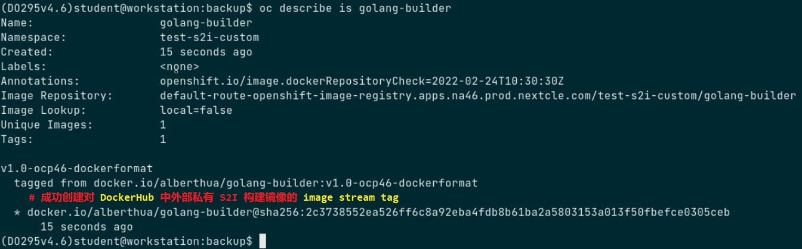

    - 创建 service 资源对象与 route 资源对象暴露应用：

      ```bash
      $ oc expose svc gowebserver
      $ curl http://$(oc get route gowebserver -o jsonpath='{.spec.host}')
        Test S2I process!
      ```

      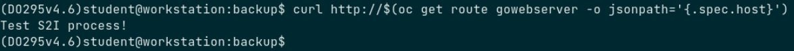

## 参考链接

- [GitHub Doc - source-to-image (S2I)](https://github.com/openshift/source-to-image)
- [GitHub Doc - source-to-image/cli.md](https://github.com/openshift/source-to-image/blob/master/docs/cli.md)
- [GitHub Doc - Software Collections](https://github.com/sclorg/?q=s2i)
- [Using Red Hat Software Collections Container Images](https://access.redhat.com/articles/1752723)
- [How to override S2I builder scripts](https://cloud.redhat.com/blog/override-s2i-builder-scripts)
- [How to Create an S2I Builder Image](https://cloud.redhat.com/blog/create-s2i-builder-image)
- [Writing your own Golang Builder with Source-to-Image](https://github.com/clcollins/golang-s2i)
- [Creating a basic S2I builder image](https://github.com/openshift/source-to-image/tree/master/examples/nginx-centos7#creating-a-basic-s2i-builder-image)
- [Multiple Deployment Methods for OpenShift](https://cloud.redhat.com/blog/multiple-deployment-methods-openshift)
