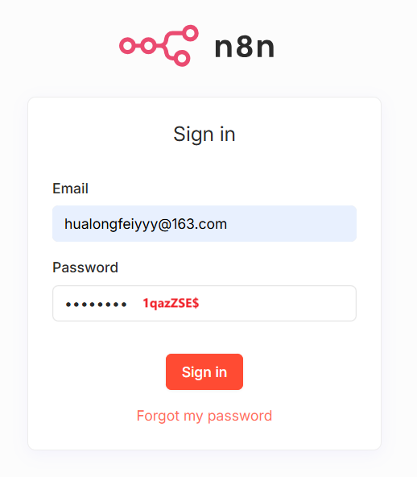

# 实战2：n8n 工作流平台部署安装

## 文档目录

- [实战2：n8n 工作流平台部署安装](#实战2n8n-工作流平台部署安装)
  - [文档目录](#文档目录)
  - [1. 实验环境](#1-实验环境)
  - [2. 方式1：npm 模块安装方式](#2-方式1npm-模块安装方式)
  - [3. 方式2：n8n 容器化部署](#3-方式2n8n-容器化部署)
    - [3.1 RHEL 10.0 (Coughlan) 节点上拉取 n8n 容器镜像](#31-rhel-100-coughlan-节点上拉取-n8n-容器镜像)
    - [3.2 RHEL 10.0 (Coughlan) 节点上部署 n8n 容器](#32-rhel-100-coughlan-节点上部署-n8n-容器)
  - [参考链接](#参考链接)

## 1. 实验环境

| 系统 | 内核 | CPU | 内存 | NVM | npm | n8n | Podman | 功能 |
| ----- | ----- | ----- | ----- | ----- | ----- | ----- | ----- | ----- |
| Ubuntu 24.04.4 LTS | 6.8.0-110-generic | 8 | 16G | 0.40.4 | 11.12.1 | 2.18.6 | - | n8n 工作流平台（npm 安装方式） |
| RHEL 10.0 (Coughlan) | 6.12.0-124.55.1.el10_1.x86_64 | 8 | 16G | - | - | - | 5.6.0 | Baserow 应用 Pod <br> 向量数据库 <br> n8n 工作流平台（容器化方式） |

## 2. 方式1：npm 模块安装方式

> 说明：这种方式在常规开发调试中常用。

- 1️⃣ 先根据 [1.2 方式2：NVM 管理多版本 Node.js 环境（用户环境安装）](https://github.com/Alberthua-Perl/tech-docs/blob/master/DevOps%20%E6%8A%80%E6%9C%AF%E6%A0%88/Jenkins%20%E7%9A%84%20CICD%20%E4%B9%8B%E6%97%85/Node.js%20%E4%B9%8B%20npm%20%E5%B8%B8%E7%94%A8%E6%96%B9%E6%B3%95/Node.js%20%E4%B9%8B%20npm%20%E5%B8%B8%E7%94%A8%E6%96%B9%E6%B3%95.md#12-%E6%96%B9%E5%BC%8F2nvm-%E7%AE%A1%E7%90%86%E5%A4%9A%E7%89%88%E6%9C%AC-nodejs-%E7%8E%AF%E5%A2%83%E7%94%A8%E6%88%B7%E7%8E%AF%E5%A2%83%E5%AE%89%E8%A3%85) 部署 npm 所需版本环境
- 2️⃣ 参考以下步骤使用淘宝 npm 模块源加速安装 n8n：
  
  ```bash
  ### 检查各组件版本
  $ cd $HOME
  $ nvm --version
  0.40.4
  $ node --version
  v24.15.0
  $ npm --version
  11.12.1
  $ npm install -g n8n@2.18.6 --registry=https://registry.npmmirror.com
  $ n8n --version
  2.18.6

  ### 创建服务端密钥与证书
  $ mkdir ~/certs
  $ cd ~/certs
  $ openssl genrsa -out CA-center.key 2048
  $ openssl req -key CA-center.key \
    -subj "/C=CN/ST=Shanghai/L=Shanghai/O=LAB/OU=N8N/CN=CA-center.lab.example.com" \
    -new -x509 -days 3650 -out CA-center.crt
  $ openssl genrsa -out server.key 2048
  $ openssl req -key server.key \
    -subj "/C=CN/ST=Shanghai/L=Shanghai/O=LAB/OU=N8N/CN=cloud-ctl.lab.example.com" \
    -new -out server.csr
  $ openssl x509 -req -in server.csr \
    -CAkey CA-center.key -CA CA-center.crt -CAcreateserial -days 3650 -out server.crt

  ### 加载 N8N 运行所需环境变量
  $ export N8N_PROTOCOL=https
  $ export N8N_SSL_CERT=$HOME/certs/server.crt
  $ export N8N_SSL_KEY=$HOME/certs/server.key
  $ export N8N_HOST=0.0.0.0
  $ export N8N_PORT=5678

  ### 启动 n8n 进程
  $ n8n start
  Initializing n8n process
  n8n ready on ::, port 5678
  n8n Task Broker ready on 127.0.0.1, port 5679
  Failed to start Python task runner in internal mode. because its virtual environment is missing from this system. Launching a Python runner in internal mode is intended only for debugging and is not recommended for production. Users are encouraged to deploy in external mode. See: https://docs.n8n.io/hosting/configuration/task-runners/#setting-up-external-mode
  [license SDK] Skipping renewal on init: license cert is not initialized
  Registered runner "JS Task Runner" (rkxTUM7Hk8MMlVczcVJRA)
  Version: 2.18.6
  Building workflow dependency index...
  Finished building workflow dependency index. Processed 0 draft workflows, 0 published workflows.

  Editor is now accessible via:
  https://0.0.0.0:5678

  Press "o" to open in Browser.
  ```

- 3️⃣ 打开浏览器（Chrome 或 Firefox），输入 https://<n8n_node_ip>:5678，在指引下设置完成所需字段，即可通过以下界面登录：

  <center></center>

## 3. 方式2：n8n 容器化部署

> 说明：这种方式更推荐在生产环境中部署，更灵活，方便管理。

n8n 容器镜像层采用 zstd 压缩格式，在一些旧版本的 Podman 中已经无法操作此镜像，运行 podman run 等命令返回以下报错。因此，切换高版本的 Podman 即可解决此问题。

```plain
Error: error creating build container: error preparing image configuration: error converting image "containers-storage:[overlay@/home/godev/.local/share/containers/storage+/run/user/1000/containers]@f3727744768b5a6cc7943e5c398ca6f28d9b3039f3a19a62ee2fab5990001d49" from "application/vnd.oci.image.manifest.v1+json" to "application/vnd.docker.distribution.manifest.v2+json": Error during manifest conversion: "application/vnd.oci.image.layer.v1.tar+zstd": zstd compression is not supported for docker images
```

### 3.1 RHEL 10.0 (Coughlan) 节点上拉取 n8n 容器镜像

n8n 容器镜像存储于 DockerHub 内，由于国内网络环境拉取经常超时失败，现已将 `n8n:2.19.5` 与 `runners:2.19.5` 这两个 stable 版本的镜像备份至 quay.io 中，可公开拉取使用。

```bash
$ podman pull docker.io/n8nio/n8n:2.19.5
$ podman pull docker.io/n8nio/runners:2.19.5
```

若执行以上命令 timeout 超时失败，可尝试拉取上述镜像备份，为后续部署做准备：

```bash
$ podman pull quay.io/alberthua/n8n:2.19.5
$ podman pull quay.io/alberthua/runners:2.19.5
```

### 3.2 RHEL 10.0 (Coughlan) 节点上部署 n8n 容器

n8n 的 **Code 节点** 可集成运行 JavaScript 代码与 **Python 代码**，但是为了安全起见，不允许在 n8n 容器中直接运行 Python 代码，需要依赖 n8n 的 **runners 容器**。关于此容器的架构和功能可参考 [Task runners | n8n docs](https://docs.n8n.io/hosting/configuration/task-runners/)。

```bash

```

## 参考链接

- [Install n8n | n8n docs](https://docs.n8n.io/hosting/installation/npm/#try-n8n-with-npx)
- [n8nio/n8n | DockerHub](https://hub.docker.com/r/n8nio/n8n)
- [Task runners | n8n docs](https://docs.n8n.io/hosting/configuration/task-runners/)
