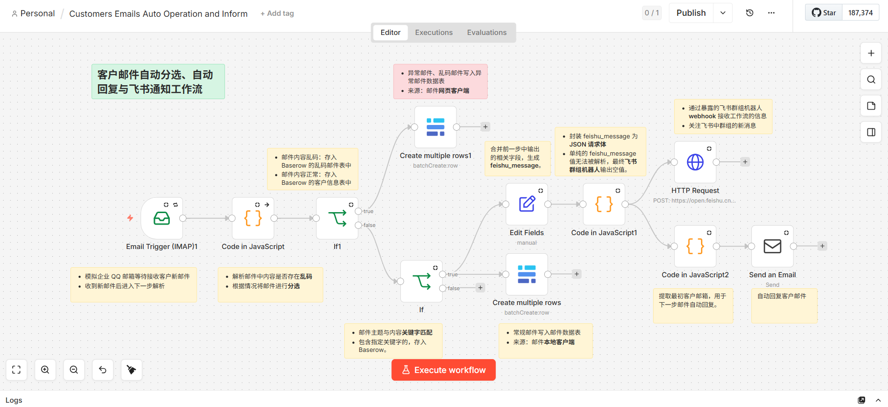

# 实战3：客户邮件自动收发与飞书通知响应

## 文档目录

- [实战3：客户邮件自动收发与飞书通知响应](#实战3客户邮件自动收发与飞书通知响应)
  - [文档目录](#文档目录)
  - [0. 整体 n8n 工作流示例](#0-整体-n8n-工作流示例)
  - [1. 准备 QQ 邮箱 POP3/IMAP/SMTP 服务的授权码](#1-准备-qq-邮箱-pop3imapsmtp-服务的授权码)
  - [2. 创建 n8n 工作流](#2-创建-n8n-工作流)
    - [2.1 设置 Email Trigger (IMAP) 触发节点](#21-设置-email-trigger-imap-触发节点)
    - [2.2 邮件内容乱码筛选](#22-邮件内容乱码筛选)
    - [2.3 If 判断节点分选数据](#23-if-判断节点分选数据)
    - [2.4 部署 Baserow 应用 Pod 存储存储邮件数据](#24-部署-baserow-应用-pod-存储存储邮件数据)
    - [2.5 生成 Baserow 数据库访问](#25-生成-baserow-数据库访问)
    - [2.5 设置 Baserow 记录客户请求](#25-设置-baserow-记录客户请求)
    - [2.6](#26)
  - [工作流扩展方向](#工作流扩展方向)
  - [参考链接](#参考链接)

## 0. 整体 n8n 工作流示例



## 1. 准备 QQ 邮箱 POP3/IMAP/SMTP 服务的授权码

- 此工作流从 `Email Trigger (IMAP)` 触发节点开始，
- 什么是 POP3/IMAP/SMTP 服务？
  - POP3（Post Office Protocol - Version 3）协议用于支持使用电子邮件客户端获取并删除在服务器上的电子邮件。
  - IMAP（Internet Message Access Protocol）协议用于支持使用电子邮件客户端交互式存取服务器上的邮件。
  - SMTP（Simple Mail Transfer Protocol）协议用于支持使用电子邮件客户端发送电子邮件。
- IMAP/SMTP 设置方法：
  - 用户名/帐户：你的 QQ 邮箱完整的地址
  - 密码：生成的授权码
  - 电子邮件地址：你的 QQ 邮箱的完整邮件地址
  - 接收邮件服务器：imap.qq.com，使用 SSL，端口号 **993**。
  - 发送邮件服务器：smtp.qq.com，使用 SSL，端口号 **465** 或 **587**。

## 2. 创建 n8n 工作流

登录 Ubuntu 24.04.4 LTS 节点上启动原生 n8n 进程：

```bash
$ cd $HOME
$ export N8N_PROTOCOL=https
$ export N8N_SSL_CERT=$HOME/certs/server.crt
$ export N8N_SSL_KEY=$HOME/certs/server.key
$ export N8N_HOST=0.0.0.0
$ export N8N_PORT=5678
$ n8n start
```

### 2.1 设置 Email Trigger (IMAP) 触发节点

### 2.2 邮件内容乱码筛选

### 2.3 If 判断节点分选数据

### 2.4 部署 Baserow 应用 Pod 存储存储邮件数据

笔者原本考虑使用在线 Airtable 存储邮件中的客户信息与邮件内容等，但考虑到国内用户对 Airtable 的账号注册与网络环境因素，采用替代方案，即使用离线的 Baserow 应用 Pod 来代替 Airtable。Baserow 类似于 Airtable，是一种无代码数据库平台（No-Code Database），可以像电子表格一样操作，但底层是 PostgreSQL 结构化数据库。它可用于客户关系管理（Customer Relationship Management, **CRM**）。

在 Red Hat Enterprise Linux release 10.0 (Coughlan) 节点上执行以下步骤完成 Baserow 应用 Pod 的部署：准备 k8s.gcr.io/pause:3.6 基础容器镜像，并运行 Baserow 应用 Pod

```bash

```

### 2.5 生成 Baserow 数据库访问

### 2.5 设置 Baserow 记录客户请求

163 邮箱发送（客户发送） --> qq 邮箱接收（统一接收入口） --> n8n 工作流接收触发流程

163 网页版邮箱发送的邮件中文内容默认使用非 UTF-8 编码，后续从 QQ 邮箱中接收的邮件由 n8n 工作流触发读取处理。Baserow 使用 UTF-8 编码格式存储中文字段，而邮件来源使用非 UTF-8 编码的话，在 Baserow 中将已乱码形式出现。因此，需注意邮件发送客户端的类型。

### 2.6 


## 工作流扩展方向

- 可以根据邮件内容的关键词，自动分配给不同的技术专家。
- 可以集成AI模型，自动生成初步的回复建议。
- 可以设置超时提醒，如果24小时未处理，自动升级通知。

## 参考链接

- [SMTP/IMAP服务 | QQ邮箱](https://wx.mail.qq.com/list/readtemplate?name=app_intro.html#/agreement/authorizationCode)
- [Baserow Docs](https://baserow.io/docs/index)
- [baserow/baserow | DockerHub](https://hub.docker.com/r/baserow/baserow)
- [在群组中使用机器人 | 飞书帮助中心](https://www.feishu.cn/hc/zh-CN/articles/360024984973-%E5%9C%A8%E7%BE%A4%E7%BB%84%E4%B8%AD%E4%BD%BF%E7%94%A8%E6%9C%BA%E5%99%A8%E4%BA%BA#tabs0|lineguid-TINL0)