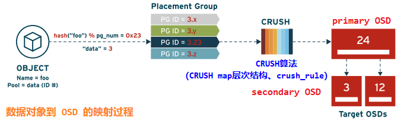
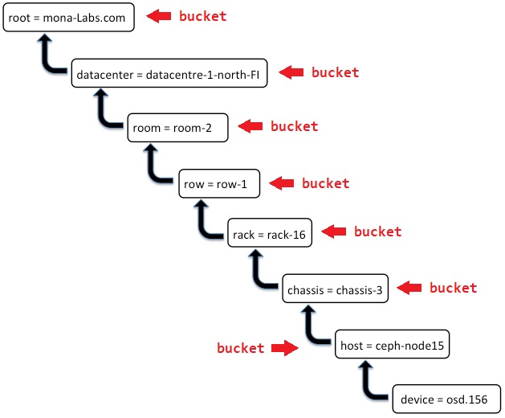
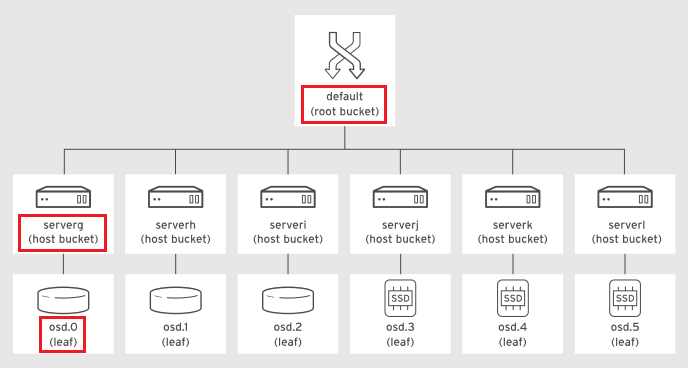
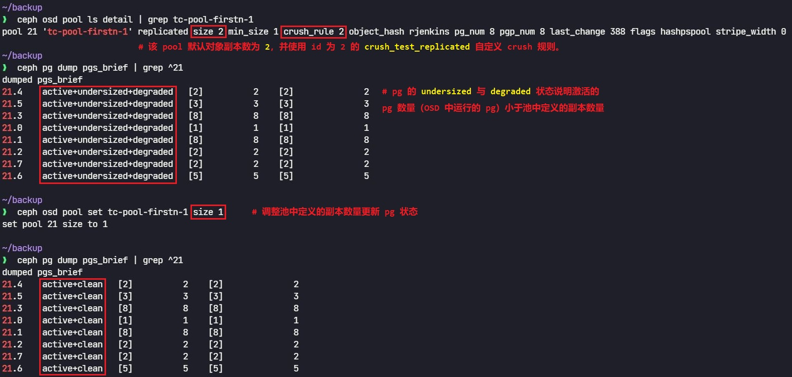
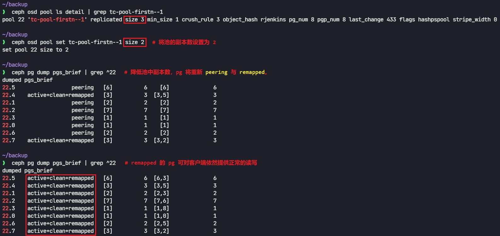
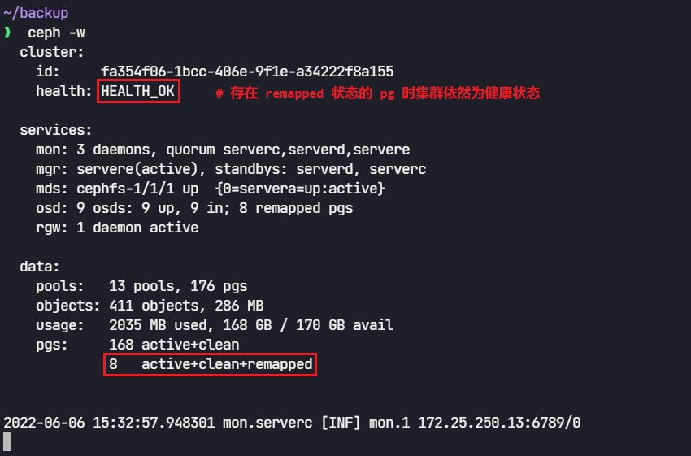

# 🚀 Ceph CRUSH map 概述与实现

## 文档说明

- 该文档中的命令与配置均在 `Red Hat Ceph Storage v3.0` 集群中验证。
- Red Hat Ceph Storage v3.0 对应 `Ceph Luminous (12.2.13)` 开源版本。
- 该文档中的相关概念、示例与方法在高版本 Ceph 集群中大部分依然可用，但版本间的差异需要根据实际环境进行测试及调整，此处提供思路与方法。

## 文档目录

- [CRUSH 与对象放置策略](#crush-与对象放置策略)
- [CRUSH 配置](#crush-配置)
- [CRUSH 可调项（tunable）](#crush-可调项tunable)
- [CRUSH 中的 OSD](#crush-中的-osd)
- [CRUSH 中的 bucket 类型](#crush-中的-bucket-类型)
- [Lab: CRUSH 规则（rule）](#lab-crush-规则rule)
- [CRUSH 算法流程](#crush-算法流程)
- [管理 CRUSH map](#管理-crush-map)
- [Lab: CRUSH map 自定义层次结构与规则](#lab-crush-map-自定义层次结构与规则)
- [设置 OSD 的位置](#设置-osd-的位置)
- [crushtool 命令使用示意](#crushtool-命令使用示意)

## CRUSH 与对象放置策略

- Ceph 使用 `CRUSH`（`Controlled Replication Under Scalable Hashing`，可扩展哈希下的受控复制）的放置算法来计算哪些 OSD 存放哪些对象。
- 对象分配到放置组（PG）中，CRUSH 决定这些 PG 应使用哪些 OSD 来存储其对象。
- 理想情况下，算法需要将数据均匀分布到对象存储中。
- 🤘 当添加了新的 OSD 或现有 OSD 主机出现故障时，Ceph 能够使用 CRUSH 在活跃的 OSD 间重新平衡（rebalance）集群中的对象。

> ✅ 注意：
>
> OSD 主机或部分 OSD 故障：集群通过 cluster network 实现副本恢复与数据重平衡。
>
> OSD 恢复或添加新的 OSD：集群通过 cluster network 实现数据回填与数据重平衡。

- 可调优放置算法，以确保 CRUSH 运行顺畅。
- ✨ `CRUSH map` 是 CRUSH 算法的中央配置机制。
- 默认情况下，CRUSH 算法将复制的对象放置到不同主机上的 OSD 中。
  
  

- 👉 可以配置 `CRUSH map` 与 `CRUSH rules`，使得对象复制到位于不同房间或不同 PDU（配电装置）供电的主机上的 OSD。例如，将带有 `SSD` 驱动器的 OSD 分配给需要极快存储的应用使用的池，并将带有传统 `SATA` 硬盘驱动器的 OSD 分配给支持较低需求工作负载的池。
- ✨ `CRUSH map` 包含两大组成部分：
  - CRUSH 层次结构（hierarchy）：
    - 它列出所有可用的 OSD 并将它们整理到 `bucket` 树形结构中。
    - CRUSH 层次结构通常用于代表 OSD 所处的位置。
    - 默认情况下，有一个表示整个层次结构的根（root）bucket，含有每个 OSD 主机的主机bucket，OSD 则是树上的树叶（leaf）。
    - 默认情况下，同一 OSD 主机上的所有 OSD 都放在该主机 bucket 中。
    - 可自定义树结构，对它重新排列或添加更多层级，以实现一些目的，如将 OSD 主机分组到代表它们在不同机架（`rack`）或数据中心（`datacenter`）中所处位置的 bucket 中。
  - 至少一条 CRUSH 规则（rule）：
    - 它决定了如何从这些 bucket 中分配 OSD 给 PG，决定了在哪里存储这些 PG 的对象。
    - 不同的池可能使用来自 CRUSH map 的不同 CRUSH 规则。

## CRUSH 配置

- CRUSH map 的定义里包含：
  - 所有可用物理存储设备列表
  - 包含所有基础架构 bucket 以及各自含有的 OSD 存储设备或其他 bucket ID 的列表
  - 包含 PG 与 OSD map 的 `CRUSH rule` 列表
  - 其他 CRUSH 可调项及其设置的列表
- Ceph 集群使用默认部署，将配置默认的 CRUSH map。
- 查看 CRUSH map 的相关命令：
  
  ```bash
  $ ceph osd crush dump
  # 以 JSON 格式查看 CRUSH map 的详细信息
  $ ceph osd getcrushmap -o <binfile>
  # 导出 CRUSH map 的二进制文件
  $ crushtool -d <binfile> -o <textfile>
  # 将 CRUSH map 的二进制文件反编译为文本文件
  # 以上命令分别以不同的形式导出 CRUSH map
  ```

## CRUSH 可调项（tunable）

- 可以使用选项来调整与禁用或启用 CRUSH 算法的功能。
- 较新版本的 Ceph 增强并且优化了 CRUSH，可提供更好、更快地映射，以及更均匀的 PG 分布。
- CRUSH map 的开头定义可调项。
- 调整 CRUSH 可调项或许会改变 CRUSH 将 PG 映射到 OSD 的方式。
- 发生这种情况时，集群将需要把对象移到集群中的不同 OSD 以更正对象放置，来反映重新计算后的映射。
- CRUSH 可调项的相关命令，如下所示：
  
  ```bash
  $ ceph osd crush show-tunables
  {
      "choose_local_tries": 0,
      "choose_local_fallback_tries": 0,
      "choose_total_tries": 50,
      "chooseleaf_descend_once": 1,
      "chooseleaf_vary_r": 1,
      "chooseleaf_stable": 1,
      "straw_calc_version": 1,
      "allowed_bucket_algs": 54,
      "profile": "jewel",
      "optimal_tunables": 1,
      "legacy_tunables": 0,
      "minimum_required_version": "jewel",
      "require_feature_tunables": 1,
      "require_feature_tunables2": 1,
      "has_v2_rules": 1,
      "require_feature_tunables3": 1,
      "has_v3_rules": 0,
      "has_v4_buckets": 1,
      "require_feature_tunables5": 1,
      "has_v5_rules": 0
  }
  # 查看 CRUSH 的可调项
  
  $ ceph osd crush set-tunable <tunable_option> <value>
  # 设置指定的可调项
  $ ceph osd crush tunables <profile>
  # 设置预定义的可调项 profile
  ```

- 一些 profile 需要 Ceph 或 Ceph 客户端的最低版本。
- ✅ Red Hat 建议所有集群守护进程与客户端使用相同的发行版本。
- `profile` 的值可以是如下任一个：
  - `legacy`：Ceph 社区发行版 0.47（Argonaut 前）与更早版本
  - `argonaut`：社区发行版 Argonaut（CRUSH V1）所支持的值
  - `bobtail`：社区发行版 Bobtail 与 Dumpling（CRUSH V2）所支持的值
  - `firefly`：社区发行版 Firefly 与 RHCS v1.2.3（CRUSH V3）所支持的值
  - `hammer`：社区发行版 Hammer 与 RHCS v1.3（CRUSH V4）所支持的值
  - 👉 `jewel`：社区发行版 Jewel 与 RHCS v2（随 RHEL 7.3 发布）及更高版本（CRUSH V5）所支持的值。
  - 👉 `optimal`：当前版本的 RHCS 的最佳（最优）值

## CRUSH 中的 OSD

- CRUSH map 包含 Ceph 中所有存储设备的列表。
- 每一存储设备都提供有以下信息：
  - 存储设备的 ID
  - 存储设备的名称（name）
  - 🤘 存储设备的权重（weight）：
    - 通常基于以 `TB` 为单位的容量
    - 如，`4TB` 权重大约为 `4.0`，这是设备可以存储的相对数据量，CRUSH 算法用它来帮助确保对象均匀分布。
    - `ceph-ansible` 安装程序会自动设置权重。
  - 存储设备的类型（class）：
    - 包括：`HDD (hdd)`、`SSD (ssd)`、`NVMe (nvme)`
    - OSD 自动检测与设置其设备类型
  
  > 以上 osd 的设备类型将在下文的示例中使用。

## CRUSH 中的 bucket 类型

> 💥 CRUSH 中的 bucket 与 radosgw 中的 bucket 不同！

- CRUSH 层次结构将 OSD 整理到由不同故障域组成的树中，这些故障域称为 `bucket`。
- bucket 是故障域，或是 CRUSH 层次结构中的树枝（`branch`）。
- device 是 OSD，或是 CRUSH 层次结构中的树叶（`leaf`）。
- 🚀 通过创建 CRUSH map 规则，既可以使 Ceph 将对象的副本放在不同服务器上的 OSD 中，也可以使它放在位于不同的机架或不同数据中心中的 OSD 中。
- 对于 Ceph 集群的大型部署，可创建如下所示的具体层次结构：
  
  

- 重要的 bucket 属性：
  - bucket 的 ID：该 ID 为负数，以便与存储设备（OSD）ID 区分。
  - bucket 的名称（name）
  - bucket 的类型（type）：
    - 默认 map 定义了几种类型，可通过 `ceph osd crush dump` 命令来检索，如下所示：
      - `root`：默认最顶级 bucket
      - `region`：区域（地理范畴）
      - `datacenter`：数据中心（可能由多个机房组成数据中心）
      - `room`：机房
      - `pod`：多个机架列
      - `pdu`：配电单元（可能多个机架列共用一个配电单元）
      - `row`：机架列
      - `rack`：机架（一个机架可包含多个机箱）
      - `chassis`：机箱
      - `host`：服务器
    - 除了以上的默认 bucket 类型外，还可自定义 bucket 类型。
    - 以上 bucket 类型在自定义的 CRUSH 层次结构中可无需全部使用，可只使用其中一部分 bucket 类型。
    - 🤘 Ceph 在映射 PG 副本到 OSD 时使用 `straw2` 故障域算法。
- CRUSH map 可以包含多个层次结构，可通过不同 CRUSH 规则加以选择。
- Ceph 部署时仅创建两个层级的层次结构，即 `host bucket` 与 `device leaf`。
- CRUSH map 默认层次结构，如下所示：
  
  

## Lab: CRUSH 规则（rule）

- CRUSH map 也包含数据放置规则，它们决定了 PG 如何 map 到 OSD 来存储对象。
- 默认有两种规则：`replicated_rule`、`erasure-code`
- 以上这些默认规则将每一 PG 映射到不同主机上的 OSD 上。
- 查看 CRUSH 规则：
  
  ```bash
  $ ceph osd crush rule ls
  # 列出现有的 CRUSH 规则
  $ ceph osd crush rule dump <rule_name>
  # 查看 CRUSH 规则的详细信息
  ```

- CRUSH 规则示例：使用反编译后的 CRUSH map 也包含规则且更容易阅读
  
  ```bash
  $ ceph osd getcrushmap -o ./map.bin
  $ crushtool -d ./map.bin -o ./map.txt
  $ cat ./map.txt
    ...
    # rules
    rule replicated_rule {  # 1️⃣
        id 0  # 2️⃣
        type replicated
        min_size 1  # 3️⃣
        max_size 10 # 4️⃣
        step take default  # 5️⃣
        step chooseleaf firstn 0 type host  # 6️⃣
        step emit  # 7️⃣
    }
    ...
  # 查看 CRUSH 规则的详细信息
  ```
  
  - 1️⃣ 规则的名称：在通过 ceph osd pool create 命令创建池时，可使用该名称来选择规则。
  - 2️⃣ 规则的 ID：一些命令使用规则 ID，而不使用规则名称，如下所示：

    ```bash
    $ ceph osd pool set <pool_name> crush_ruleset <ID>
    # 为现有的指定的池设置规则
    ```
  
  - 3️⃣ 最少的对象副本数：若池形成的副本数少于该数目，CRUSH 不会选择该规则。
  - 4️⃣ 最多的对象副本数：若池形成的副本数多于该数目，CRUSH 不会选择该规则。
  - 5️⃣ 取 `bucket` 名称，再沿着树结构往下迭代。
    - 🤘 该 step 定义 PG 映射的 OSD 的分布范围。
    - 如上图所示，迭代始于名为 default 的 bucket，即默认 CRUSH 层次结构的根部。
    - 对于由多个数据中心（datacenter）组成的复杂层次结构，可以为一个数据中心创建一条规则，使得特定池中的对象强制存储到该数据中心内的 OSD 中，在这种情形中，此 step可以在 `datacenter` bucket 处开始迭代。
  - 6️⃣ 选择给定 bucket 类型的 bucket 集合，并且从该集合中各个 bucket 的子树中选择树叶（OSD）。
    - 在本例中，规则从集合的每一 host bucket 上选择一个 OSD，确保 OSD 来自不同的主机。

    > 📝 池中副本数量由集群部署时定义的 `osd_pool_default_size` 参数定义。

    - 👉 若 `firstn` 后面的数字为 `0`，则选择的 bucket 与池中定义的副本数相同（默认情况）。
    - 👉 若数字大于零，但小于池中定义的副本数，则选择该数量的 bucket。
      - 这时，规则需要另一个 step 为剩余的副本抽取 bucket，可以运用这种机制来强制实施对象副本某一子集的位置。

      > 💥 若无另一个 step 为剩余的副本抽取 bucket，那么剩余的副本不再进行 pg 至 osd 的映射，实际的副本数小于池中定义的副本数！

      - 如下 CRUSH 规则所示：

        ```bash
        $ cat ./cm-firstn-1.txt
          ...
          rule crush_test_replicated {
              id 2
              type replicated
              min_size 1
              max_size 10
              step take default
              step chooseleaf firstn 1 type host
              step emit
          }
          ...
        # 若使用该规则创建定义 2 副本的池，该规则定义从 1 个 host bucket 中选择 1 个
        # osd 进行 pg 至 osd 的映射。
        # 因此，若使用该规则创建池，pg 只被映射至 1 个 osd 中。 
        $ crushtool -c ./cm-firstn-1.txt -o ./cm-firstn-1.bin
        # 将文本形式的 CRUSH map 编译为二进制形式
        $ ceph osd setcrushmap -i ./cm-firstn-1.bin
        # 将新生成的二进制形式的 CRUSH map 导入至集群中
        $ ceph osd crush rule ls
          replicated_rule
          myerasurepool
          crush_test_replicated
        # 查看当前集群最新版本的 CRUSH 规则
        $ ceph osd pool create tc-pool-firstn-1 8 8 crush_test_replicated
          pool 'tc-pool-firstn-1' created
        # 使用 crush_test_replicated 规则创建 tc-pool-firstn-1 存储池
        ```

        

        如上所示，创建的池中 pg 状态始终为 `active+undersized+degraded`，提示 pg 数量小于池中定义的副本数量，这是由于自定义的 CRUSH 规则中定义从 1 个 host bucket 中选取 1 个 osd 进行 pg 的映射，因此只有 1 个副本存储于 osd 中，调整池的副本数 2 为 1 即可恢复 pg 状态。

    - 👉 若数字小于零，则从池中定义的副本数减去其绝对值，再选择这个数量的 bucket。如下 CRUSH 规则所示：

      ```bash
      $ cat ./cm-firstn--1.txt
        ...
        rule crush_test_firstn {
            id 3
            type replicated
            min_size 1
            max_size 10
            step take default
            step chooseleaf firstn -1 type host
            step emit
        }
        ...
      # 若使用该规则创建定义 3 副本的池，该规则定义从 2（3-|-1|）个 host bucket 中
      # 分别选择 1 个 osd 进行 pg 至 osd 的映射。
      # 因此，若使用该规则创建池，pg 将被映射至 2 个 osd 中。
      # 由于实际的副本数（2 个）小于池中定义的副本数（3 个），pg 状态将显示为 
      # active+undersized+degraded
      
      ### 编译与导入 CRUSH map 的过程此处省略
      $ ceph osd pool create tc-pool-firstn--1 8 8 crush_test_firstn
        pool 'tc-pool-firstn--1' created
      $ ceph -w
        cluster:
          id:     fa354f06-1bcc-406e-9f1e-a34222f8a155
          health: HEALTH_WARN
                  Degraded data redundancy: 
                  8 pgs unclean, 8 pgs degraded, 8 pgs undersized
      
        services:
          mon: 3 daemons, quorum serverc,serverd,servere
          mgr: servere(active), standbys: serverd, serverc
          mds: cephfs-1/1/1 up  {0=servera=up:active}
          osd: 9 osds: 9 up, 9 in
          rgw: 1 daemon active
      
        data:
          pools:   13 pools, 176 pgs
          objects: 411 objects, 286 MB
          usage:   2035 MB used, 168 GB / 170 GB avail
          pgs:     168 active+clean
                   8   active+undersized+degraded
      
        2022-06-06 11:08:58.246678 mon.serverc [WRN] overall HEALTH_WARN Degra
            ded data redundancy: 8 pgs unclean, 8 pgs degraded, 8 pgs undersized
      
      $ ceph pg dump pgs_brief | grep ^22
        dumped pgs_brief
        22.5    active+undersized+degraded [6,3]    6  [6,3]              6 
        22.4    active+undersized+degraded [3,5]    3  [3,5]              3 
        22.1    active+undersized+degraded [2,3]    2  [2,3]              2 
        22.2    active+undersized+degraded [7,6]    7  [7,6]              7 
        22.3    active+undersized+degraded [1,8]    1  [1,8]              1 
        22.0    active+undersized+degraded [1,0]    1  [1,0]              1 
        22.6    active+undersized+degraded [2,5]    2  [2,5]              2 
        22.7    active+undersized+degraded [3,2]    3  [3,2]              3
      # 创建的池中 pg 将处于 active+undersized+degraded 状态
      ```

      

      

      重新 `peering` 与 `remapped` 的 pg 依然可被 Ceph 客户端读写。

  - 7️⃣ 输出规则的结果

- 示例：
  
  ```bash
  rule myrackruleinDC1 {
      id 2
      type replicated
      min_size 1
      max_size 10
      step take DC1
      step chooseleaf firstn 0 type rack
      step emit
  }
  # 若使用该规则创建定义 3 副本的池，仅从 DC1 数据中心 bucket 开始选择，并从 3 个
  # 机架（rack）中选择任意 1 个 osd（共 3 个 osd）进行 pg 至 osd 的映射。
  ```

## CRUSH 算法流程

- `take`：从 step take 选择一个根节点，该节点不一定是 root，该节点可以是任何一个故障域，从指定选择的节点开始执行。
- `select`：从 step chooseleaf 定义的 bucket 类型（type）开始选择合适的 OSD，如果是复制池默认使用 `firstn` 算法，如果是纠删代码池默认使用 `indep` 算法。
- `emit`：返回最终结果。

## 管理 CRUSH map

- 修改 CRUSH map 的两种方式：
  - 方式 1：使用 `ceph osd crush` 命令
  - 方式 2：提取并反编译二进制 CRUSH map 到纯文本，编辑该纯文本文件，再重新编译为二进制格式，再重新导入到集群中。
- 通常而言，使用 ceph osd crush 命令更新 CRUSH map 较轻松。
- 不过，有一些比较不常见的情景只能使用第二种方法来实现。

## Lab: CRUSH map 自定义层次结构与规则

- 🚀 示例 1（对应前文方式 1）：
  
  使用 `ceph osd crush` 命令设置指定 osd 的设备类型，并创建 CRUSH 规则，因此，创建池时指定该 CRUSH 规则，可通过该方法将池中的所有对象副本都存储至指定设备类型的 osd 磁盘上。该示例中 `pg` 全部映射至后端为 3 个 `ssd` 设备类型的 osd 上，包括 `primary osd` 与其余两个副本 osd。
  
  ```bash
  $ ceph osd crush rm-device-class 4
    done removing class of osd(s): 4
  $ ceph osd crush rm-device-class 6
    done removing class of osd(s): 6
  $ ceph osd crush rm-device-class 8
    done removing class of osd(s): 8
  # 移除指定 osd 的设备类型
  # 注意：
  #   若在设置指定 osd 设备类型前未移除已有的设备类型将返回如下报错：
  #   Error EBUSY: osd.0 has already bound to class 'hdd', can not reset class to 
  #   'nvme'; use 'ceph osd crush rm-device-class <osd>' to remove old class first 
  
  $ ceph osd crush set-device-class ssd 4
    set osd(s) 4 to class 'ssd'
  $ ceph osd crush set-device-class ssd 6
    set osd(s) 6 to class 'ssd'
  $ ceph osd crush set-device-class ssd 8
    set osd(s) 8 to class 'ssd'
  # 设置 ssd 设备类型的 osd
  $ ceph osd crush class ls
    [
        "hdd",
        "ssd"
    ]
  # 查看当前 CRUSH map 中已设置的 osd 设备类型
  
  $ ceph osd crush tree
      ID CLASS WEIGHT  TYPE NAME        
    -1       0.16498 root default     
    -3       0.05499     host serverc 
     0   hdd 0.01799         osd.0    
     3   hdd 0.01799         osd.3    
     4   ssd 0.01799         osd.4    
    -5       0.05499     host serverd 
     1   hdd 0.01799         osd.1    
     5   hdd 0.01799         osd.5    
     6   ssd 0.01799         osd.6    
    -7       0.05499     host servere 
     2   hdd 0.01799         osd.2    
     7   hdd 0.01799         osd.7    
     8   ssd 0.01799         osd.8
  
  $ ceph osd crush rule create-replicated onssd default host ssd
  # 创建名为 onssd 的 CRUSH 规则，并指定 default 根 bucket、host 故障域与 ssd
  # 设备类型的 osd
  # 注意：
  #   $ ceph osd crush rule create create-replicated <name> <root> <type> {<class>}
  #   指定 CRUSH 规则的名称、根 bucket（可以是非 default）、故障域类型与 osd 设备类型
  #   创建 CRUSH 规则
  
  $ ceph osd pool create myfast 32 32 onssd
  # 使用 onssd 的 CRUSH 规则创建名为 myfast 的池
  # 注意：
  #   若只存在 1 个 ssd 设备类型的 osd，再使用 onssd 的 CRUSH 规则创建池后，由于 CRUSH 
  #   规则中的 firstn 为 0，即将从 3 个 host bucket 中选取 1 个 ssd 设备类型的 osd 进行
  #   pg 至 osd 的映射，然而此时 osd 中 的副本数为 1 个小于池中定义的副本数 3 个，pg 状态
  #   将为 active+undersized+degraded。

  $ ceph osd pool ls detail | grep myfast
    pool 23 'myfast' replicated size 3 min_size 1 crush_rule 4 object_hash rjenkins 
    pg_num 32 pgp_num 32 last_change 458 flags hashpspool stripe_width 0
  
  $ ceph pg dump pgs_brief | grep ^23
    dumped pgs_brief
    23.6             active+clean [6,8,4]          6 [6,8,4]              6 
    23.7             active+clean [8,4,6]          8 [8,4,6]              8 
    23.1             active+clean [4,6,8]          4 [4,6,8]              4 
    23.2             active+clean [8,4,6]          8 [8,4,6]              8 
    23.3             active+clean [8,4,6]          8 [8,4,6]              8 
    23.1c            active+clean [8,6,4]          8 [8,6,4]              8 
    23.1d            active+clean [4,8,6]          4 [4,8,6]              4 
    23.1e            active+clean [4,6,8]          4 [4,6,8]              4 
    ...
  # 池中的 pg 都映射至 ssd 设备类型的 osd 4,6,8 上
  # 该示例的 CRUSH 规则生效 
  ```

- ✨ 示例 2（对应前文方式 2）：
  
  对原始 Ceph 集群创建自定义 CRUSH map 层次结构与自定义 CRUSH 规则，该规则会将位于原始 osd 中的 pg 根据自定义 CRUSH 规则重新映射至更改的 osd 中，其中副本所在 `primary osd` 的后端磁盘类型为 `ssd`，而其余副本的后端磁盘类型为 `hdd`。
  
  ```bash
  $ ceph osd crush rm-device-class 2
  $ ceph osd crush rm-device-class 4
  $ ceph osd crush rm-device-class 8
  
  $ ceph osd crush set-device-class ssd 2
  $ ceph osd crush set-device-class ssd 4
  $ ceph osd crush set-device-class ssd 8
  # 设置 ssd 设备类型的 osd
  
  $ ceph osd crush add-bucket East-DC1 root
  $ ceph osd crush add-bucket rackA1 rack
  $ ceph osd crush add-bucket hostc host
  $ ceph osd crush add-bucket rackB1 rack
  $ ceph osd crush add-bucket hostd host
  $ ceph osd crush add-bucket rackC1 rack
  $ ceph osd crush add-bucket hoste host
  # 创建自定义 root bucket、rack bucket 与 host bucket
  
  $ ceph osd crush move rackA1 root=East-DC1
  $ ceph osd crush move hostc rack=rackA1
  $ ceph osd crush move rackB1 root=East-DC1
  $ ceph osd crush move hostd rack=rackB1
  $ ceph osd crush move rackC1 root=East-DC1
  $ ceph osd crush move hoste rack=rackC1
  # 将 rack bucket 整合至 root bucket 下，并将 host bucket 整合至 rack bucket 下。
  
  $ ceph osd crush tree
    ID  CLASS WEIGHT  TYPE NAME          
     -9             0 root East-DC1      
    -10             0     rack rackA1    
    -13             0         host hostc 
    -11             0     rack rackB1    
    -14             0         host hostd 
    -12             0     rack rackC1    
    -15             0         host hoste 
     -1       0.16644 root default       
     -3       0.05548     host serverc   
      0   hdd 0.01849         osd.0      
      1   hdd 0.01849         osd.1      
      2   ssd 0.01849         osd.2      
     -5       0.05548     host serverd   
      3   hdd 0.01849         osd.3      
      5   hdd 0.01849         osd.5      
      4   ssd 0.01849         osd.4      
     -7       0.05548     host servere   
      6   hdd 0.01849         osd.6      
      7   hdd 0.01849         osd.7      
      8   ssd 0.01849         osd.8 
  # 查看调整后的 CRUSH map 层次结构，此时还未将 osd 设置于各个 host bucket 中。
  ```
  
  更改 CRUSH map 层次结构后，需将 osd 设置于指定的 host bucket 中。
  
  该示例中使用直接编辑 `/etc/ceph/ceph.conf` 配置文件的方式以定义 osd 在各个 host bucket 中的位置（见后文 "设置 OSD 位置"），如下所示：
  
  ```bash
  $ sudo vim /etc/ceph/ceph.conf
    ...
    ### customized crush osd location
    [osd.0]
    crush_location= root=East-DC1 rack=rackA1 host=hostc
  
    [osd.1]
    crush_location= root=East-DC1 rack=rackA1 host=hostc
  
    [osd.2]
    crush_location= root=East-DC1 rack=rackA1 host=hostc
  
    [osd.3]
    crush_location= root=East-DC1 rack=rackB1 host=hostd
  
    [osd.4]
    crush_location= root=East-DC1 rack=rackB1 host=hostd
  
    [osd.5]
    crush_location= root=East-DC1 rack=rackB1 host=hostd
  
    [osd.6]
    crush_location= root=East-DC1 rack=rackC1 host=hoste
  
    [osd.7]
    crush_location= root=East-DC1 rack=rackC1 host=hoste
  
    [osd.8]
    crush_location= root=East-DC1 rack=rackC1 host=hoste
  # 在该配置文件中添加如上配置以设置 osd 至 host bucket 中的位置
  ```
  
  以上 /etc/ceph/ceph.conf 配置文件可参考 [该 GitHub 链接](https://github.com/Alberthua-Perl/sc-col/blob/master/redhat-ceph-conf/v3.0/ceph.conf)。
  
  通过上述方法将原始 Ceph 集群的 CRUSH map 层次结构进行重构，执行以下命令使 osd 设置于正确的 host bucket 中：
  
  ```bash
  ### root@serverc:
  $ scp /etc/ceph/ceph.conf root@serverd:/etc/ceph/ceph.conf
  $ scp /etc/ceph/ceph.conf root@servere:/etc/ceph/ceph.conf
  # 将 Ceph 集群配置文件同步至其余 osd 节点
  
  $ sudo systemctl restart ceph-osd.target
  $ ssh root@serverd systemctl restart ceph-osd.target
  $ ssh root@servere systemctl restart ceph-osd.target
  # 重启所有节点的 ceph-osd 服务，使配置生效。 
  
  $ ceph osd crush tree
    ID  CLASS WEIGHT  TYPE NAME          
     -9       0.16498 root East-DC1      
    -10       0.05499     rack rackA1    
    -13             0         host hostc 
      0   hdd 0.01799         osd.0      
      1   hdd 0.01799         osd.1      
      2   ssd 0.01799         osd.2      
    -11       0.05499     rack rackB1    
    -14             0         host hostd 
      3   hdd 0.01799         osd.3      
      5   hdd 0.01799         osd.5      
      4   ssd 0.01799         osd.4      
    -12       0.05499     rack rackC1    
    -15             0         host hoste 
      6   hdd 0.01799         osd.6      
      7   hdd 0.01799         osd.7      
      8   ssd 0.01799         osd.8      
     -1             0 root default       
     -3             0     host serverc   
     -5             0     host serverd   
     -7             0     host servere
  # 重构的 CRUSH map 层次结构
  ```
  
  配置完 osd 位置后，需创建自定义 CRUSH 规则以满足对象存储的要求：
  
  ```bash
  $ ceph osd getcrushmap -o ./cm-org.bin
  $ crushtool -d ./cm-org.bin -o ./cm-org.txt
  # 备份原始 Ceph 集群的 CRUSH map 与规则
  
  $ cp ./cm-org.txt ./cm-on-ssd-distributed.txt
  $ vim ./cm-on-ssd-distributed.txt
    ...
    # rules
    rule replicated_rule {
        id 0
        type replicated
        min_size 1
        max_size 10
        step take East-DC1
        # 指定从根 East-DC1 bucket 开始选取 osd
        step chooseleaf firstn 0 type host
        # 从与池中定义的副本数相同数量的 host bucket 中随机选取 1 个 osd 进行 pg 的映射
        # 该示例中池的副本数默认为 2，也就需要 2 个 osd，因此默认将从 2 个 host bucket 中
        # 随机选取 1 个 osd 进行映射。
        step emit
    }
  # 复制池默认情况下使用的 CRUSH 规则
  
    rule on-ssd-distributed {
        id 1
        type replicated
        min_size 1
        max_size 10
        step take East-DC1 class ssd
        # 指定从根 East-DC1 bucket 开始选取 ssd 设备类型的 osd
        step chooseleaf firstn 1 type rack
        # 从 1 个 rack bucket 中随机选取 ssd 设备类型的 1 个 osd 进行 pg 的映射
        # 此时只有 1 个 pg 映射至 ssd 设备类型的 osd 上
        # 该示例中池的副本数默认为 2，pg 数量小于副本数，因此需再定义选取规则。
        step emit
        step take East-DC1 class hdd
        # 指定从根 East-DC1 bucket 开始选取 hdd 设备类型的 osd 
        step chooseleaf firstn -1 type rack
        # 由于池中定义的副本数默认为 2，根据前面的定义，还剩余 1 个副本需存储于 osd 中，
        # 因此将 firstn 设置为 -1，即 2-|-1| 为 1，最终将剩余的 1 个 pg 映射至 hdd 
        # 设备类型的 osd 上，完成 2 个 pg 的 osd 映射，满足池中定义的副本数。      
        step emit
    }
    ...
  # 根据原始 CRUSH map 与规则添加并更新自定义的规则
  ```
  
  以上 CRUSH map 与规则的纯文本文件可参考 [该 GitHub 链接](https://github.com/Alberthua-Perl/sc-col/blob/master/redhat-ceph-conf/v3.0/cm-on-ssd-distributed.txt)。
  
  ```bash
  $ crushtool -c ./cm-on-ssd-distributed.txt -o ./cm-on-ssd-distributed.bin
  # 编译自定义的 CRUSH map 与规则为二进制格式
  $ ceph osd setcrushmap -i ./cm-on-ssd-distributed.bin
  # 将编译的二进制格式 CRUSH map 与规则导入至 Ceph 集群中
  # 导入后将返回 CRUSH map 的 epoch 版本号

  $ ceph -s
    cluster:
      id:     d696618e-20ee-4169-a1da-edc7a33857be
      health: HEALTH_OK
  
    services:
      mon: 3 daemons, quorum serverc,serverd,servere
      mgr: serverc(active), standbys: servere, serverd
      mds: cephfs-1/1/1 up  {0=servera=up:active}
      osd: 9 osds: 9 up, 9 in
      rgw: 1 daemon active
  
    data:
      pools:   6 pools, 48 pgs
      objects: 240 objects, 3359 bytes
      usage:   1000 MB used, 169 GB / 170 GB avail
      pgs:     48 active+clean 
  
  $ ceph osd pool create myfast 8 8 on-ssd-distributed
  # 使用自定义的 CRUSH 规则创建池
  $ ceph osd pool ls detail | grep myfast
    pool 9 'myfast' replicated size 2 min_size 1 crush_rule 1 object_hash rjenkins pg_num 8 pgp_num 8 
    last_change 192 flags hashpspool stripe_width
  
  $ ceph pg dump pgs_brief | grep ^9
  dumped pgs_brief
  9.7     active+clean [8,7]          8  [8,7]              8 
  9.6     active+clean [4,5]          4  [4,5]              4 
  9.5     active+clean [4,5]          4  [4,5]              4 
  9.4     active+clean [8,1]          8  [8,1]              8 
  9.3     active+clean [8,7]          8  [8,7]              8 
  9.2     active+clean [2,1]          2  [2,1]              2 
  9.1     active+clean [8,7]          8  [8,7]              8 
  9.0     active+clean [2,1]          2  [2,1]              2 
  # 创建后池中的所有 pg 状态均为 active+clean，即可对外提供读写。
  ```
  
  💥 若未根据 CRUSH map 层次结构正确配置 CRUSH 规则，在导入编译的二进制格式文件后，通过 `ceph -w` 命令将查看到以下类似的报错：
  
  ```bash
  $ ceph -w
    cluster:
      id:     d696618e-20ee-4169-a1da-edc7a33857be
      health: HEALTH_WARN
              36/480 objects misplaced (7.500%)
              Reduced data availability: 16 pgs inactive, 22 pgs peering, 22 pgs stale
              Degraded data redundancy: 72/480 objects degraded (15.000%), 47 pgs unclean, 25 pgs degraded, 23 pgs undersized
  
    services:
      mon: 3 daemons, quorum serverc,serverd,servere
      mgr: serverc(active), standbys: servere, serverd
      mds: cephfs-1/1/1 up  {0=servera=up:active}
      osd: 9 osds: 9 up, 9 in; 2 remapped pgs
      rgw: 1 daemon active
  
    data:
      pools:   6 pools, 48 pgs
      objects: 240 objects, 3359 bytes
      usage:   997 MB used, 169 GB / 170 GB avail
      pgs:     45.833% pgs not active
               72/480 objects degraded (15.000%)
               36/480 objects misplaced (7.500%)
               19 peering
               17 stale+active+undersized+degraded
               6  active+undersized+degraded+remapped
               2  stale+remapped+peering
               1  stale+active+recovery_wait+degraded+remapped
               1  stale+active+recovering+degraded+remapped
               1  stale+peering
               1  active+clean+remapped
  
    io:
      recovery: 0 B/s, 2 objects/s
  ```

- 示例 3：
  
  以上示例 1 与示例 2 中以创建复制池为例说明 `replicated` 类型的 CRUSH 规则，而纠删代码池不使用该类型的规则，可使用如下方法创建 `erasure-code-profile` 与纠删代码池：
  
  ```bash
  $ ceph osd erasure-code-profile set myprofile k=2 m=1 \
    crush-root=East-DC1 \
    crush-failure-domain=rack \
    crush-device-class=ssd
  # 创建名为 myprofile 的 erasure-code-profile
  # 该 profile 定义 2 个数据区块与 1 个编码区块，将从根 East-DC1 bucket 中开始选取 osd，
  # 在 3 个 rack 类型的故障域中分别随机选取 1 个 ssd 设备类型的 osd 进行 pg 至 osd 的
  # 映射（共 3 个 osd）。
  
  $ ceph osd pool create myecpool 50 50 erasure myprofile
  # 使用上述 profile 创建名为 myecpool 的纠删代码池 
  ```

## 设置 OSD 的位置

- 在创建了自定义 CRUSH map 层次结构后，由于每一 OSD 具有一个位置，可以将 OSD 放置于 host bucket 上作为树上的树叶。
- 如下所示：附加至 rackA1 bucket 的 OSD 的位置
  
  ```bash
  root=default datacenter=DC1 rack=rackA1
  ```

- 设置 OSD 位置的 2 种方式：
  - 方式 1：自定义 `Shell` 脚本
    - 当 Ceph 启动时，它使用 `ceph-crush-location` 脚本自动验证每个 OSD 在不在正确的 CRUSH 位置上。

      ```bash
      $ which ceph-crush-location
        /usr/bin/ceph-crush-location
      $ file /usr/bin/ceph-crush-location
        /usr/bin/ceph-crush-location: POSIX shell script, ASCII text executable
      $ rpm -qf /usr/bin/ceph-crush-location
        ceph-common-12.2.1-40.el7cp.x86_64
      ```

    - 若 OSD 不在 CRUSH map 中的预期位置上，它会被自动移动。
    - 默认情况：`root=default host=<hostname>`
    - 可将 ceph-crush-location 脚本替换为自己的脚本，以更改 OSD 在 CRUSH map 中 的放置位置。
    - 👉 可指定 `/etc/ceph/ceph.conf` 配置文件中的 `crush_location_hook` 参数。

      ```ini
      [osd]
      crush_location_hook = /path/to/your/script
      ```

    - Ceph 会使用以下参数调用脚本：`--cluster $cluster --id osd.$id --type osd`
    - 脚本必须在标准输出中以单行形式打印位置。
    - Ceph 文档有一个自定义脚本的简单示例，其假定每个系统具有 `/etc/rack` 文件，其中含有其机架的名称：

      ```bash
      #!/bin/sh
      echo "root=default rack=$(cat /etc/rack) host=$(hostname -s)"
      ```
  
  - 方式 2：设置 `crush_location` 参数
    - 可以在 /etc/ceph/ceph.conf 配置文件中设置 crush_location 参数，以重新定义特定 OSD 的位置（前文示例 2 中使用的方法）。
    - 如，设置 osd.0 与 osd.1 的位置，可以将 crush_location 参数添加到它们在该文件中的对应部分中：

      ```ini
      [osd.0]
      crush_location = root=default datacenter=DC1 rack=rackA1 
      
      [osd.1]
      crush_location = root=default datacenter=DC1 rack=rackB1
      ```

## crushtool 命令使用示意

- 可以使用 `crushtool` 命令手动编辑与编译 CRUSH map 与规则的命令。
- 使用方法如下所示：
  
  ```bash
  $ ceph osd getcrushmap -o <binfile>
  # 将当前的 CRUSH map 与规则导出至指定的二进制格式文件中
  
  $ crushtool -d <binfile> -o <textfile>
  # 将 CRUSH map 与规则的二进制格式文件反编译为纯文本格式文件
  
  $ crushtool -c <textfile> -o <binfile>
  # 将编辑好的 CRUSH map 与规则的纯文本格式文件编译为二进制格式文件
  
  $ ceph osd setcrushmap -i <binfile>
  # 将编译好的 CRUSH map 与规则的二进制格式文件导入 Ceph 集群中以更新 CRUSH map 与规则
  # 注意：以上命令可在前文示例中查看更为详细的使用方法
  
  $ crushtool -i <binfile> --test --show-mappings \
    --rule=<rule_id> --num-rep <replica_num>
  # 使用编译好的 CRUSH map 与规则的二进制格式文件根据 CRUSH 规则的 id 及定义的副本数
  # 进行映射测试（不进行真正的 pg 映射） 
  ```
