# 🐙 Red Hat Ceph Storage v5.0 常用命令汇总

## 文档说明

- 此文档涉及的命令已在 `Red Hat Ceph Storage v5.0` 集群中进行验证
- Red Hat Ceph Storage v5.0 对应 `Ceph 16.2.0 pacific (stable)` 开源版本
- 此文档将持续更新
- 🧪 文档中带有 `Lab` 标记的内容可进行实验验证

## 文档目录

- [Ceph 集群状态](#ceph-集群状态)
  - [cephadm 命令](#cephadm-命令)
  - [Ceph Orchestrator 编排器使用](#ceph-orchestrator-编排器使用)
  - [Ceph 集群配置](#ceph-集群配置)
- [Ceph 集群网络](#ceph-集群网络)
  - [集群网络类型说明](#集群网络类型说明)
  - [Lab: 配置 Ceph 集群网络](#lab-配置-ceph-集群网络)
- [Ceph Monitor 监控器](#ceph-monitor-监控器)
- [Ceph Manager 管理器](#ceph-manager-管理器)
  - [Ceph Mgr 命令](#ceph-mgr-命令)
  - [Lab: 配置管理 Ceph Dashboard](#lab-配置管理-ceph-dashboard)
  - [Lab: 修改 Dashboard 仪表板密码](#lab-修改-dashboard-仪表板密码)
  - [Ceph balancer 均衡器](#ceph-balancer-均衡器)
- [Ceph Cluster Map 集群映射](#ceph-cluster-map-集群映射)
- [Ceph CRUSH Map 映射](#ceph-crush-map-映射)
- [Ceph PG 放置组](#ceph-pg-放置组)
  - [Ceph PG 常用管理命令](#ceph-pg-常用管理命令)
- [Ceph OSD 对象存储设备](#ceph-osd-对象存储设备)
  - [Lab: 定位对象与 OSD、PG 的映射关系](#lab-定位对象与-osdpg-的映射关系)
  - [Lab: 标记 OSD 在集群中的状态](#lab-标记-osd-在集群中的状态)
  - [Lab: 使用命令行部署新的 OSD 设备（scale up）](#lab-使用命令行部署新的-osd-设备scale-up)
  - [Lab: 使用 osd specification file 部署 OSD 设备](#lab-使用-osd-specification-file-部署-osd-设备)
  - [Lab: 删除 OSD 设备](#lab-删除-osd-设备)
  - [Lab: 配置 ceph 软件源](#lab-配置-ceph-软件源)
  - [Lab: RHCS5 中使用 ceph-volume 手动部署 OSD](#lab-rhcs5-中使用-ceph-volume-手动部署-osd)
- [RADOS 对象操作](#rados-对象操作)
- [Ceph Pool 存储池](#ceph-pool-存储池)
  - [Ceph 存储池状态](#ceph-存储池状态)
  - [Ceph 复制池命令](#ceph-复制池命令)
  - [Ceph 纠删代码池命令](#ceph-纠删代码池命令)
- [CephX 认证与用户](#cephx-认证与用户)
  - [CephX 认证机制](#cephx-认证机制)
  - [CephX 用户认证管理命令](#cephx-用户认证管理命令)
- [Ceph RBD 镜像](#ceph-rbd-镜像)
  - [RBD 镜像的特性（feature）](#rbd-镜像的特性feature)
  - [RBD 镜像常用命令](#rbd-镜像常用命令)
  - [Ceph RBD Mirror 集群模式](#ceph-rbd-mirror-集群模式)
  - [Lab: 实现 RBD one-way mirroring](#lab-实现-rbd-one-way-mirroring)
  - [Lab: `rbd-nbd` 映射使用已 mirroring 的 RBD 镜像](#lab-rbd-nbd-映射使用已-mirroring-的-rbd-镜像)
  - [其他 RBD Mirror 相关命令](#其他-rbd-mirror-相关命令)
  - [RBD Mirror 的故障转移](#rbd-mirror-的故障转移)
- [CephFS 文件系统](#cephfs-文件系统)
- [参考链接](#参考链接)

## Ceph 集群状态

Red Hat Ceph Storage v5.0 中已不再使用旧式的 systemd 管理守护进程的方式管理 Ceph 进程，而使用 `Podman rootfull` 容器的方式封装运行 Ceph 进程，因此，可使用 `cephadm` 命令行工具取代以往的 `ceph-ansible` 来实现集群的部署与管理。

管理 Ceph 集群的两种方式：

- 1️⃣ 在管理节点上直接使用 ceph 命令。
- 2️⃣ 进入管理节点的 cephadm shell 临时容器中，使用交互式命令管理。

### cephadm 命令

cephadm 工具一般安装于部署节点或管理节点中，因此运行以下命令需在对应节点中运行。
  
```bash
$ cephadm --help
$ cephadm version
$ cephadm inspect-image
# 查看当前集群使用的 Ceph 容器镜像仓库与版本
$ cephadm list-networks
# 查看当前集群使用的网段信息
  
$ cephadm shell -- <command>
$ cephadm shell -- ceph status  #示例
# 在集群 bootstrap 节点使用 cephadm shell 以确认集群健康状态
# 此命令运行过程中将启动一个临时容器以运行指定的命令
$ cephadm shell --mount /root/<mount-point>
# 启动临时容器并将指定目录映射至容器 /mnt 目录上
  
$ cephadm bootstrap --config /etc/ceph/ceph.conf
# 集群引导过程中更改集群配置文件以传递修改的配置使其生效
  
$ ceph versions
# 查看集群所有服务组件的版本
$ ceph tell osd.* version
# 查看所有 osd 的版本
$ ceph tell mon.* version
# 查看所有 mon 的版本
```
  
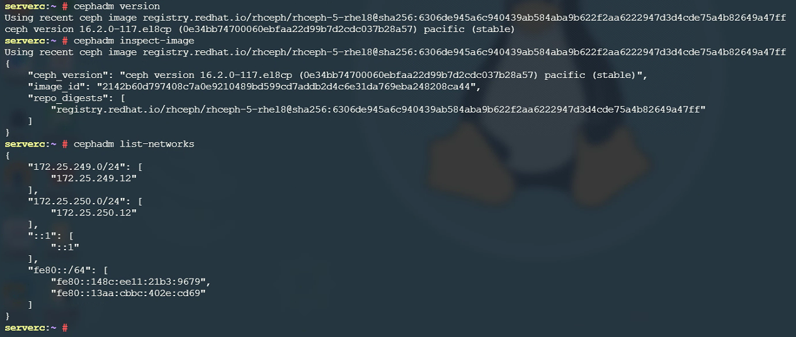
  
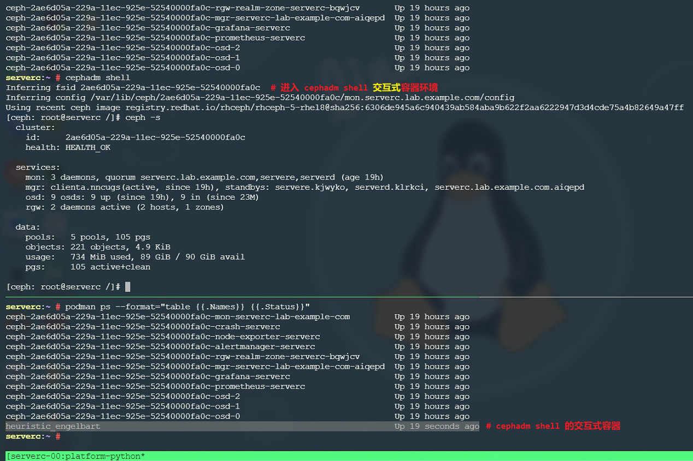
  
✨ 注意：使用 ceph orch host add 添加额外的节点时，需先将集群公钥导出并同步至节点。
  
```bash
$ ceph cephadm get-pub-key > /path/to/ceph.pub
# 生成集群公钥
$ ssh-copy-id -f -i /path/to/ceph.pub root@<hostname>
# 将集群公钥同步至节点，即可添加此节点。
$ ceph orch host add <node>
# 添加节点为集群节点
```

### Ceph Orchestrator 编排器使用
  
```bash
$ ceph orch status
  Backend: cephadm
  Available: Yes
  Paused: No
# 查看集群整体状态
  
$ ceph orch ls [--service_type=<name>]
  NAME                     RUNNING  REFRESHED  AGE  PLACEMENT                                                                
  alertmanager                 1/1  9m ago     2y   count:1                                                                  
  crash                        4/4  9m ago     2y   *                                                                        
  grafana                      1/1  9m ago     2y   count:1                                                                  
  mgr                          3/3  9m ago     5d   serverc.lab.example.com;serverd.lab.example.com;servere.lab.example.com  
  mon                          3/3  9m ago     5d   serverc.lab.example.com;serverd.lab.example.com;servere.lab.example.com  
  node-exporter                4/4  9m ago     2y   *                                                                        
  osd.default_drive_group     9/12  9m ago     2y   server*                                                                  
  prometheus                   1/1  9m ago     2y   count:1                                                                  
  rgw.realm.zone               2/2  9m ago     23M  serverc.lab.example.com;serverd.lab.example.com
# 查看 Ceph 集群中的服务（service）状态
# 使用 --service_type 选项指定 Ceph 服务类型
$ ceph orch ls --service_type=mon
  NAME  RUNNING  REFRESHED  AGE  PLACEMENT                                                                                        
  mon       4/4  3m ago     2y   clienta.lab.example.com;serverc.lab.example.com;serverd.lab.example.com;servere.lab.example.com
# 查看 mon 服务的状态
  
$ ceph orch ps [--daemon_type=<name>]
  NAME                         HOST                     STATUS         REFRESHED  AGE  PORTS  VERSION           IMAGE ID      CONTAINER ID  
  mon.clienta                  clienta.lab.example.com  running (12h)  3m ago     2y   -      16.2.0-117.el8cp  2142b60d7974  6c85145c2b22  
  mon.serverc.lab.example.com  serverc.lab.example.com  running (12h)  3m ago     2y   -      16.2.0-117.el8cp  2142b60d7974  f93b366a9f74  
  mon.serverd                  serverd.lab.example.com  running (12h)  3m ago     2y   -      16.2.0-117.el8cp  2142b60d7974  d35695b5833e  
  mon.servere                  servere.lab.example.com  running (12h)  3m ago     2y   -      16.2.0-117.el8cp  2142b60d7974  97319d05259c
# 查看 Ceph 集群中的服务实例状态
# 使用 --daemon_type 选项可指定服务实例的名称进行过滤
  
$ ceph orch host ls
  HOST                     ADDR           LABELS  STATUS  
  clienta.lab.example.com  172.25.250.10  _admin          
  serverc.lab.example.com  172.25.250.12  _admin          
  serverd.lab.example.com  172.25.250.13                  
  servere.lab.example.com  172.25.250.14
# 使用编排器查看各节点概要与 label 标签
# 注意：label 标签的作用在于区分各个节点，对节点进行分组管理，并且一个节点可具有多个标签。
$ ceph orch host label add <node> _admin
# 为集群节点添加 admin 管理员 label 标签
$ ceph orch host label add <node> prometheus
# 为集群节点添加 prometheus 标签
$ ceph orch apply prometheus --placement="label:prometheus"
# 根据集群节点标签部署 prometheus
  
$ ceph orch device ls [--wide]
# 查看集群各节点可用与不可用的设备信息，--wide 选项将指定全部的详细设备信息。
  
$ sudo systemctl list-units --all "ceph*"
# 登录 Ceph 集群节点查看所有的 ceph 服务单元
  
$ ceph orch host maintenance enter <node>
# 将指定节点设置为维护模式
$ ceph orch host maintenance exit <node>
# 将指定节点退出维护模式
```

### Ceph 集群配置
  
每个 `ceph monitor` 节点管理一个集中式配置数据库，位于 `/var/lib/ceph/$fsid/mon.$host/store.db/` 中。在集群启动时，Ceph 守护进程解析由命令行选项、环境变量与本地集群配置的配置选项。Ceph 守护进程连接到集群以获取存储在集中式配置数据库中的配置设定。从 RHCS 4 开始弃用 `/etc/ceph/ceph.conf` 集群配置文件，而将集中式配置数据库作为配置存储的首选方式。`ceph config set` 命令可用于更改集群各类配置。
  
```bash
$ ceph -s
$ ceph status
$ ceph -w
# 实时刷新日志
```
  
```bash
$ ceph config ls
# 列出集群所有的可配置参数（RHCS5 包含 2026 个配置参数）
$ ceph config help <config_setting>
# 查看指定配置参数的具体信息
$ ceph config dump
# 查看集中式配置数据库的配置（区别于集群配置文件）
$ ceph config show $type.$id
# 查看特定守护进程正在运行的配置
$ ceph config show-with-defaults $type.$id
# 查看特定守护进程正在运行的默认配置
  
$ ceph config get $type.$id
# 查看特定守护进程在集中式配置数据库中的配置
$ ceph config set $type.$id <config_setting>
# 设置特定守护进程在集中式配置数据库中的配置
$ ceph config set mon.serverd mon_max_pool_pg_num 65536  #示例
# 设置 mon.serverd 的 mon_max_pool_pg_num 为 65536
  
$ ceph config assimilate-conf -i /path/to/config_file
# 将指定配置文件中的参数融入当前的集中式配置数据库中
  
$ ceph config get mon mon_allow_pool_delete
# 查看集群是否允许删除存储池
$ ceph config get mon mon_compact_on_start
  false
# 查看 mon 在集群启动过程中是否可收缩数据库，以提高数据库性能。
$ ceph config set mon mon_compact_on_start true
# 设置 mon 在集群启动过程中进行数据库压缩
  
$ ceph config get mon auth_service_required
$ ceph config get mon auth_cluster_required
$ ceph config get mon auth_client_required
# 查看集群的各认证方式
  
### 集群运行时覆盖配置设置 ###
$ ceph tell $type.$id config get <config_setting>
$ ceph tell mon.serverc config get mon_max_pool_pg_num  #示例
# 查看 serverc 控制节点上支持的每个存储池可包含的最大 pg 数
# 注意：
#   1. 以上命令可在集群运行时覆盖配置，此方式作为临时配置，当守护进程重启后将失效。
#   2. ceph tell 子命令依然使用 mon。
```

## Ceph 集群网络

### 集群网络类型说明

- `public_network`：公共网络，主要用于客户端与 Mon、Mgr、Mds、osd 以及其他相关组件之间的数据请求与交换。
- `cluster_network`：集群网络，主要用于 osd 之间的数据同步、数据重平衡、数据恢复、数据回填、心跳检测等。
  
<center>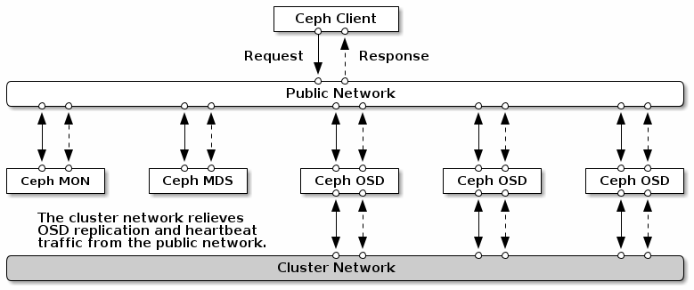</center>

<center>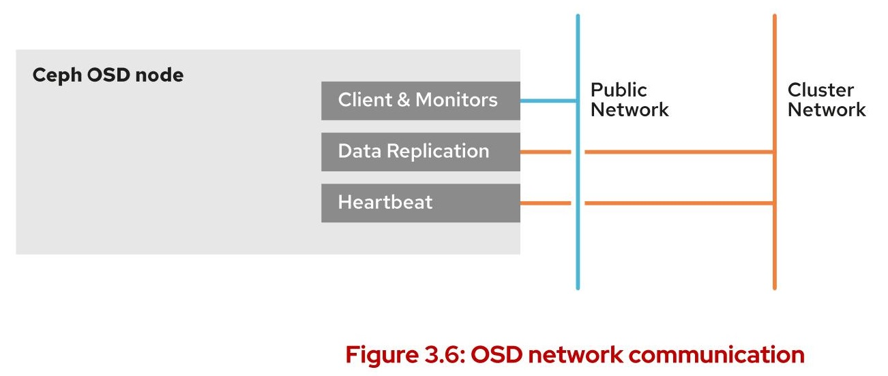</center>
  
<center>Ceph OSD 节点的网络连接示意</center>

- 每个 OSD 使用一个端口通过 public 网络与客户端及 Mon 通信
- 一个端口通过 cluster 网络与其他 OSD 间传输数据
- 一个端口通过 cluster 网络交换 heatbeat 心跳包）

<center>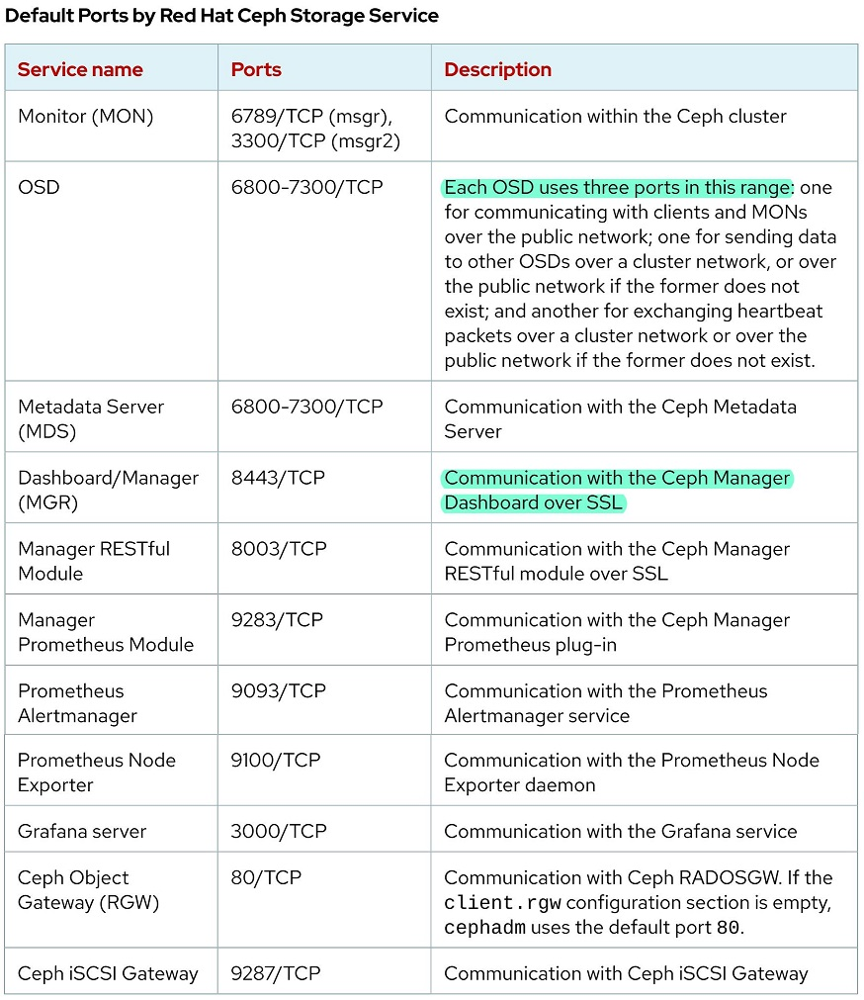</center>

<center>RHCS5 中的默认端口范围</center>

### Lab: 配置 Ceph 集群网络

Ceph 集群网络配置的两种方式：

```bash
### 方式1：配置文件方式
$ vim ./cluster-public-network.conf
[osd]  #配置 osd 使用的两大类网络，也可定义 mon 使用的网络。
  public network = 172.25.250.0/24
  cluster network = 172.25.249.0/24

$ ceph config assimilate-conf -i ./cluster-public-network.conf
$ ceph config get osd public_network
$ ceph config get osd cluster_network
$ ceph orch restart osd  #重启所有 osd 服务确保配置生效

### 方式2：命令行配置集中式数据库
$ ceph config set mon cluster_network 172.25.249.0/24
$ ceph config get mon cluster_network
$ ceph orch restart mon  #重启所有 mon 服务确保配置生效
```

## Ceph Monitor 监控器

```bash
$ ceph mon stat
  e5: 3 mons at {serverc.lab.example.com=[v2:172.25.250.12:3300/0,v1:172.25.250.12:6789/0],
  serverd=[v2:172.25.250.13:3300/0,v1:172.25.250.13:6789/0],servere=[v2:172.25.250.14:3300/0,
  v1:172.25.250.14:6789/0]}, election epoch 42, leader 0 serverc.lab.example.com, 
  quorum 0,1,2 serverc.lab.example.com,serverd,servere
# 查看 mon 状态，包括 mon 的 IPv4 地址与 leader mon。

$ ceph quorum_status -f json-pretty
{
  "election_epoch": 42,
  "quorum": [
    0,
    1,
    2
  ],
  "quorum_names": [
    "serverc.lab.example.com",
    "serverd",
    "servere"
  ],
  "quorum_leader_name": "serverc.lab.example.com",
  ...
# 查看 mon 的选举状态
```

## Ceph Manager 管理器

### Ceph Mgr 命令

```bash
$ ceph mgr stat
{
    "epoch": 19,
    "available": true,
    "active_name": "serverc.lab.example.com.weqbtr",
    "num_standby": 2
}
# 确认 mgr 的整体状态

$ ceph mgr module enable pg_autoscaler
$ ceph mgr module ls
{
    "always_on_modules": [
        "balancer",
        "crash",
        "devicehealth",
        "orchestrator",
        "pg_autoscaler",
        "progress",
        "rbd_support",
        "status",
        "telemetry",
        "volumes"
    ],
    ...
}
```

### Lab: 配置管理 Ceph Dashboard

```bash
$ ceph mgr module enable dashboard --force
# 启用 dashboard 模块
$ ceph mgr module ls | \
  perl -MJSON -MYAML -0777 -wnl -e 'print YAML::Dump(decode_json($_))' -
# 查看 mgr 管理的模块并使用 perl 将输出的 JSON 格式转换为 YAML 格式
# 注意：使用 perl 时需提前安装 perl-JSON 与 perl-YAML 软件包以提供对应模块
$ ceph dashboard create-self-signed-cert
# 配置 dashboard 生成证书
$ ceph config set mgr mgr/dashboard/server_addr <dashboard_server_address>
# 配置 dashboard 的主机 IP 地址
$ ceph config set mgr mgr/dashboard/server_port 8080
# 配置 dashboard 监听的非 SSL 端口
$ ceph config set mgr mgr/dashboard/ssl_server_port 8443
# 配置 dashboard 监听的 SSL 端口
$ ceph mgr services
{
    "dashboard": "https://172.25.250.12:8443/",
    "prometheus": "http://172.25.250.12:9283/"
}
# 获取 mgr 管理的 dashboard URL
$ ceph dashboard ac-user-create \
<dashboard_user> <dashboard_password> administrator
# 创建登录 dashboard 的用户名与密码，以管理员用户身份登录。
```

### Lab: 修改 Dashboard 仪表板密码

```bash
$ echo "<password>" > /path/to/dashboard_password.yml
# 注入修改的新密码
$ ceph dashboard ac-user-set-password <dashboard_user> -i /path/to/dashboard_password.yml 
# 设置指定用户与密码
```

### Ceph balancer 均衡器

```bash
$ ceph balancer status
{
    "active": true,
    "last_optimize_duration": "0:00:00.000462",
    "last_optimize_started": "Thu Jan 11 05:51:41 2024",
    "mode": "upmap",
    "optimize_result": "Unable to find further optimization, or pool(s) pg_num is decreasing, or distribution is already perfect",
    "plans": []
} 
# 查看 balancer 均衡器状态
```

## Ceph Cluster Map 集群映射

Ceph Cluster Map 包含 `MON Map`、`OSD Map`、`PG Map`、`MDS Map` 和 `CRUSH Map`。

```bash
$ ceph mon dump
  epoch 55
  fsid 2ae6d05a-229a-11ec-925e-52540000fa0c
  last_changed 2023-09-17T23:46:59.748723+0000
  created 2021-10-01T09:30:30.146231+0000
  min_mon_release 16 (pacific)
  election_strategy: 1
  0: [v2:172.25.250.12:3300/0,v1:172.25.250.12:6789/0] mon.serverc.lab.example.com
  1: [v2:172.25.250.14:3300/0,v1:172.25.250.14:6789/0] mon.servere
  2: [v2:172.25.250.13:3300/0,v1:172.25.250.13:6789/0] mon.serverd
  dumped monmap epoch 55
# 查看集群 monmap
$ ceph osd dump
# 查看集群 osdmap
$ ceph pg dump
# 查看集群 pgmap
$ ceph pg dump pgs_brief
# 查看集群简要 pgmap
$ ceph osd crush dump
# 查看集群 crush map（可查看集群整体的 CRUSH 层次结构与故障恢复域）
$ ceph fs dump
# 查看集群 cephfs map
```

## Ceph CRUSH Map 映射

🚀 关于 `CRUSH map` 的说明可参考 [Ceph CRUSH map 概述与实现](https://github.com/Alberthua-Perl/tech-docs/blob/master/%E5%88%86%E5%B8%83%E5%BC%8F%E5%AD%98%E5%82%A8/Ceph%20CRUSH%20map%20%E6%A6%82%E8%BF%B0%E4%B8%8E%E5%AE%9E%E7%8E%B0.md#-ceph-crush-map-%E6%A6%82%E8%BF%B0%E4%B8%8E%E5%AE%9E%E7%8E%B0)

## Ceph PG 放置组

### Ceph PG 常用管理命令

Ceph PG、CRUSH 放置规则与 OSD 之间的关系如下图所示：

<center>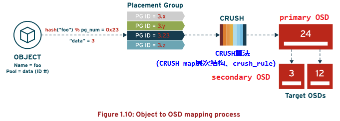</center>


```bash
$ ceph osd pool set <pool_name> pg_autoscale_mode on
# 启用 mgr 的 pg_autoscaler 模块并启用指定存储池的自动扩展 pg 功能

$ ceph pg stat
  105 pgs: 105 active+clean; 4.9 KiB data, 181 MiB used, 90 GiB / 90 GiB avail
# 查看集群中所有 pg 的状态
$ ceph pg map <pg.id>
# 重要：根据 pd id 查找指定 pg 与 osd 的对应关系
$ ceph pg <pg.id> query
# 重要：根据 pg id 查看其详细状态信息
```

## Ceph OSD 对象存储设备

```bash
$ ceph osd df
# osd 级别的存储使用情况
$ ceph osd df tree
# osd 级别的存储使用情况并显示 osd 在 CRUSH map 中的位置

$ ceph osd tree
# osd 磁盘在集群中的分布情况
$ ceph osd stat
  9 osds: 9 up (since 13h), 9 in (since 2y); epoch: e199
# 查看所有 osd 的状态

$ ceph osd find <osd.id>
# 根据 osd id 查找 osd 的状态及所在的节点
$ ceph osd find 2  #示例
{
    "osd": 2,
    "addrs": {
        "addrvec": [
            {
                "type": "v2",
                "addr": "172.25.250.12:6816",
                "nonce": 3631084615
            },
            {
                "type": "v1",
                "addr": "172.25.250.12:6817",
                "nonce": 3631084615
            }
        ]
    },
    "osd_fsid": "a28ad912-a54a-423a-a2d1-4889b0788a47",
    "host": "serverc.lab.example.com",
    "crush_location": {
        "host": "serverc",
        "root": "default"
    }
}
# 查找 osd.2 的状态及所在的节点

$ ceph osd metadata <osd.id>
# 重要：根据 osd id 查看 osd 的元数据信息
```

### Lab: 定位对象与 OSD、PG 的映射关系

```bash
$ rados -p <pool_name> ls
# 查看指定存储池中的对象
$ rados -p testpool ls  #示例
test-data
testobject
$ ceph osd map <pool_name> <object_name>
# 重要：
#   1. 根据指定的对象名称查找其与 pg 及 osd 的映射关系
#   2. 此命令相较于 ceph pg map <pg.id> 更进一步，直接查找对象的映射关系。
$ ceph osd map testpool test-data  #示例
osdmap e664 pool 'testpool' (9) object 'test-data' -> pg 9.4a628b60 (9.0) -> up ([0,2,5], p0) acting ([0,2,5], p0)
# 查看指定存储池中对象、pg 与 osd 的映射关系
```

### Lab: 标记 OSD 在集群中的状态

```bash
$ ceph osd out <osd.id>
# 将指定的 osd 标记为 out 状态
$ ceph osd in <osd.id>
# 将指定的 osd 标记为 in 状态
# 注意：可将运行中的 osd 标记为 in 或 out 的状态，因为 in 或 out 状态不与运行状态关联。

$ ceph osd [set|unset] noscrub
# (不)设置 osd 不执行清理
$ ceph osd [set|unset] nodeep-scrub
# (不)设置 osd 不执行深度清理
```

### Lab: 使用命令行部署新的 OSD 设备（scale up）

```bash
$ ceph orch device zap --force <hostname> /path/to/device
# 强制删除之前 osd 创建的所有分区并清除其中的所有数据为部署 osd 做准备
$ ceph orch daemon add osd <hostname>:/path/to/device
$ ceph orch daemon add osd serverd.lab.example.com:/dev/vde  #示例
# 添加指定主机上的 osd 设备
```
  
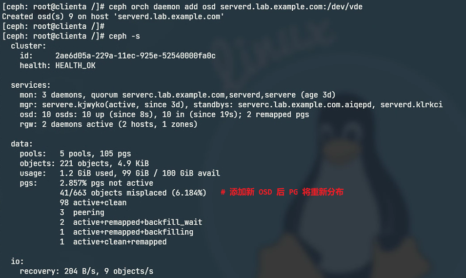

### Lab: 使用 osd specification file 部署 OSD 设备

关于 `--all-available-devices` 选项的说明：

使用 `ceph orch apply osd --all-available-devices` 命令添加 `ceph orch device ls` 命令返回为 Available 状态的 osd，如果将 osd 从集群中删除并 zap 后，这些 osd 将重新自动加入到集群中。有时对于此种行为是不需要的，可通过以下方法去除自动添加到集群中，如下所示：

```bash
$ ceph orch ls --service-type osd --format yaml > ./osd-spec.yaml
$ vim ./osd-spec.yaml
service_type: osd
service_id: default_drive_group
service_name: osd.default_drive_group
placement:
  hosts:
  - serverc.lab.example.com
  - serverd.lab.example.com
  - servere.lab.example.com
spec:
  data_devices:
    paths:
    - /dev/vdc
    - /dev/vdd
  filter_logic: AND
  objectstore: bluestore
unmanaged: true    #此选项将不再使 osd 被重新自动加入集群
status:
  created: '2025-04-13T06:49:36.576870Z'
  running: 0
  size: 3

$ ceph orch apply -i ./osd-spec.yaml
# 重新设置 osd 配置使其生效
```
  
### Lab: 删除 OSD 设备
  
```bash
$ ceph device ls | awk /<hostname>/
# 查看指定节点上磁盘设备与 osd 的对应关系
$ ceph orch daemon stop osd.$id
# 停止指定的 osd 守护进程
# 注意：
#   1. 若登录至 osd 所在的节点使用 systemctl 命令查看，可发现此服务单元已停止。
#   2. 可在此节点上使用 systemctl 命令启动此 osd 守护进程
$ ceph orch daemon rm osd.$id --force
# 将指定的 osd 守护进程强制移除
$ ceph osd rm $id
# 将 osd 从集群 osdmap（osd 映射）中删除
# 注意：
#   1. 此时，ceph -s 集群状态将显示 crushmap 中依然保留着 osd，而 osdmap 中已移除 osd，两者的状态不匹配。
#   2. ceph osd tree 显示的 osd 状态为 DNE，当从 crushmap 中移除后将清除。
$ ceph orch osd rm status
# 查看 osd 删除的状态

$ ceph osd crush rm $id
# 将 osd 从集群 crushmap（CRUSH 映射）中删除
# 注意：若后续还需要将 osd 添加到集群中的话，那么在 crushmap 中可继续保留！
```
  
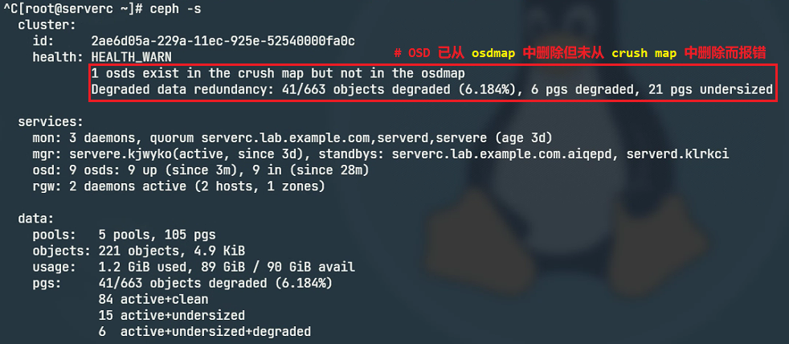

### Lab: 配置 ceph 软件源

RHCS5 (Ceph Pacific 16.x) 中全面使用 `cephadm shell` 启用容器化对 Ceph 集群的管理，在容器中包含有 `ceph-volume` 命令行工具，而在宿主机系统中默认不安装此工具，需要配置 ceph 软件源进行安装。

```bash
$ sudo cat /etc/yum.repos.d/ceph.repo <<EOF
[ceph-noarch]
name=Ceph noarch packages
baseurl=http://mirrors.163.com/ceph/rpm-pacific/el8/x86_64/
enabled=1
gpgcheck=1
priority=1
type=rpm-md
gpgkey=http://mirrors.163.com/ceph/keys/release.asc
EOF

$ sudo dnf provides ceph-volume  #ceph-volume 工具的软件包
Last metadata expiration check: -836 days, 2:08:01 ago on Wed 16 Apr 2025 02:13:18 AM EDT.
ceph-osd-2:16.2.15-0.el8.x86_64 : Ceph Object Storage Daemon
Repo        : @System
Matched from:
Filename    : /usr/sbin/ceph-volume

ceph-osd-2:16.2.15-0.el8.x86_64 : Ceph Object Storage Daemon
Repo        : ceph-noarch
Matched from:
Filename    : /usr/sbin/ceph-volume

$ sudo dnf install -y ceph-osd
```

🔥 关于 `ceph-volume` 的说明：

从 RHCS4 开始引入 `ceph-volume` 命令用于创建基于 `BlueStore` 存储引擎的 OSD，分别使用 `ceph-volume lvm prepare` 与 `ceph-volume lvm activate` 子命令创建与激活 OSD 设备，过程如下示意：

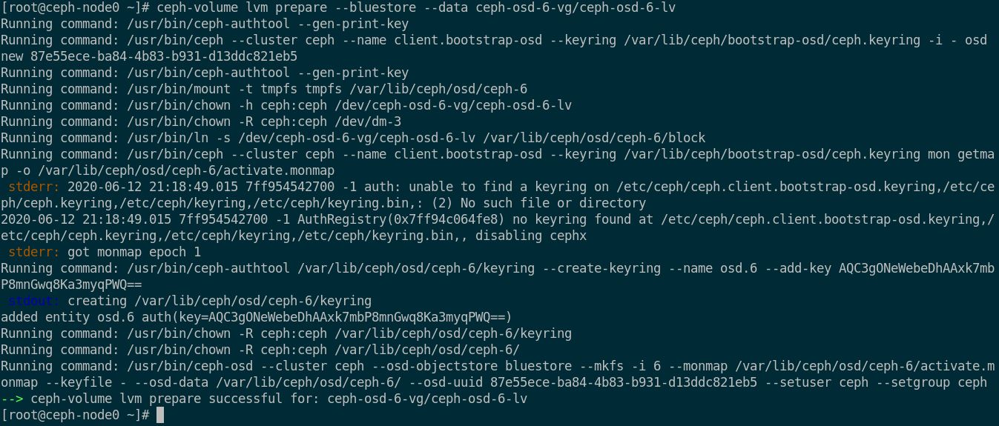

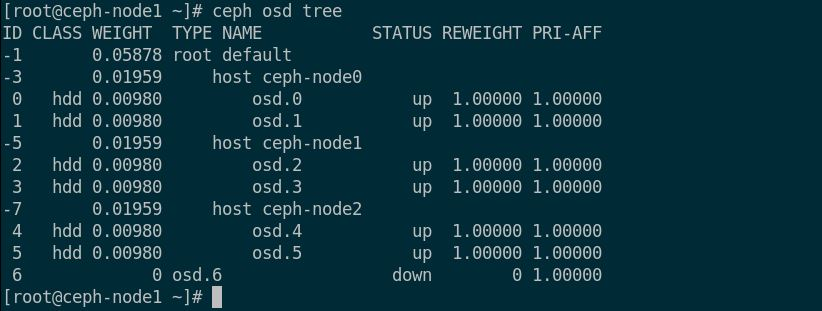
  
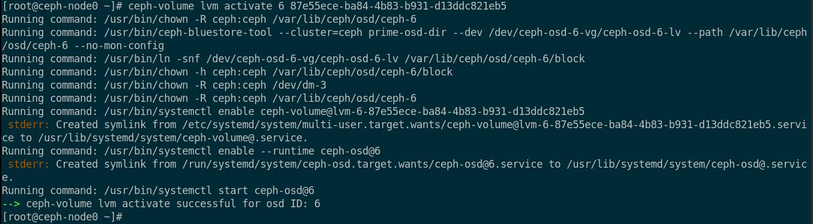

### Lab: RHCS5 中使用 ceph-volume 手动部署 OSD

虽然使用 `osd specification file` 定义需部署的 osd 磁盘灵活且便捷，但有时可能需要将多个 osd 的 `wal` 与 `rocksdb` 部署在同一磁盘上（高性能的 SSD 或 NVMe）加速 osd 的读写性能，可通过手动添加的方式完成（也同样可以通过 osd 定义文件的方式实现）。如下所示：

```bash
[root@servere ~]# lsblk -p
...
vde               252:64   0   10G  0 disk
├─vde1            252:65   0    1G  0 part  #本节点 /dev/vdb osd 的 wal
├─vde2            252:66   0    2G  0 part  #本节点 /dev/vdb osd 的 rocksdb
├─vde3            252:67   0    1G  0 part  #本节点 /dev/vdc osd 的 wal
├─vde4            252:68   0    2G  0 part  #本节点 /dev/vdc osd 的 rocksdb
├─vde5            252:69   0    1G  0 part  #本节点 /dev/vdd osd 的 wal
└─vde6            252:70   0    2G  0 part  #本节点 /dev/vdd osd 的 rocksdb
...
# 注意：
#   1. 此处先不考虑单个 osd 的数据、wal 与 rocksdb 之间的容量分配比，演示如何将 /dev/vde 分配给 3 个 osd 的 wal 与 rocksdb。
#   2. 以上分区需预先手动完成分区（fdisk/gdisk/parted 均可）

[root@servere ~]# ceph auth get client.bootstrap-osd -o /var/lib/ceph/bootstrap-osd/ceph.keyring
# 导出 bootstrap-osd 的 keyring 文件用于集群中新增 osd 的认证凭据
# 注意：
#   若不生成此 ceph.keyring 文件，那么在使用 ceph-volume lvm create 命令添加 osd 时报错如下：
#   stderr: 2023-01-01T01:29:07.360+0000 7febf169a700 -1 auth: unable to find a keyring on /var/lib/ceph/bootstrap-osd/ceph.keyring: (2) No such file or directory
#   stderr: 2023-01-01T01:29:07.360+0000 7febf169a700 -1 AuthRegistry(0x7febec05b3f8) no keyring found at /var/lib/ceph/bootstrap-osd/ceph.keyring, disabling cephx
#   以上提示 ceph.keyring 文件不存在导致认证失败。

[root@servere ~]# ceph-volume lvm create --bluestore --data /dev/vdb --block.wal /dev/vde1 --block.db /dev/vde2
Running command: /usr/bin/ceph-authtool --gen-print-key
Running command: /usr/bin/ceph --cluster ceph --name client.bootstrap-osd --keyring /var/lib/ceph/bootstrap-osd/ceph.keyring -i - osd new 03e01019-a426-4190-b711-b9e3ad21dd5a
Running command: vgcreate --force --yes ceph-eb4fe887-63fa-4bdf-8bd4-1f0f9a4fbb2a /dev/vdb
 stdout: Physical volume "/dev/vdb" successfully created.
 stdout: Volume group "ceph-eb4fe887-63fa-4bdf-8bd4-1f0f9a4fbb2a" successfully created
Running command: lvcreate --yes -l 2559 -n osd-block-03e01019-a426-4190-b711-b9e3ad21dd5a ceph-eb4fe887-63fa-4bdf-8bd4-1f0f9a4fbb2a
 stdout: Logical volume "osd-block-03e01019-a426-4190-b711-b9e3ad21dd5a" created.
Running command: /usr/bin/ceph-authtool --gen-print-key
Running command: /usr/bin/mount -t tmpfs tmpfs /var/lib/ceph/osd/ceph-6
Running command: /usr/sbin/restorecon /var/lib/ceph/osd/ceph-6
Running command: /usr/bin/chown -h ceph:ceph /dev/ceph-eb4fe887-63fa-4bdf-8bd4-1f0f9a4fbb2a/osd-block-03e01019-a426-4190-b711-b9e3ad21dd5a
Running command: /usr/bin/chown -R ceph:ceph /dev/dm-0
Running command: /usr/bin/ln -s /dev/ceph-eb4fe887-63fa-4bdf-8bd4-1f0f9a4fbb2a/osd-block-03e01019-a426-4190-b711-b9e3ad21dd5a /var/lib/ceph/osd/ceph-6/block
Running command: /usr/bin/ceph --cluster ceph --name client.bootstrap-osd --keyring /var/lib/ceph/bootstrap-osd/ceph.keyring mon getmap -o /var/lib/ceph/osd/ceph-6/activate.monmap
 stderr: got monmap epoch 4
--> Creating keyring file for osd.6  #创建 osd.6 的 keyring 文件
Running command: /usr/bin/chown -R ceph:ceph /var/lib/ceph/osd/ceph-6/keyring
Running command: /usr/bin/chown -R ceph:ceph /var/lib/ceph/osd/ceph-6/
Running command: /usr/bin/chown -R ceph:ceph /dev/vde1
Running command: /usr/bin/chown -R ceph:ceph /dev/vde2
Running command: /usr/bin/ceph-osd --cluster ceph --osd-objectstore bluestore --mkfs -i 6 --monmap /var/lib/ceph/osd/ceph-6/activate.monmap --keyfile - --bluestore-block-wal-path /dev/vde1 --bluestore-block-db-path /dev/vde2 --osd-data /var/lib/ceph/osd/ceph-6/ --osd-uuid 03e01019-a426-4190-b711-b9e3ad21dd5a --setuser ceph --setgroup ceph
 stderr: 2022-12-31T21:25:21.005-0500 7f85c0737380 -1 bluestore(/var/lib/ceph/osd/ceph-6/) _read_fsid unparsable uuid
--> ceph-volume lvm prepare successful for: /dev/vdb  #添加 osd 准备阶段完成
Running command: /usr/bin/chown -R ceph:ceph /var/lib/ceph/osd/ceph-6
Running command: /usr/bin/ceph-bluestore-tool --cluster=ceph prime-osd-dir --dev /dev/ceph-eb4fe887-63fa-4bdf-8bd4-1f0f9a4fbb2a/osd-block-03e01019-a426-4190-b711-b9e3ad21dd5a --path /var/lib/ceph/osd/ceph-6 --no-mon-config
Running command: /usr/bin/ln -snf /dev/ceph-eb4fe887-63fa-4bdf-8bd4-1f0f9a4fbb2a/osd-block-03e01019-a426-4190-b711-b9e3ad21dd5a /var/lib/ceph/osd/ceph-6/block
Running command: /usr/bin/chown -h ceph:ceph /var/lib/ceph/osd/ceph-6/block
Running command: /usr/bin/chown -R ceph:ceph /dev/dm-0
Running command: /usr/bin/chown -R ceph:ceph /var/lib/ceph/osd/ceph-6
Running command: /usr/bin/ln -snf /dev/vde2 /var/lib/ceph/osd/ceph-6/block.db
Running command: /usr/bin/chown -R ceph:ceph /dev/vde2
Running command: /usr/bin/chown -h ceph:ceph /var/lib/ceph/osd/ceph-6/block.db
Running command: /usr/bin/chown -R ceph:ceph /dev/vde2
Running command: /usr/bin/ln -snf /dev/vde1 /var/lib/ceph/osd/ceph-6/block.wal
Running command: /usr/bin/chown -R ceph:ceph /dev/vde1
Running command: /usr/bin/chown -h ceph:ceph /var/lib/ceph/osd/ceph-6/block.wal
Running command: /usr/bin/chown -R ceph:ceph /dev/vde1
Running command: /usr/bin/systemctl enable ceph-volume@lvm-6-03e01019-a426-4190-b711-b9e3ad21dd5a
 stderr: Created symlink /etc/systemd/system/multi-user.target.wants/ceph-volume@lvm-6-03e01019-a426-4190-b711-b9e3ad21dd5a.service → /usr/lib/systemd/system/ceph-volume@.service.
Running command: /usr/bin/systemctl enable --runtime ceph-osd@6
 stderr: Created symlink /run/systemd/system/ceph-osd.target.wants/ceph-osd@6.service → /usr/lib/systemd/system/ceph-osd@.service.
Running command: /usr/bin/systemctl start ceph-osd@6
--> ceph-volume lvm activate successful for osd ID: 6
--> ceph-volume lvm create successful for: /dev/vdb
# osd 创建添加日志：/dev/vdb 作为 osd 的数据盘，/dev/vde1 作为 osd 的 wal，/dev/vde2 作为 osd 的 rocksdb。
# 此 osd 使用 BlueStore 存储驱动，/dev/vdb 在后续过程中自动创建为逻辑卷。
[root@servere ~]# lsblk
NAME                                                                                                  MAJ:MIN RM  SIZE RO TYPE MOUNTPOINT
...
vdb                                                                                                   252:16   0   10G  0 disk 
└─ceph--eb4fe887--63fa--4bdf--8bd4--1f0f9a4fbb2a-osd--block--03e01019--a426--4190--b711--b9e3ad21dd5a 253:0    0   10G  0 lvm
...
# osd.6 对应的逻辑卷已创建
[root@servere ~]# ceph osd tree
ID  CLASS  WEIGHT   TYPE NAME         STATUS  REWEIGHT  PRI-AFF
-1         0.07047  root default                               
-3         0.02939      host serverc                           
 1    hdd  0.00980          osd.1         up   1.00000  1.00000
 3    hdd  0.00980          osd.3         up   1.00000  1.00000
 5    hdd  0.00980          osd.5         up   1.00000  1.00000
-5         0.02939      host serverd                           
 0    hdd  0.00980          osd.0         up   1.00000  1.00000
 2    hdd  0.00980          osd.2         up   1.00000  1.00000
 4    hdd  0.00980          osd.4         up   1.00000  1.00000
-9         0.01169      host servere                           
 6    hdd  0.01169          osd.6         up   1.00000  1.00000  #osd.6 已加入集群

[root@servere ~]# ceph-volume lvm create --bluestore --data /dev/vdc --block.wal /dev/vde3 --block.db /dev/vde4
[root@servere ~]# ceph-volume lvm create --bluestore --data /dev/vdd --block.wal /dev/vde5 --block.db /dev/vde6
[root@servere ~]# ceph osd tree
ID  CLASS  WEIGHT   TYPE NAME         STATUS  REWEIGHT  PRI-AFF
-1         0.09384  root default                               
-3         0.02939      host serverc                           
 1    hdd  0.00980          osd.1         up   1.00000  1.00000
 3    hdd  0.00980          osd.3         up   1.00000  1.00000
 5    hdd  0.00980          osd.5         up   1.00000  1.00000
-5         0.02939      host serverd                           
 0    hdd  0.00980          osd.0         up   1.00000  1.00000
 2    hdd  0.00980          osd.2         up   1.00000  1.00000
 4    hdd  0.00980          osd.4         up   1.00000  1.00000
-9         0.03506      host servere                           
 6    hdd  0.01169          osd.6         up   1.00000  1.00000
 7    hdd  0.01169          osd.7         up   1.00000  1.00000
 8    hdd  0.01169          osd.8         up   1.00000  1.00000
# 3 个 osd 已全部加入集群中

[root@servere ~]# ceph-volume lvm list
# 查看 osd 与 lv 的对应关系（必须在对应节点上运行）

[root@servere ~]# ceph orch ps --daemon_type=osd
NAME   HOST                     STATUS        REFRESHED  AGE  PORTS  VERSION           IMAGE ID      CONTAINER ID
osd.0  serverd.lab.example.com  running (2d)  9m ago     2d   -      16.2.0-117.el8cp  2142b60d7974  214f946e935e
osd.1  serverc.lab.example.com  running (2d)  9m ago     2d   -      16.2.0-117.el8cp  2142b60d7974  169b37f63a95
osd.2  serverd.lab.example.com  running (2d)  9m ago     2d   -      16.2.0-117.el8cp  2142b60d7974  605c9c7817a7
osd.3  serverc.lab.example.com  running (2d)  9m ago     2d   -      16.2.0-117.el8cp  2142b60d7974  32495d4269b9
osd.4  serverd.lab.example.com  running (2d)  9m ago     2d   -      16.2.0-117.el8cp  2142b60d7974  31990acee22c
osd.5  serverc.lab.example.com  running (2d)  9m ago     2d   -      16.2.0-117.el8cp  2142b60d7974  0a0963f26a56
# 但请注意，由于是通过手动添加 osd，这些添加的 osd 不被 ceph 编排器管理，因此不在以上返回的 osd 列表中！
```

如上所示，直接在对应节点上使用 ceph-volume 命令可成功添加 osd，但在 cephadm 运行的容器中使用同样的方法无法完成 osd 的添加。因为在添加 osd 的过程中，将会使用 `systemctl` 管理 osd 服务的守护进程，需连接节点的 bus 总线，而在容器中无法完成而报错。返回如下：

```bash
[ceph: root@servere ~]# ceph-volume lvm create --bluestore --data /dev/vdb --block.wal /dev/vde1 --block.db /dev/vde2
...
 stderr: Failed to connect to bus: No such file or directory
--> Was unable to complete a new OSD, will rollback changes
Running command: /usr/bin/ceph --cluster ceph --name client.bootstrap-osd --keyring /var/lib/ceph/bootstrap-osd/ceph.keyring osd purge-new osd.6 --yes-i-really-mean-it
 stderr: purged osd.6
-->  RuntimeError: command returned non-zero exit status: 1
```

若 ceph-volume lvm create 添加 osd 失败，会保留创建的卷组与逻辑卷，以及 `/var/lib/ceph/osd/*` 中的对应目录。因此，回退重新部署的话，需将其全部删除，可参考如下：

```bash
[root@servere ~]# vgs  #查询创建的卷组
[root@servere ~]# vgremove -f <vg_name>  #删除已创建的卷组
[root@servere ~]# rm -rf /var/lib/ceph/osd/*  #删除已创建的 osd 目录
# 重新执行创建 osd 的命令完成创建
```

## RADOS 对象操作

```bash
$ rados -p <pool_name> put <object_name> /path/to/file
# 指定文件将其上传至集群中以指定的名称命名
$ rados -p <pool_name> ls
# 查看指定存储池中的对象
```

## Ceph Pool 存储池

### Ceph 存储池状态

```bash
$ ceph osd lspools
$ ceph osd ls pool detail
# 以上两个命令用于查看集群中的存储池

$ rados df
# RADOS 层面查询集群状态
$ ceph df
# Ceph 集群与存储池级别的存储使用情况
$ ceph osd pool stats
# 确认所有存储池的性能统计信息
```

### Ceph 复制池命令

```bash
$ ceph osd pool create <pool_name> \
  <pg_num> <pgp_num> [replicated] <crush_rule_set>
# 创建复制池
# 注意：
#   1. 默认情况下可只指定存储池名称与 PG 数量，也可自定义 CRUSH 放置规则在创建存储池时指定。
#   2. 若设置了相同的 pg_num 与 pgp_num，之后再调整 pg_num 将自动调整 pgp_num。

$ ceph osd pool application enable <pool_name> [rbd|rgw|cephfs]
# 设置指定的存储池为 rbd、rgw 或 cephfs 应用类型

$ ceph osd pool get <pool_name> all
# 查看存储池的所有参数值
$ ceph osd pool get <pool_name> [size|nodelete|min_size]
# 查看存储池的指定参数值
$ ceph osd pool get <pool_name> pg_autoscale_mode
# 查看存储池的 PG 自动扩展模式
$ ceph osd pool set <pool_name> [size|nodelete|min_size] <value>
# 设置存储池的指定参数值

$ ceph osd pool get mon osd_pool_default_size
# 查看集中配置数据库中定义的默认对象副本数量

$ ceph osd pool rename <old-pool_name> <new-pool_name>
# 重命名存储池名称（不影响池中存储的数据，但需要注意用户对池的权限）
```

### Ceph 纠删代码池命令

```bash
$ ceph osd erasure-code-profile ls
# 查看纠删代码池的 profile
$ ceph osd erasure-code-profile get <profile_name>
# 查看指定纠删代码池的 profile 具体信息
$ ceph osd erasure-code-profile set <profile_name> k=<num> m=<num> crush-failure-domain=[osd|host|rack]
# 创建纠删代码池的 profile
$ ceph osd erasure-code-profile set myerasure k=3 m=2 crush-failure-domain=rack  #示例
# rack 类型的故障恢复域必须提前在 CRUSH map 中构建
$ ceph osd erasure-code-profile rm <profile_name>
# 删除指定的纠删代码池的 profile
$ ceph osd pool create <pool_name> <pg_num> <pgp_num> erasure <profile_name> <crush_rule_set>
# 创建纠删代码池
```

关于纠删代码 profile 的设置 RedHat 给出以下推荐方式：

<center>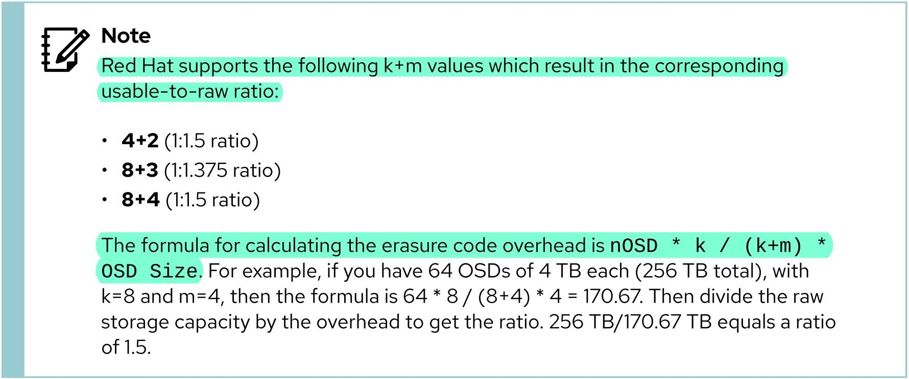</center>

## CephX 认证与用户

### CephX 认证机制

<center></center>

Ceph 客户端使用 CephX 协议向 monitor 发送用户创建请求，当 monitor 创建用户后将存储用户名、keyring 与 capability 等信息，并将相同的 keyring 文件返回给客户端，其中 keyring 文件中的 key 为 `secret key`，用于加密与解密 monitor 生成的会话密钥（`session key`）。

<center>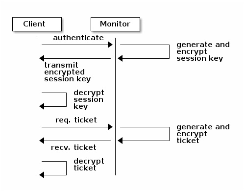</center>

<center>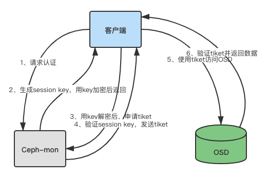</center>

每个 monitor 都可以对客户端进行身份验证并分发密钥，这意味着认证依靠 monitor 节点完成，不会存在单点和性能瓶颈。monitor 会返回用于身份验证的数据结构，其中包含获取 Ceph 服务时用到的 session key。所谓 session key 就是客户端用来向 monitor 请求所需服务的凭证，`session key` 是通过客户端的 `secret key` 进行加密传输。

🚀 当 monitor 收到客户端认证请求后，首先生成 session key，然后用客户端的 secret key 加密session key，再发送给客户端，客户端用自身的 secret key 将其解密，拿到 session key。客户端获取 session key 之后，它就可以用此 session key 向 monitor 请求服务，monitor 收到客户端的请求（携带 session key），此时 monitor 会向客户端提供一个 `ticket`（票据），然后使用 session key 加密后发送给客户端。随后客户端使用 session key 解密此票据，使用此票据到对应 OSD 完成认证。

以上过程，需要注意的是，首先，客户端的 secret key 是通过 monitor 节点在创建用户帐号时就生成，所以 monitor 节点有对应客户端的 secret key，通过客户端的 secret key 加密，客户端可以用自身的 secret key 解密。其次，monitor 节点生成的 session key 是有记录的，所以对于不同客户端来说，都有不同的记录，并且此 session key 是有时间限制的，过期即便是对应客户端，也无法正常使用。所以客户端使用对应 session key 向 monitor 请求服务，对应 monitor 都是认可的，monitor 会向其发放 ticket。最后，monitor 和 OSD 都共享客户端的 secret key 和 session key，以及 monitor 发放的 ticket，所以客户端使用 monitor 发放的 ticket，对应 OSD 是认可的。这也意味着不管是哪个 monitor 节点发放的 ticket，对应所有 monitor 节点和 OSD 都可认证。

<center>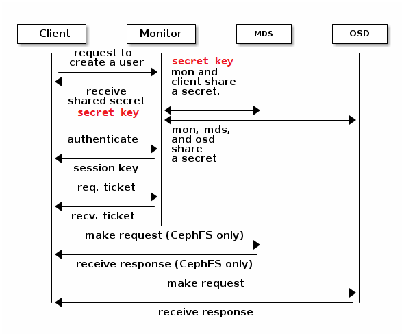</center>

🏷 关于 CephX 认证机制更多可参考 [HIGH AVAILABILITY AUTHENTICATION](https://docs.ceph.com/en/latest/architecture/#high-availabilityauthentication) 中的说明。

### CephX 用户认证管理命令

```bash
$ ceph auth get-or-create [--id <name>|--name client.<name>] client.<name> \
  mon 'allow r' osd 'allow rw' \
  -o /path/to/ceph.client.<name>.keyring
# 使用指定的 Ceph 用户创建新用户并将其 secret key 注入 keyring 文件
# 也可使用 --keyring 选项指定 keyring 文件用于创建新用户

### 限制用户的访问 ###
$ ceph auth get-or-create client.<name> \
  mon 'profile rbd' osd 'profile rbd pool=<pool_name>'
# 限制用户只能访问指定存储池中的 RBD 镜像
$ ceph auth get-or-create client.<name> \
  mon 'allow r' osd 'allow rw object_prefix <prefix-name>'
# 限制用户只能访问指定前缀的对象
$ ceph auth get-or-create client.<name> \
  mon 'allow r' osd 'allow rw namespace=<namespace>'
# 限制用户只能访问指定 namespace 中的对象
$ ceph fs authorize cephfs client.<name> /path/to/cephfs rw
# 限制用户只能读写 CephFS 中的指定路径
$ ceph auth get-or-create client.<name> \
  mon 'allow r, allow command "auth get-or-create", allow command "auth list"'
# 通过 monitor 命令限制用户只能运行指定的 ceph 命令

$ ceph auth list
# 列出所有的 Ceph 用户
$ ceph auth get client.<name>
# 显示指定用户的详细信息
$ ceph auth print-key client.<name>
# 显示指定用户的 secret key
$ ceph auth export client.<name> > /path/to/keyring
# 导出指定用户的 keyring 至文件
$ ceph auth import -i /path/to/keyring
# 指定用户的 keyring 导入集群

$ ceph auth caps client.<name> mon 'allow r' osd 'allow rw'
# 覆盖更新当前指定用户的现有功能
$ ceph auth caps client.<name> osd ''
# 使用空字符删除指定用户的所有功能

$ ceph auth del client.<name>
# 删除集中配置数据库中的指定用户
$ rm -f /path/to/keyring
# 删除指定用户的 keyring 文件（若存在的话）
```

## Ceph RBD 镜像

### RBD 镜像的特性（feature）

- `layering`：是否支持镜像分层、克隆（BIT 码为 1）
- `exclusive-lock`：是否支持分布式独占锁机制以限制同时仅能一个客户端访问当前镜像（BIT 码为 4）
- `object-map`：是否支持对象映射，主要用于加速导入、导出及已用容量统计等操作，依赖于 exclusive-lock 特性（BIT 码为 8）。
- `fast-diff`：是否支持快照间的快速比较操作，依赖于 object-map 特性（BIT 码为 16）。
- `deep-flatten`：是否支持克隆分离时解除在克隆镜像时创建的快照与其父镜像之间的关联，即快照扁平化操作（BIT 码为 32）。
- `journaling`：是否支持日志 I/O 操作，即是否支持记录镜像的修改操作至日志对象，依赖于 exclusive-lock 特性（BIT 码为 64）。
- `data-pool`：是否支持将镜像的数据对象存储于纠删码存储池，主要用于将镜像的元数据与数据放置于不同的存储池。
- `striping`: 是否支持数据对象间的数据条带化（BIT 码为 2）

### RBD 镜像常用命令
  
```bash
$ rbd pool init <pool_name>
# 初始化指定存储池存储 RBD 镜像
$ rbd create [--id <name>] \
  --size <num>[M|G] [--object-size <num>[M|G]] \
  --image-feature=<feature1>,<feature2>,... \
  #--image-feature=exclusive-lock,journaling \  #示例
  <pool_name>/<rbd_image_name>
# 指定 RBD 镜像大小（默认单位 MiB）、chunk 的对象大小以及支持的镜像特性以创建 RBD 镜像
# 注意：
#   1. 其中 layering, exclusive-lock, object-map, fast-diff, deep-flatten 为
#      默认支持的镜像特性
#   2. 若只需启用特定的镜像特性可使用 --image-feature 选项指定即可
#   3. 以上示例中的 exclusive-lock 与 journaling 特性在 RBD Mirror 中启用
  
$ rbd rm [--id <name>] <pool_name>/<rbd_image_name>
$ rbd ls [--id <name>] --pool <pool_name>
$ rbd info [--id <name>] <pool_name>/<rbd_image_name>
$ rbd resize --size <number>[M|G] <pool_name>/<rbd_image_name>
  
$ rbd map [--id <name>] <pool_name>/<rbd_image_name>
$ rbd unmap /dev/rbdX
$ rbd showmapped
# 注意：
#   1. RBD 镜像的映射于客户端上执行
#   2. 客户端需安装 ceph-common 软件包并加载 rbd 内核模块
  
$ fsfreeze --freeze /path/to/<mount-point>
$ fsfreeze --unfreeze /path/to/<mount-point>
$ rbd snap create [--id <name>] <pool_name>/<rbd_image_name>@<snap-name>
$ rbd snap remove [--id <name>] <pool_name>/<rbd_image_name>@<snap-name>
$ rbd snap list [--id <name>] <pool_name>/<rbd_image_name>
$ rbd snap protect [--id <name>] <pool_name>/<rbd_image_name>@<snap-name>
$ rbd clone [--id <name>] <pool_name>/<rbd_image_name>@<snap-name> <pool_name>/<clone_name>
# 创建基于 RBD 镜像快照的克隆
$ rbd flatten <rbd-image-clone_name>
#创建扁平化克隆
  
$ blockdev --getro /path/to/device
```

### Ceph RBD Mirror 集群模式
  
RBD Mirror 的两种模式，包括 `RBD one-way mirroring` 模式（`active-backup mode`）、`RBD two-way mirroring` 模式（`active-active mode`），如下所示：
  
<center>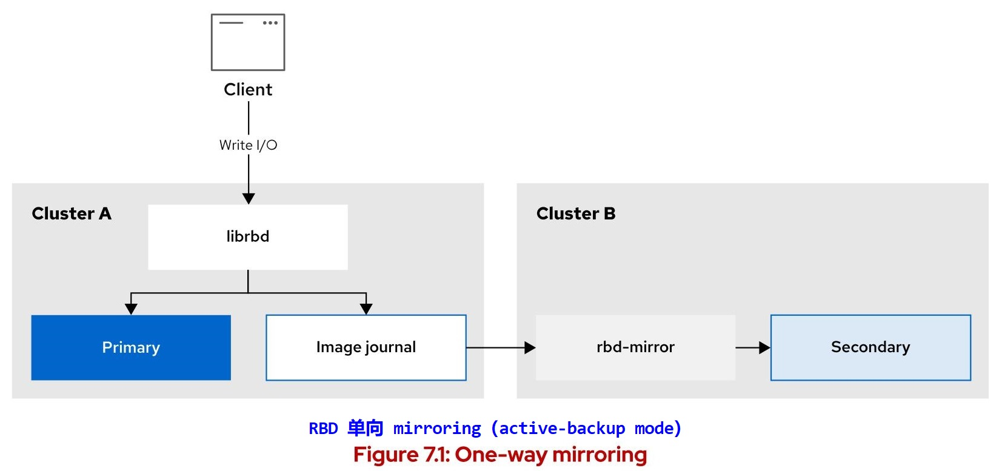</center>
  
<center>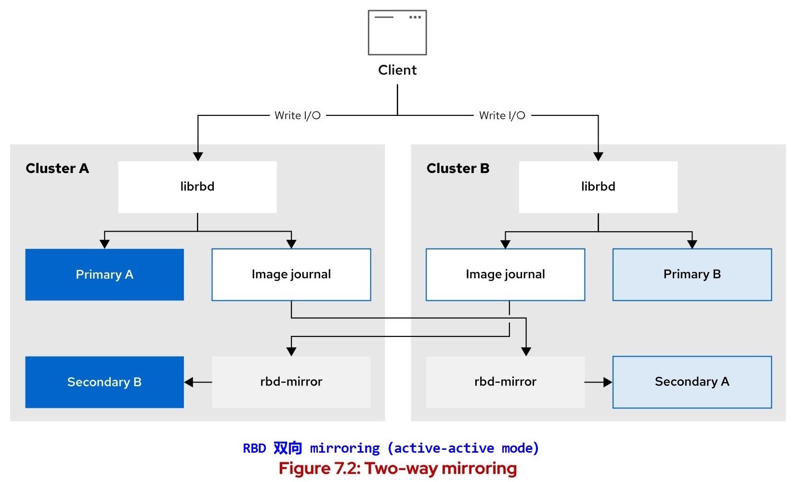</center>
  
### Lab: 实现 RBD one-way mirroring
  
```bash
### RBD Mirror Primary 集群（pool 模式）###
$ rbd mirror pool enable <pool_name> <mirror-mode>
# 指定存储池启用 RBD Mirror 的指定模式（pool 模式、image 模式）
$ rbd mirror pool enable rbd pool  #示例
# 启用 rbd 存储池启用 RBD Mirror 的 pool 模式（池模式）
$ rbd info rbd/image1  #示例
  rbd image 'image1':
        ...
        features: exclusive-lock, journaling
        ...
        mirroring state: enabled
        mirroring mode: journal
        mirroring global id: cccdeb7c-1ce5-4ca4-9498-1400f228bf72
        mirroring primary: true
# 此示例显示 rbd 存储池已启用 pool 模式，并且其中的 image1 镜像可进行同步。
  
$ rbd mirror pool peer bootstrap create \
  --site-name <site-name> <pool_name> > /path/to/mirror-bootstrap-token
# 创建引导对等存储集群的 bootstrap token（active-passive 集群模式）
  
### RBD Mirror Secondary 集群（pool 模式）###
$ ceph orch apply rbd-mirror --placement=<fqdn>
# 指定节点启用 rbd-mirror 守护进程
$ ceph orch apply rbd-mirror --placement=serverf.lab.example.com  #示例
$ ceph orch ls  #示例
  ...
  rbd-mirror                   1/1  8m ago     2h   serverf.lab.example.com
  ...
$ rbd mirror pool peer bootstrap import \
  --site-name <site-name> \
  --direction rx-only <pool_name> \
  /path/to/mirror-bootstrap-token
# 导入 primary 集群提供的对等集群引导 token，将设置为 secondary 集群。
# 此集群只能以接收方式（rx-only）备份同步指定存储池中的镜像
  
$ rbd mirror pool info <pool_name>
# 查看 RBD Mirror 指定存储池的对等信息
$ rbd mirror pool info rbd  #示例
  Mode: pool
  Site Name: bup
  
  Peer Sites: 
  
  UUID: 763de4dc-ba66-4672-aaec-582b68cf9cf1
  Name: prod
  Direction: rx-only
  Client: client.rbd-mirror-peer
$ rbd mirror pool status
  health: OK
  daemon health: OK
  image health: OK
  images: 1 total
      1 replaying
# 查看 RBD Mirror 的对等状态
# 注意：primary 集群中无法查询 RBD 镜像同步状态
  
### 报错示例 ###
# RBD Mirror Secondary 集群
$ rbd rm rbd/image1
  2023-10-07T05:14:13.113+0000 7f6c226f3700 -1 librbd::image::PreRemoveRequest: 0x564199439410 handle_exclusive_lock:
  cannot obtain exclusive lock - not removing
  Removing image: 0% complete...failed.
  rbd: error: image still has watchers
  This means the image is still open or the client using it crashed. Try again after closing/unmapping it or waiting 
  30s for the crashed client to timeout.
# 由于 primary 集群存储池中镜像设置了分布式锁（exclusive-lock）特性，
# 因此，secondary 集群中无法删除镜像，只能从 primary 集群中删除。
```
  
### Lab: `rbd-nbd` 映射使用已 mirroring 的 RBD 镜像
  
笔者环境中已部署 RBD Mirror Primary 与 Secondary 集群，两套集群中均已创建 rbd 存储池并启用 pool 模式的 RBD Mirror。primary 集群的 rbd 存储池中已创建 image1 镜像，此镜像已启用 `exclusive-lock` 与 `journaling` 特性。现将此镜像映射给客户端虚拟机作虚拟磁盘使用，如下所示：
  
```bash
### 客户端虚拟机 ###
$ sudo dnf install -y ceph-common
# 安装 rbd 命令
$ sudo rbd map rbd/image1
  rbd: sysfs write failed
  RBD image feature set mismatch. You can disable features unsupported by 
  the kernel with "rbd feature disable image1 journaling"
  In some cases useful info is found in syslog - try "dmesg | tail".
  rbd: map failed: (6) No such device or address
# rbd 映射 rbd/image1 镜像内核模块报错
# 注意：
#   1. 使用此命令前需同步 primary 集群的 /etc/ceph/{ceph.conf,
#      ceph.client.admin.keyring} 文件至本地 /etc/ceph/ 目录中
#   2. rbd 内核模块报错无法映射是由于当前内核不支持 journaling 特性。
#      但是，mirroring 必须依赖此特性，因此使用 rbd 映射与 journaling 之间存在矛盾。
#      目前现有的内核版本均不支持此特性！
#   3. 可使用 rbd-nbd 替代 rbd 以完成镜像的映射。可参看文末参考链接。
$ sudo uname -r
  4.18.0-305.el8.x86_64
  
$ sudo dnf install -y rbd-nbd
# 安装 rbd-nbd 软件包
$ sudo dnf info rbd-nbd
  ...
  Name         : rbd-nbd
  Epoch        : 2
  Version      : 16.2.0
  Release      : 117.el8cp
  Architecture : x86_64
  Size         : 511 k
  Source       : ceph-16.2.0-117.el8cp.src.rpm
  Repository   : @System
  From repo    : rhceph-5-tools-for-rhel-8-x86_64-rpms
  Summary      : Ceph RBD client base on NBD
  URL          : http://ceph.com/
  License      : LGPL-2.1 and LGPL-3.0 and CC-BY-SA-3.0 and GPL-2.0 and 
                 BSL-1.0 and BSD-3-Clause and MIT
  Description  : NBD based client to map Ceph rbd images to local device
$ sudo lsmod | egrep 'rbd|nbd'
  nbd                    49152  2
  rbd                   110592  0
  libceph               454656  1 rbd
# 确认 rbd 与 nbd 内核模块是否加载
$ sudo rbd-nbd map rbd/image1
  /dev/nbd1
# 映射 rbd/image1 镜像为 /dev/nbd1
$ sudo mkfs -t ext4 /dev/nbd1
$ sudo mkdir /mnt/rbd
$ sudo mount -t ext4 /dev/nbd1 /mnt/rbd
$ sudo dd if=/dev/zero of=/mnt/rbd/test-data1 oflag=direct bs=4M count=10
  10+0 records in
  10+0 records out
  41943040 bytes (42 MB, 40 MiB) copied, 0.747552 s, 56.1 MB/s
$ sudo ls -lh /mnt/rbd/test-data1 
  -rw-r--r--. 1 root root 40M Oct  7 23:05 /mnt/rbd/test-data1
# 创建测试数据文件
  
### RBD Mirror Primary/Secondary 集群 ###
$ rbd info rbd/image1
  rbd image 'image1':
        size 1 GiB in 256 objects
        order 22 (4 MiB objects)
        snapshot_count: 0
        id: 8569a03bc09a
        block_name_prefix: rbd_data.8569a03bc09a
        format: 2
        features: exclusive-lock, journaling
        op_features: 
        flags: 
        create_timestamp: Sat Oct  7 17:41:54 2023
        access_timestamp: Sun Oct  8 03:05:02 2023
        modify_timestamp: Sun Oct  8 03:05:02 2023  # 镜像中已写入数据
        journal: 8569a03bc09a
        mirroring state: enabled
        mirroring mode: journal
        mirroring global id: c28aca80-f176-49d0-9a7c-0f34f2380f51
        mirroring primary: true
# 从以上 primary 与 secondary 集群的镜像信息可见数据已写入并同步
```
  
### 其他 RBD Mirror 相关命令
  
```bash
$ rbd mirror pool disable <pool_name>
# 指定存储池禁用 pool 模式的 RBD Mirror
  
$ rbd feature enable <pool_name>/<rbd_image_name> <feature-name>
# 启用 RBD 镜像的指定特性
$ rbd feature disable <pool_name>/<rbd_image_name> <feature-name>
# 禁用 RBD 镜像的指定特性
```
  
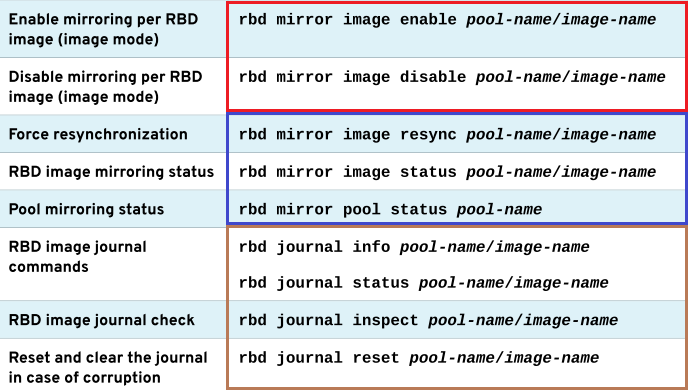
  
### RBD Mirror 的故障转移
  
当 primary 集群中的 RBD 镜像变为不可用时（非集群不可用），可对 primary 集群执行镜像的降级（demote）操作，而对 secondary 集群执行镜像的升级（promote）操作。
  
```bash
$ rbd mirror image demote <pool_name>/<rbd_image_name>
  Image demoted to non-primary
# primary 集群节点：降级执行指定的 RBD 镜像
$ rbd mirror image promote <pool_name>/<rbd_image_name>
  Image promoted to primary
# secondary 集群节点：升级指定的 RBD 镜像
```

- Ceph iSCSI Gateway 相关命令：

## CephFS 文件系统

```bash
$ ceph fs status
```

## 参考链接

- [Product Documentation for Red Hat Ceph Storage 5 | Red Hat Customer Portal](https://access.redhat.com/documentation/zh-cn/red_hat_ceph_storage/5)
- ❤ [5.4. 使用 Ceph Manager 负载均衡器模块 Red Hat Ceph Storage 5 | Red Hat Customer Portal](https://access.redhat.com/documentation/zh-cn/red_hat_ceph_storage/5/html/operations_guide/using-the-ceph-manager-balancer-module_ops)
- [SERVICE MANAGEMENT | Ceph Docs](https://docs.ceph.com/en/latest/cephadm/services/?highlight=service_id#)
- [使用 cephadm 搭建 ceph（octopus）过程](https://juejin.cn/post/7160585472538837006)
- [Chapter 2. Management of services using the Ceph Orchestrator Red Hat Ceph Storage 5 | Red Hat Customer Portal](https://access.redhat.com/documentation/en-us/red_hat_ceph_storage/5/html/operations_guide/management-of-services-using-the-ceph-orchestrator#deploying-the-ceph-daemons-using-the-service-specification_ops)
- [Stray daemon tcmu-runner is reported not managed by cephadm - Red Hat Customer Portal](https://access.redhat.com/solutions/6472281)
- [Ceph - mapping rbd image is failing with RBD image feature set mismatch or image uses unsupported features - Red Hat Customer Portal](https://access.redhat.com/solutions/4270092)
- [maillist - rbd map image with journaling](https://lists.ceph.io/hyperkitty/list/ceph-users@ceph.io/thread/377S7XFN74MUYKVSXXRAN534FNZTDICK/)
- [使用命令行界面更改 Ceph 仪表板密码](https://www.ibm.com/docs/zh/storage-ceph/6?topic=ia-changing-ceph-dashboard-password-using-command-line-interface)
