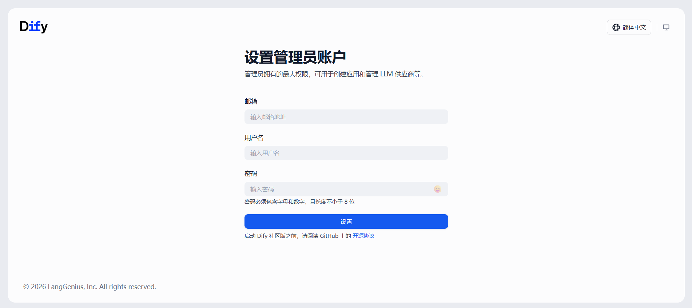

# 基于 Dify 的 AIOps 实践

## 环境资源要求

| 操作系统类型 | CPU 数量 | 内存容量 | Docker 版本 | Dify 版本 |
| ----- | ----- | ----- | ----- | ----- |
| Ubuntu 24.04.4 LTS (Noble Numbat) | 8 | 16GB | 29.5.0 | 1.13.3 |

## 文档目录

- [基于 Dify 的 AIOps 实践](#基于-dify-的-aiops-实践)
  - [环境资源要求](#环境资源要求)
  - [文档目录](#文档目录)
  - [Dify 容器化部署与管理](#dify-容器化部署与管理)
    - [踩过的坑](#踩过的坑)
    - [Dify 多容器部署与运行：Docker Compose 方式](#dify-多容器部署与运行docker-compose-方式)
    - [Dify 多容器停止](#dify-多容器停止)
  - [Dify 插件安装](#dify-插件安装)
  - [Dify 节点执行报错汇总](#dify-节点执行报错汇总)
  - [参考链接](#参考链接)

## Dify 容器化部署与管理

### 踩过的坑

截止笔者部署 Dify 时，其最新版本更新为 `1.14.0`，遂尝试此版本部署，但在使用过程中发现以下两大问题，

- ⚠️ 创建知识库后使用内置 DSL 知识库模板无法正确渲染！
- ⚠️ 在自定义知识库流水线中由于内部数据库通信异常而导致调试单个节点常出现实例失败！

因此，笔者选择 Dify 1.13.3 版本部署测试。

### Dify 多容器部署与运行：Docker Compose 方式

Dify 启动过程如下：

```bash
$ git clone https://github.com/langgenius/dify.git
# 克隆 Dify 源代码
$ cd dify
# 进入 Dify 源代码目录
$ git checkout 1.13.3
# 切换 Dify 1.13.3 版本
$ cd dify/docker
# 切换至 docker-compose.yaml 文件所在目录
$ cp .env.example .env
# 生成默认的环境文件，此文件定义 Dify 各功能，后续可自定义修改。
$ docker compose pull
# 先拉取 Dify 相关容器镜像，防止因拉取超时而导致启动失败。
$ docker compose up -d
[+] up 13/13
 ✔ Network docker_default              Created      0.1s
 ✔ Network docker_ssrf_proxy_network   Created      0.0s
 ✔ Container docker-ssrf_proxy-1       Started      1.1s
 ✔ Container docker-sandbox-1          Started      0.9s
 ✔ Container docker-init_permissions-1 Exited       1.6s
 ✔ Container docker-redis-1            Started      1.1s
 ✔ Container docker-db_postgres-1      Healthy      2.1s
 ✔ Container docker-web-1              Started      1.0s
 ✔ Container docker-plugin_daemon-1    Started      3.2s
 ✔ Container docker-worker-1           Started      3.3s
 ✔ Container docker-api-1              Started      2.8s
 ✔ Container docker-worker_beat-1      Started      3.3s
 ✔ Container docker-nginx-1            Started      3.4s
# 在 Dify 源码目录中执行：根据 docker-compose.yaml 文件以后台形式启动整个 Dify 应用

$ docker compose ps
NAME                     IMAGE                                       COMMAND                  SERVICE         CREATED          STATUS                             PORTS
docker-api-1             langgenius/dify-api:1.13.3                  "/bin/bash /entrypoi…"   api             17 seconds ago   Up 15 seconds                      5001/tcp
docker-db_postgres-1     postgres:15-alpine                          "docker-entrypoint.s…"   db_postgres     17 seconds ago   Up 17 seconds (healthy)            5432/tcp
docker-nginx-1           nginx:latest                                "sh -c 'cp /docker-e…"   nginx           17 seconds ago   Up 14 seconds                      0.0.0.0:80->80/tcp, [::]:80->80/tcp, 0.0.0.0:443->443/tcp, [::]:443->443/tcp
docker-plugin_daemon-1   langgenius/dify-plugin-daemon:0.5.3-local   "/bin/bash -c /app/e…"   plugin_daemon   17 seconds ago   Up 14 seconds                      0.0.0.0:5003->5003/tcp, [::]:5003->5003/tcp
docker-redis-1           redis:6-alpine                              "docker-entrypoint.s…"   redis           17 seconds ago   Up 17 seconds (health: starting)   6379/tcp
docker-sandbox-1         langgenius/dify-sandbox:0.2.14              "/entrypoint.sh"         sandbox         17 seconds ago   Up 17 seconds (health: starting)
docker-ssrf_proxy-1      ubuntu/squid:latest                         "sh -c 'cp /docker-e…"   ssrf_proxy      17 seconds ago   Up 17 seconds                      3128/tcp
docker-web-1             langgenius/dify-web:1.13.3                  "/bin/sh ./entrypoin…"   web             17 seconds ago   Up 17 seconds                      3000/tcp
docker-worker-1          langgenius/dify-api:1.13.3                  "/bin/bash /entrypoi…"   worker          17 seconds ago   Up 15 seconds                      5001/tcp
docker-worker_beat-1     langgenius/dify-api:1.13.3                  "/bin/bash /entrypoi…"   worker_beat     17 seconds ago   Up 15 seconds                      5001/tcp

### 等效地查询方法 ###
$ docker compose -f ~/backup/dify/docker/docker-compose.yaml ps
# 注意：如果不在 Dify 源码目录中，那么指定 docker-compose.yaml 的绝对路径
```

等待片刻，打开浏览器访问 Dify 所在节点的 IP 地址，如 http://<dify_ip_address>，默认监听 80/tcp 端口。根据页面提示创建用户，如下所示：




### Dify 多容器停止

```bash
$ docker compose stop
[+] stop 11/11
 ✔ Container docker-worker_beat-1      Stopped      3.1s
 ✔ Container docker-sandbox-1          Stopped      10.7s
 ✔ Container docker-worker-1           Stopped      7.4s
 ✔ Container docker-nginx-1            Stopped      11.0s
 ✔ Container docker-plugin_daemon-1    Stopped      11.1s
 ✔ Container docker-ssrf_proxy-1       Stopped      11.1s
 ✔ Container docker-web-1              Stopped      0.3s
 ✔ Container docker-api-1              Stopped      3.5s
 ✔ Container docker-db_postgres-1      Stopped      0.3s
 ✔ Container docker-redis-1            Stopped      0.4s
 ✔ Container docker-init_permissions-1 Stopped      0.0s
```

## Dify 插件安装

Dify 插件安装过程中虽然可从官方的 Markplace 中下载插件，但插件所需的依赖依然需要从国外的 Python 模块站点上下载，经常因为超时超时而报错。以下为安装 **Dify 文本提取器插件** 过程中的超时报错：

```plaintext
failed to launch plugin: failed to install dependencies: failed to install dependencies: signal: killed, output: DEBUG uv 0.11.7 (x86_64-unknown-linux-gnu)
DEBUG Found project root: `/app/storage/cwd/langgenius/general_chunker-0.0.11@427168e20dcf0b761438182aaba0243f20c048c9cf816dbb6b4c7b87d3c2de82`
DEBUG No workspace root found, using project root
DEBUG No Python version file found in workspace: /app/storage/cwd/langgenius/general_chunker-0.0.11@427168e20dcf0b761438182aaba0243f20c048c9cf816dbb6b4c7b87d3c2de...iles.pythonhosted.org/packages/d5/1f/5f4a3cd9e4440e9d9bc78ad0a91a1c8d46b4d429d5239ebe6793c9fe5c41/fsspec-2026.3.0-py3-none-any.whl
DEBUG Sending fresh GET request for: https://files.pythonhosted.org/packages/d5/1f/5f4a3cd9e4440e9d9bc78ad0a91a1c8d46b4d429d5239ebe6793c9fe5c41/fsspec-2026.3.0-py3-none-any.whl
Downloading numpy (15.9MiB)
Downloading transformers (11.4MiB)
Downloading tokenizers (3.1MiB)
Downloading hf-xet (4.0MiB)
init process exited due to no activity for 120 seconds
failed to init environment
```

## Dify 节点执行报错汇总

1️⃣ 上传 Markdown 格式文件测试知识库流水线，在 `DIFY EXTRACTOR` 节点中报错如下：

```plaintext
An error occurred in the langgenius/dify_extractor/dify_extractor, please contact the author of langgenius/dify_extractor/dify_extractor for help, error type: ValueError, error details: Invalid file URL '/files/731c7e5c-ddc3-463f-93b3-40b5971351c0/file-preview?timestamp=1779170277&nonce=69df7aba32d79233f7926109d2eeeef7&sign=6tcQHLYMrIR5l0456VSiCz7NVfmcwgKvKnQvwqnDVPk%3D': Request URL is missing an 'http://' or 'https://' protocol.. Ensure the `FILES_URL` environment variable is set in your .env file
```

## 参考链接
